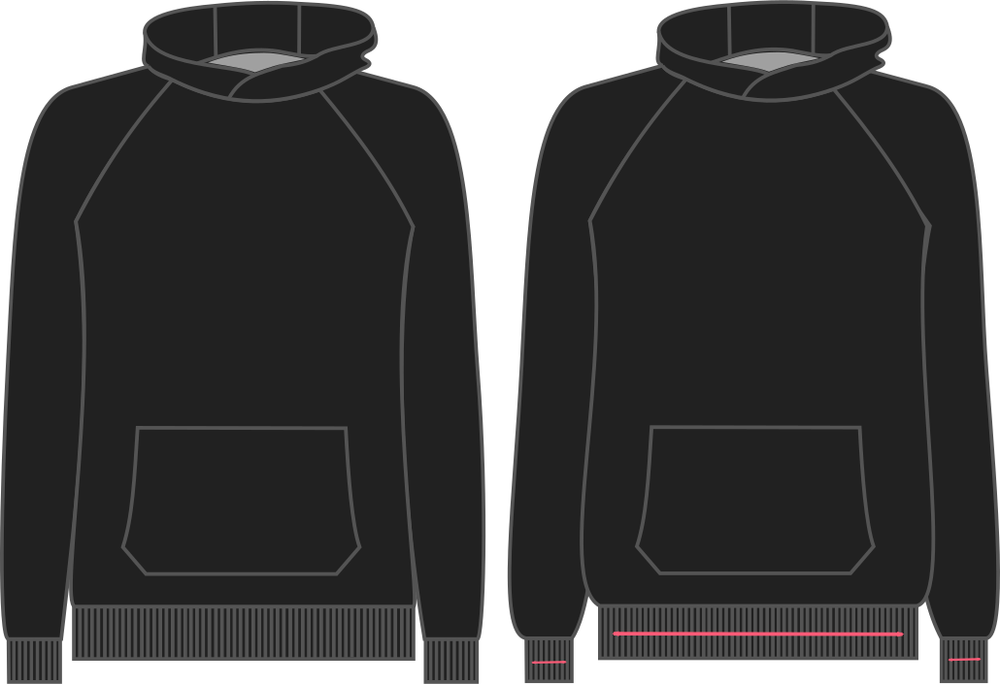

Esta opción le permite ajustar el estiramiento de su ribbing.

Si usted elige el 90% (por ejemplo) por cada 10 cm de ribbing, sólo borraremos 9 cm. De esta manera, 9cm de ribbing se estirará a 10cm.

<Note>

Si no estás seguro de qué escoger, lo mejor es tomar la costilla que vas a usar ver cuánto de ella 
necesitas estirar para llegar a 10 cm con un estiramiento *bueno*.

</Note>

## Effect of this option on the pattern
