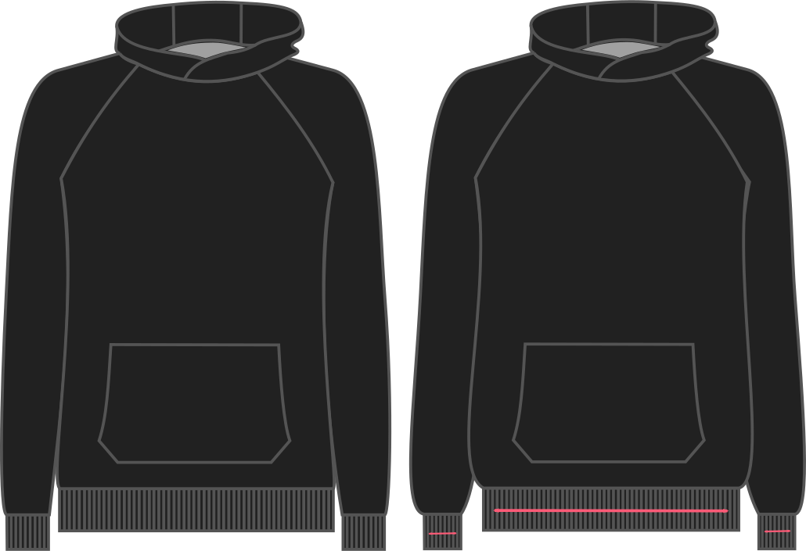

- - -
title: "Ribbing stretch"
- - -

This option allows you to tweak the stretch of your ribbing.

If you choose 90% (for example) for every 10cm of ribbing, we'll only draft 9cm. This way, 9cm of ribbing will be stretched to 10cm.

<Note>

If you're not sure what to pick, best is to take the ribbing you are going to use see how much of it
you need to stretch out to get to 10 cm with a _good_ stretch.

</Note>

## Effect of this option on the pattern

