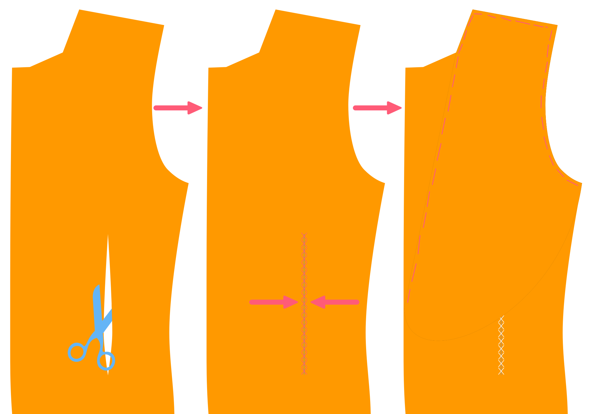

<Note>

###### Jaeger Dokumentation ist im Bau

Diese Dokumentation ist noch nicht fertig.

</Note>

## Konstruktion

### Front-Dart schließen

#### Doppelte falten

Klappen Sie das vordere Doppelte mit den guten Seiten zusammen und polieren Sie es nach unten, so dass die Falte in der Mitte des Vorderdartes sauber ist.

#### Nähen Dart

Nähen Sie den Vorderdart und achten Sie darauf, dass der Dart Stopp am richtigen oberen Ende. Die Unterseite ist nicht so wichtig, da sie von den Taschen abgedeckt wird. Aber das obere Ende des Darts wird deutlich sichtbar sein, Also stellen Sie bitte sicher, dass sie auf beiden Seiten in der gleichen Höhe endet.

#### Öffnen und drücken

Sobald die Vorderdarte geschlossen sind, schneiden Sie den Dart auf der Rückseite. Man kann es nicht bis zur Spitze schneiden, aber das ist in Ordnung. Drücken Sie die Dilts öffnen, wo sie geschnitten werden, und drücken Sie den Rest zur Seite. Achten Sie darauf, nur von der Rückseite zu drücken. Drücken von der Vorderseite wird wahrscheinlich dein Gewebe markieren.

### Baue die Brusttasche

#### Verwundbare Schnittstelle anwenden

Verwenden Sie ein rechteckiges Stück leichtes Interface um die Brusttasche herum, so dass es sich ein paar cm in alle Richtungen erstreckt.

> ##### Wir verwenden nicht fusible auf der ganzen Front
>
> Sportcoats werden typischerweise aus etwas schwereren Stoffen hergestellt. That, and the fact that I prefer to use canvas rather than fusible interfacing, means that I don't interface the front with fusible.

#### Brust Weltenumriss, Markiere Endpunkte der oberen Linie

With the fusible in place, thread a needle and baste around the chest pocket to transfer the markings to the good side of the fabric.

Diese Tasche unterscheidet sich von einer traditionellen Welttasche. Die Welt erstreckt sich über die Taschenöffnung. Dies versteckt die Taschentasche ohne Verkleidung. Der obere Teil der Öffnung ist auch kleiner als die Schweißnähte, so dass man sie schließen kann.

Markieren Sie auf der obersten Linie Ihrer Basiswelttasche 0,5 cm nach innen von den Ecken der oberen Linie.

> Diese Punkte sind Noten auf dem vorderen Teil deines Musters.

#### Falten, drücken und nähen der Seitennaht der Welt

Falten Sie die Welt mit den guten Seiten zusammen und schließen Sie die Seiten (nähen Sie die Seitennaht).

#### Nahtzugabe, drehen und drücken

Schneiden Sie die Nahtzuschläge an den Seiten und vor allem die Nahtzuweisung in die Ecke zu begrenzen, um Schüttgut zu vermeiden.

Drehen Sie sich aus, damit die gute Seite draußen ist und drücken Sie.

> Achten Sie darauf, nicht zu überdrücken, da Sie von der guten Seite des Stoffes drücken.

#### Füge die untere Linie der Welt ein, damit du weißt, wo du nähen solltest

Fügen Sie einen Heftführer am unteren Ende der Welt ein, um die Welt-/Naht-Grenze zu markieren. Dies ist die Linie, die später eingenäht werden soll.

#### Nähen Sie die Welt nach vorne

Legen Sie die Welt nach unten auf die gute Seite der Vorderseite mit der gefalteten Seite nach unten, und nähen Sie nach unten. Achten Sie darauf, dass Sie anhalten und genau am Rand der Linie starten, auf der Sie basieren.

#### Nähe die Brusttasche nach vorne

Legen Sie die Tasche auf der Vorderseite. Die Vorderseite mit guter seite, aber die Tasche mit schlechter seite. Achten Sie darauf, die längste Seite der Brusttasche auf der höchsten Seite der Brusttasche zu haben.

> Nur geschwemmte Brusttaschen haben eine höhere und untere Seite.

Nähen Sie dies an Stelle entlang der oberen Linie. Remember this should be shorter than the bottom row of stitches to attach the welt, since you marked 0.5cm inwards from the corners.

> Da die Tasche in der Regel ein rutschiger Stoff ist, sollten Sie ihn vor dem Nähen anheften oder einstoßen.

#### Öffnen, drehen und drücken der Brust ausschneiden

 Nun schneiden Sie Ihre Welt in der Mitte der beiden Nahtlinien. Schneiden Sie nicht an die Kante, sondern erstellen Sie dort eine dreimalige Form.

Drehen Sie die Tasche und die Welt auf die Rückseite, indem Sie beide durch die gerade erstellte Öffnung passieren.

Hol dir alles um schön und flach zu legen und zu drücken.

Nun bringen Sie die Welt nur auf die Vorderseite und lassen Sie sie schön und flach liegen. Drücke erneut von der Rückseite.

> Widerstehen Sie dem Drang, dies von vornherein zu drücken.

#### Beende die Brusttasche

On the backside, fold the pocket bag double and sew it to the pocket welt below the existing seamline of the welt.

Gewinde eine Nadel und beende die Brusttasche in der Hand, indem du die Seiten der Welt auf die Frontplatte abneigst (lass deine Stitches nicht vorne zeigen).

Schließen Sie schließlich die Tasche durch Nähen der Seiten. Tun Sie dies, indem Sie die Vorderseite mit der guten Seite nach oben. Dann falten Sie über jede Seite und nähen Sie die Tasche. Beim Nähen dieser Seiten, achten Sie darauf, diese dreieckigen kleinen Stücke der Öffnung zu fangen. Dies stärkt die Taschenöffnung.

Füllen Sie die Brusttasche geschlossen, während wir die Jacke konturieren.

### Die Fronten vorbereiten

Schneiden Sie das vordere Leinenstück in einer hellen und geschmeidigen Leinwand auf der Voreinstellung aus. Ausschneiden Sie die gesamte Front.

Schneiden Sie den Vorderdart aus und schließen Sie ihn mit einem Zick-Zack-Näht, damit sich die Leinwand nicht überlappt.

Zerschneiden Sie das Stück der Brust Leine. Entlang der Rollenlinie ausrichten und auf der Vorderseite auf dem Leinwand platzieren.

> Das Bruststück ist auf dem vorderen Teil Ihres Musters markiert.

#### Leinwand an die Fronten einfügen

Nimm nun die Frontseite und das Bruststück auf deine Vorderseite. Beachten Sie, dass die Leinwand keine Naht hat.

> Base it a bit inwards from the seam line so you can fold it away when sewing these seams later. You don't want your canvas to get caught in the seams.

#### Halten Sie Ihre Lapels fest

Zeit, sich wie ein echter Schneider zu fühlen, und Pad-stich diese Lapels.

Make sure to make the stitches a bit smaller towards the lapel tip, to make sure it lies flat against the chest, curling a bit inward instead of outward.

> If you're not sure how to pad-stitch the lapels, [let us know](https://discord.freesewing.org/) and we'll make an attempt to document it.

#### Klebeband den Rand und die Rollenlinie

Jetzt werden wir das Klebeband an den Rändern der Vorderseite und an der Rollenlinie handnähen. Dies wird auch die Leinwand an der Vorderseite hier und da sicherstellen.

Denken Sie daran, dass:

-   Das Band entlang der Rollenlinie sollte innerhalb der Rollenlinie platziert werden.
-   Das Band entlang der Rollenlinie sollte etwa einen halben Zentimeter kürzer sein als die Distanz, die es umspannt. Die leichte Spannung, die dadurch entsteht, hilft der Lupe angenehm zu rollen und die Kontur zu Ihrem Körper.
-   Das Klebeband am Rand der Lupe sollte innerhalb der Nahtlinie platziert werden

> ##### Nicht durch deinen Stoff nähen
>
> While sewing the tape to your front, avoid pushing your needle all the way through your fabric so that your stitches will show on the front.
>
> Gleichzeitig sollten Sie das Klebeband auch nicht nur auf Ihre Leinwand sichern. Instead, you should try to catch a few threads of your fabric on every stitch, so that the tape is secured in place, yet the stitches don't show at the front.
>
> Dies ist weniger ein Problem oberhalb des Bruchpunktes Ihrer Rasse, wo der Stoff auf der Rückseite des Lapels sein wird.

### Körper schließen

#### Seitennaht schließen

Place your front with the good side up, and your side on it with the good side down. Align the front/side seams, pin them in place if you feel like it, and sew them togther.

Place this down with the good side up, and place your back on top with the good side down. Align the back/side seams, pin them in place if you feel like it, and sew them togther.

> Vergewissern Sie sich, dass die Leinwand nicht in der Naht gefangen wird.

> ##### Hinweis für Nähschlitten
>
> Wenn Sie einen doppelten Schlot haben, wird diese Naht den Schlot enthalten.
>
> Nähen Sie den unteren Teil der Seitennaht und den seitlichen Teil, der den Schlot bildet. Nähen Sie danach nicht nach unten.

#### Rückennaht schließen

Ihre beiden Halbjacken zusammen mit den guten Seiten und schließen Sie die Rückennaht.

<Note>

##### Hinweis zum Nähen

Wenn Sie einen Schlot haben, wird diese Naht den Schlot enthalten.

Nähen Sie den unteren Teil der RückenNaht und den seitlichen Teil, der den Schlot bildet.
Nähen Sie danach nicht nach unten.

</Note>

#### Schulternähte schließen

Nähen Sie die Schulternähte mit guten Seiten zusammen und nähen Sie sie zusammen.

Vergewissern Sie sich, dass die Leinwand nicht in der Naht gefangen wird.

<Note>

##### Die Schulternoten

ausrichten und die Schulternoten auf der Basis der Noten sorgfältig ausrichten.
Aufgrund der unterschiedlichen Form der Rücken- und Frontplatten an der Nackenseite,
sieht der Stoffrand anders aus. Wenn du diese Kanten ausrichtest, erhältst du nicht das
was du brauchst.

Also achten Sie darauf, die Nocken auszurichten. Das ist es, wofür sie da sind.

</Note>
