- - -
title: "Jaeger jacket: Sewing Instructions"
- - -

<Note>

###### La documentación de Jaeger está en construcción

Esta documentación aún no está terminada.

</Note>

## Construcción

### Cerrar los dardos frontales

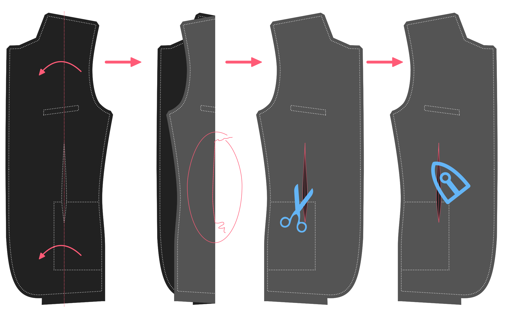

#### Doble doble

Fold the front double with the good sides together and pin it down so the fold is neatly in the middle of the front dart.

#### Dientes dardos

Sew the front dart close, taking care to have the dart stop at the correct top end. The bottom is not that important as it will be covered by the pockets. But the top end of the dart will be clearly visible, so please make sure to have it end at the same height at both sides.

#### Cortar y pulsar

Once the front darts are closed, cut open the dart at the back. You won't be able to cut it open all the way to the tip, but that's fine. Press open the darts where they are cut open, and press the rest to the side. Take care to only press from the back. Pressing from the front will likely mark your fabric.

### Construye el bolsillo

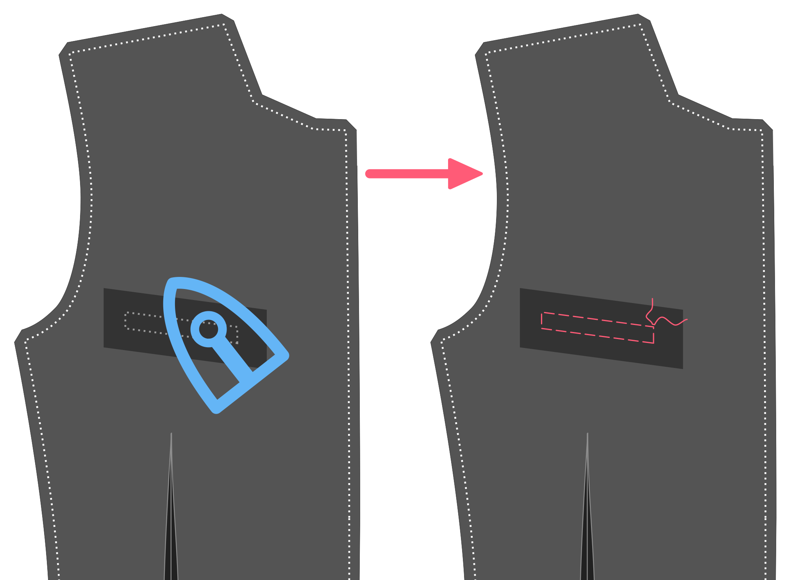

#### Aplicar interfaz fusible

Apply a rectangular piece of light fusible interfacing around the chest pocket area so that it extends a few cm in all directions.

> ##### No estamos usando fusible en todo el frente
> 
> Los escudos son típicamente hechos de telas algo más pesadas. That, and the fact that I prefer to use canvas rather than fusible interfacing, means that I don't interface the front with fusible.

#### Marca el contorno de la soldadura del cofre, marca los extremos de la línea superior

With the fusible in place, thread a needle and baste around the chest pocket to transfer the markings to the good side of the fabric.

This pocket differs from a traditional welt pocket. The welt extends above the pocket opening. This hides the pocket bag without the need for facings. The top part of the opening is also smaller than the welt, allowing you to slip-stitch it closed.

On the top line of your basted welt pocket, mark 0.5cm inwards from the corners of the top line.

> Estos puntos son notches en la parte frontal de tu patrón.

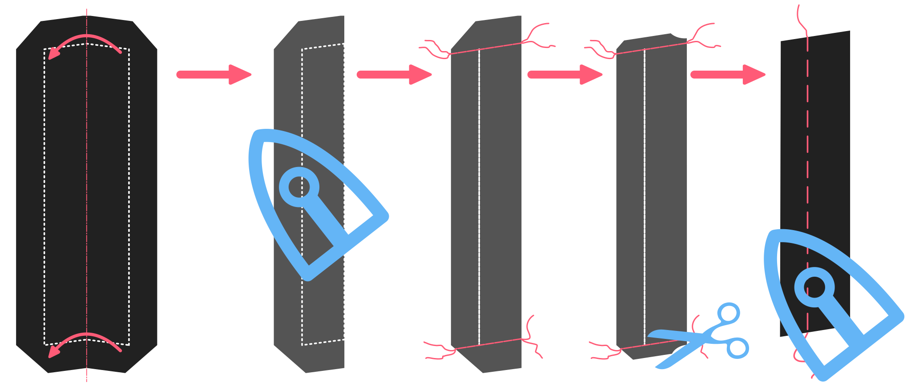

#### Plegar, prensar y coser las costuras de la soldadura

Fold the welt double with the good sides together, and close the sides (sew the side seams).

#### Recortar las costuras, girar y presionar

Trim the seam allowances on the sides and especially limit the seam allowance towards the corner to avoid bulk.

Turn inside out so the good side is out and press.

> Ten cuidado de no sobreprender ya que estarás presionando desde el buen lado de la tela.

#### Elimina la línea inferior de la soldadura para que sepa dónde coser

Baste a stitching guide at the bottom of the welt to mark the welt/seam allowance boundary. This will be the line to sew on later.

#### Difundir la soldadura al frente

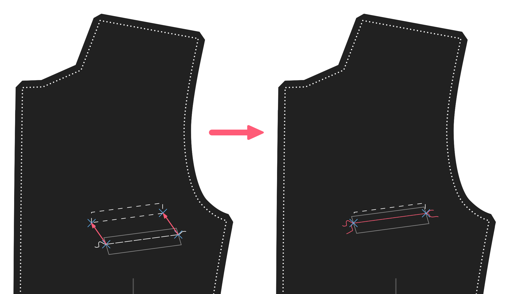

Place welt down on good side of front with the folded side downwards, and sew to bottom line. Make sure to stop and start exactly at the edge of the line you basted.

#### Difunde la bolsa de bolsillo de cofre al frente

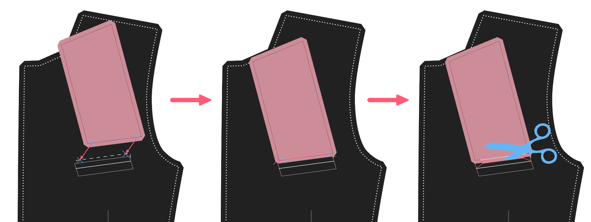

Place the pocket bag down on the front. The front with good side up, but the pocket bag with bad side up. Make sure to have the longest side of the chest pocket bag on the highest side of the chest pocket.

> Sólo los pockets de cofres trillados tienen un lado más alto e inferior.

Sew this in place along the top line. Remember this should be shorter than the bottom row of stitches to attach the welt, since you marked 0.5cm inwards from the corners.

> Como el bolsillo de espalda es típicamente un tejido deslizante, probablemente querrás anclar o bastar esto en su lugar antes de coser.

#### Corta la apertura del bolsillo de cofre, gire y presione

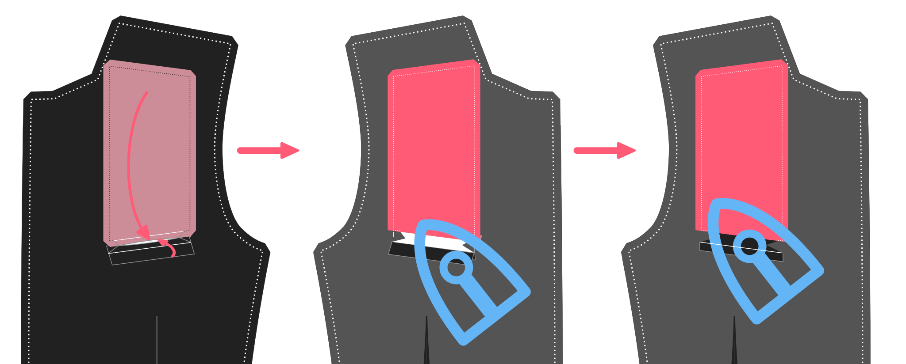 Now cut open your welt in the middle of both seamlines. Don't cut to the edge, but create a trianngular shape there.

Flip the pocket bag and welt to the backside by passing both of them through the opening you just created.

Get everything to lay nice and flat, and press.

Now, bring the welt only to the front and get it to lie nice and flat. Press again from the back.

> Resista el deseo de presionar esto desde el frente.

#### Termina el bolsillo

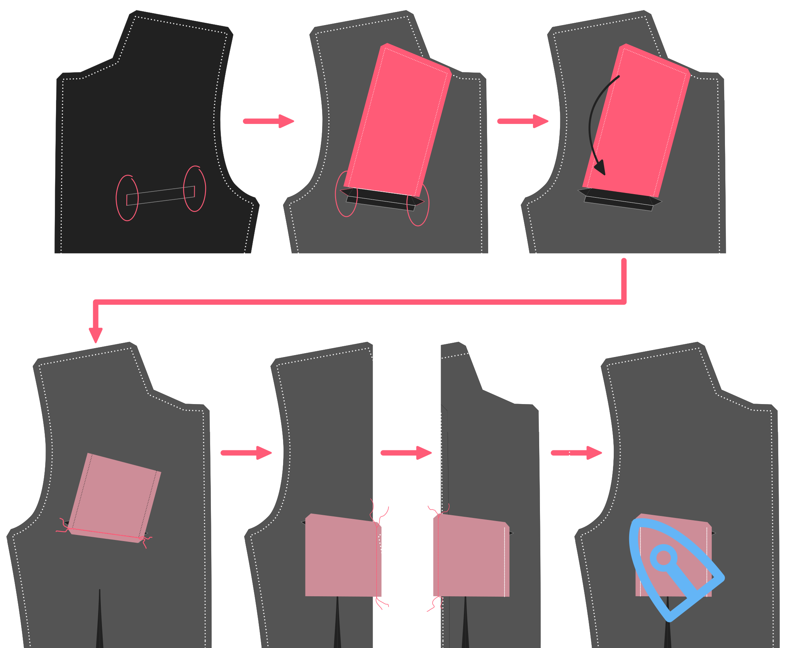

On the backside, fold the pocket bag double and sew it to the pocket welt below the existing seamline of the welt.

Thread a needle and hand-finish the chest pocket by sewing down the sides of the welt to the front panel (don't let your stitches show on the front).

Finally, close the pocket bag by sewing the sides. Do this by placing the front down with the good side up. Then fold over each side and sew the pocket bag. While sewing these sides, make sure to catch those triangular little pieces of the opening. This will reinforce the pocket opening.

Baste the chest pocket closed while we contruct the jacket.

### Prepara los frentes

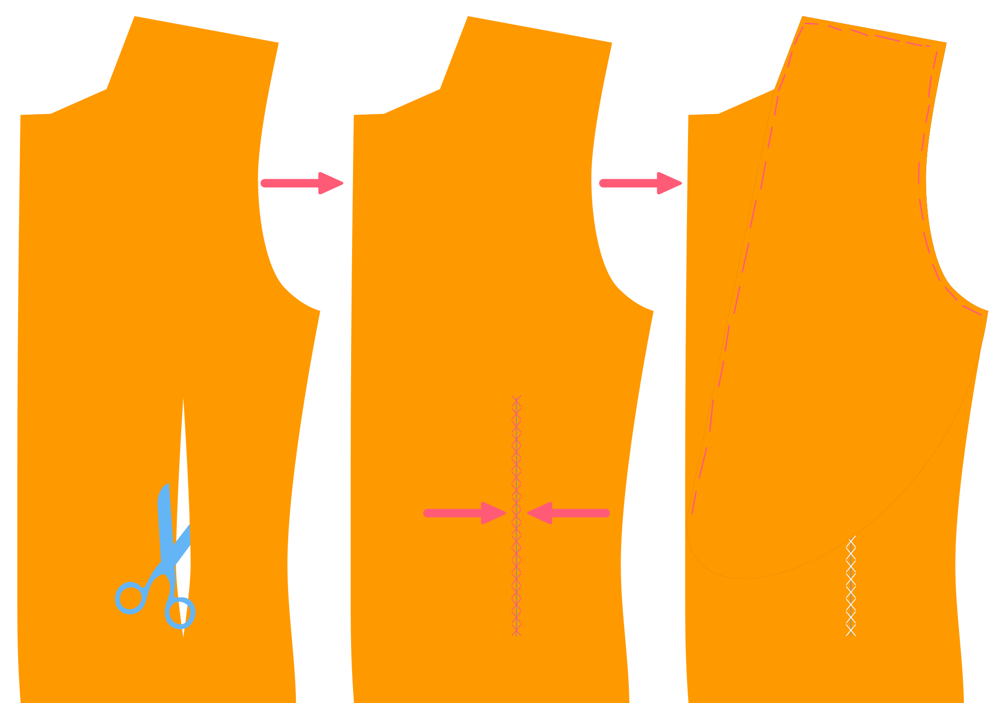

Cut out the front canvas piece in a light and supple canvas placed on the bias. Cut out the entire front.

Cut out the front dart and close it with a zig-zag stitch, making sure not to let the canvas overlap.

Cut out the chest canvas piece. Align it along the roll line, and baste it in place on front canvas piece.

> La pieza del cofre está marcada en la parte frontal de tu patrón.

#### Bastar lienzo en los frentes

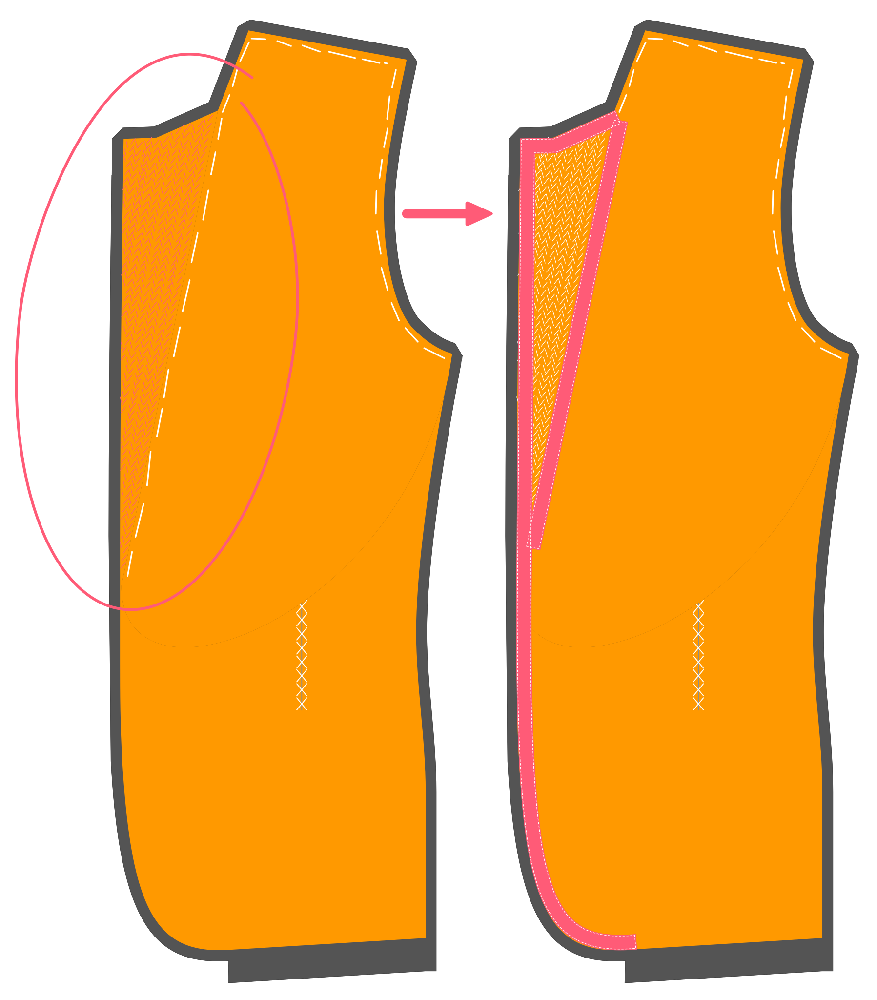

Now baste the front canvas and chest piece to your front. Keep in mind that the canvas has no seam allowance.

> Baste it a bit inwards from the seam line so you can fold it away when sewing these seams later.  
> You don't want your canvas to get caught in the seams.

#### Une tus lámparas

Time to feel like a real tailor, and pad-stitch those lapels.

Make sure to make the stitches a bit smaller towards the lapel tip, to make sure it lies flat against the chest, curling a bit inward instead of outward.

> If you're not sure how to pad-stitch the lapels, [let us know](https://discord.freesewing.org/) and we'll make an attempt to document it.

#### Toca el borde del lapel y la línea de rollo

Now we are going to hand-sew tailor tape along the lapel edges of the front, and along the roll line. This will also secure the canvas to the front here and there.

Keep in mind that:

- La cinta a lo largo de la línea de rollo debe colocarse dentro de la línea de rollo.
- La cinta a lo largo de la línea de rollo debe ser aproximadamente medio centímetro más corta que la distancia que se recorre. La ligera tensión que esto crea ayuda al lapel a rodar bien y al contorno al cuerpo.
- La cinta a lo largo del borde del lapel debe colocarse dentro de la línea de costura

> ##### No coser a través de tu tela
> 
> While sewing the tape to your front, avoid pushing your needle all the way through your fabric so that your stitches will show on the front.
> 
> Al mismo tiempo, tampoco debería asegurar la cinta sólo a su lienzo. Instead, you should try to catch a few threads of your fabric on every stitch, so that the tape is secured in place, yet the stitches don't show at the front.
> 
> Esto es menos un problema por encima del punto de ruptura de su lapel donde la tela estará en la parte trasera del lapel.

### Cerrar el cuerpo

#### Cerrar costuras laterales

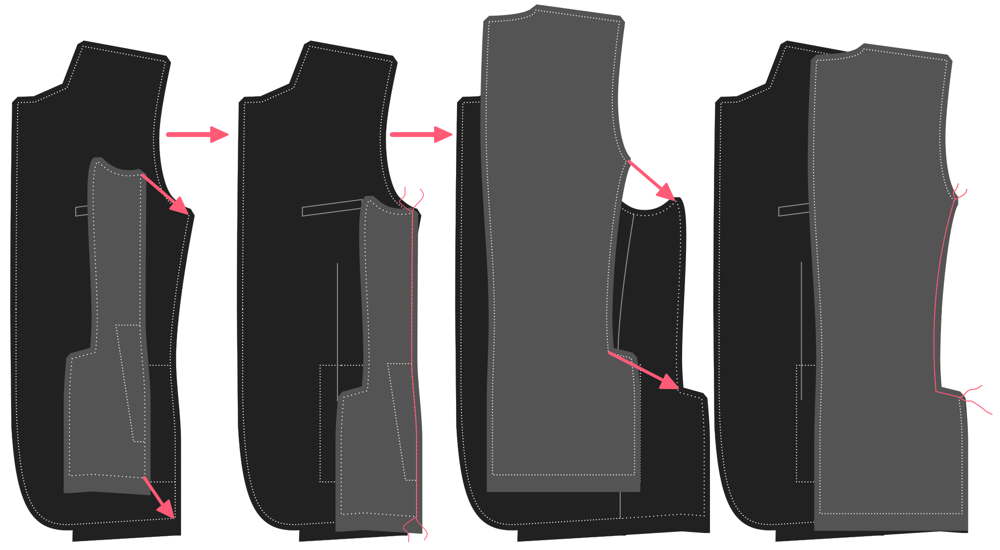

Place your front with the good side up, and your side on it with the good side down.  
Align the front/side seams, pin them in place if you feel like it, and sew them togther.

Place this down with the good side up, and place your back on top with the good side down.  
Align the back/side seams, pin them in place if you feel like it, and sew them togther.

> Asegúrese de que el lienzo no sea capturado en la costura.

> ##### Nota para los ventiladores de coser
> 
> Si tiene una doble ventana, esta costura contendrá la ventana.
> 
> Pase la parte descendente de la costura lateral/trasera y la parte lateral que forma la ventana. No coser a la baja después de eso.

#### Cerrar la costura trasera

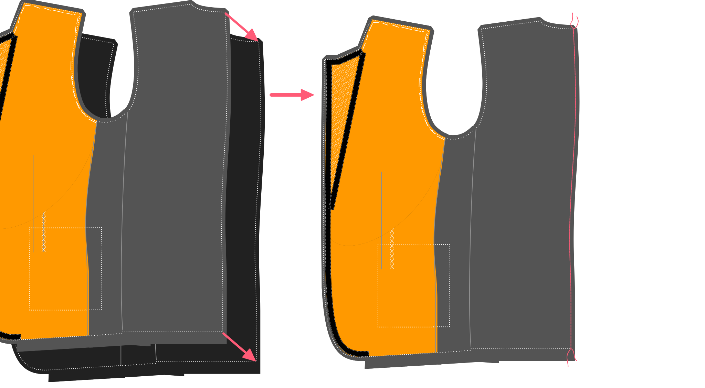

Aling your two half-jackets with the good sides together, and close the back seam.

<Note>

##### Nota para los ventiladores de coser

Si tienes una sola ventana, esta costura contendrá la ventana.

Difunde la parte descendente de la costura trasera y la parte lateral que forma la ventana.
No coser a la baja después de eso.

</Note>

#### Cerrar las costuras del hombro

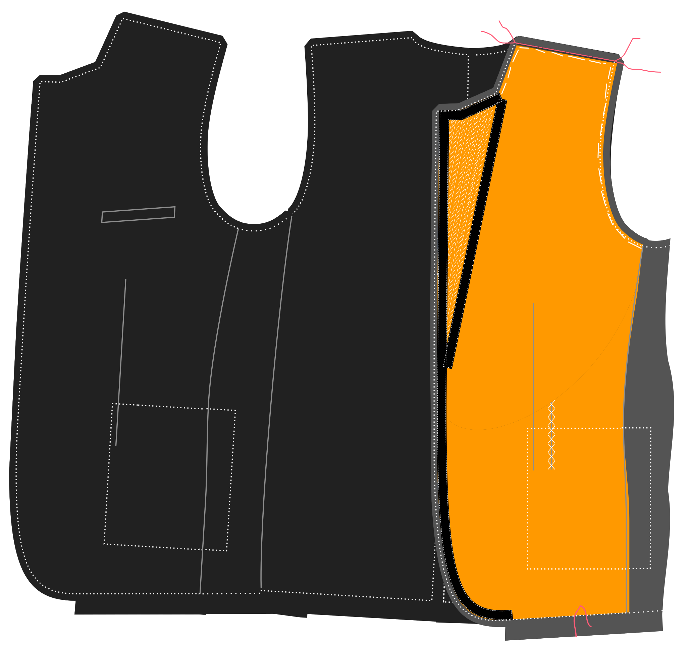

Align the shoulder seams with good sides together, and sew them together.

Make sure the canvas does not get caught in the seam.

<Note>

##### Alinear las escaleras del hombro

Asegúrate de alinear cuidadosamente los hombros basándose en las escaleras.
Debido a la diferente forma de los paneles traseros y frontales en el lado del cuello,
el borde de la tela se ve diferente. Así que alinear esos bordes no te dará
lo que necesitas.

Así que asegúrese de alinear las notas. Para eso están ahí.

</Note>

### Make the collar
In order to look real crisp, the collar should be symetrical on both sides. About 5mm difference is already visible to a collar, so the more precise you do these steps, the better.

### Add markings to both collars
But both collars on top of each other, baste the corners together and cut the basting. Then use a marking pencil or some chalk to mark the edges of the collar. Measure 2 times to make sure the remaining collars and the location of the corners are 100% identical on both corners 

#### Add interfacing or canvas to the outside collar stand and under collar
Either use a fusable interfacing, or, if you want to be hardcore use a horsehair canvas. Stich it to the outside collor stand using the same technique as when adding canvas to the lapel. 

#### Sew the outside collarstand to the under collar, and add to jacket
Make sure the outside collarstand and under collar are alligend and sew together Sew the outside collarstand+undercollar to the neckline of the jacket Give small cuts in the fabric around the neckline to give it more ease Cut the seam allowance in the corners diagonally for a better fit

### Sleeves
Sew the uppersleeve to the undersleeve untill the split

#### Create the split at the eng of the sleeve

Sew the other side of the sleeves Turn the sleeves with the good side out Add the sleeves to the jacket

### Inside pocket
<note>
The inside pocket is a double welt pocket. Which is the same as the front pockets but without a cover.
Please see images at the front pockets for details
</note>

Locate the position of the pocket on the left inner lining with basting Add some fusible interfacting around the area Draw the pocket on the interfacing. Add the  welts to the upper and lower side of the pocket Sew the welts on the line on both sides of the pocket. Make use the welts end exactly on top of eachother. Cut the pocket entrance to about 1 or 2 cm from the end. Cut the last part diagonally so you get a fish bone fcut Turn the welts inside out, baste and press Turn the triangles inside out, baste and press Sew around the pocket to put everything in place Take the pocketbag, sew it to the lower welt and the other part to the upper welt (See: chest pocket)

### Lining
Sew the lining back seam untill the split Sew the figure seams in the front parts Add the whole lining together (front, side, back) Add the from lining to the front facing. LEave about 5cm open from the bottom Close the shoulders Add the inside collar stand to the uppercollar and add to the lining jacket Make small cuts in the neckline and the corners Add upper to lower sleeves Add sleeves to lining jacket

### Close it up
But the jacket + lining jackets on top of each other with the good sides. Sew around the collar and continue all the way to the front facing Turn the jacket right side out Fold the sleeves in place (make sure they are not turned!!) Add the sleeves lining to the sleeves split Make sure the collars are straight on top of each other (they allign) and add the seam allowences to each other by hand. Add in a few places front SA to lining SA by hand from the inside of the jacket Create the backsplit and manually add the lining to the main fabric Add buttonholes and buttons

