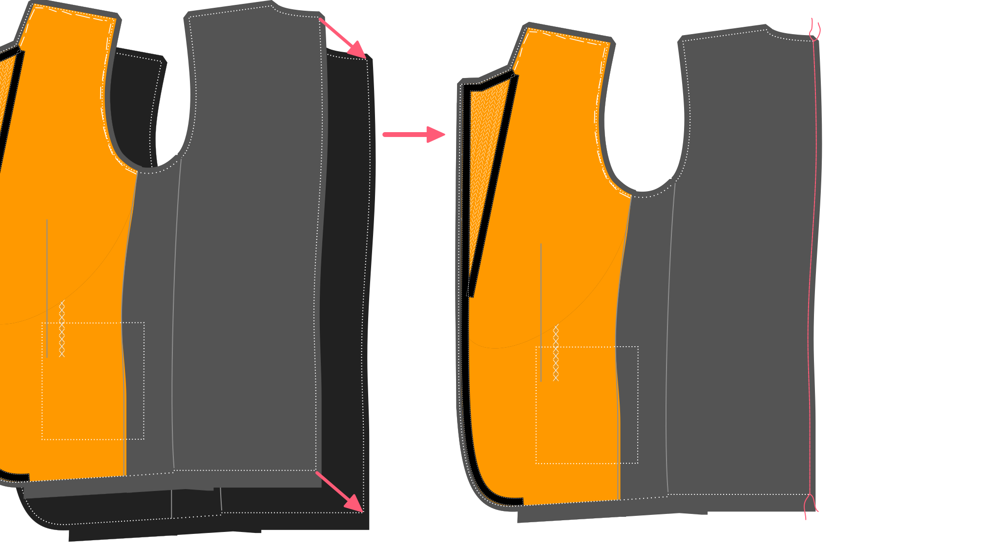

- - -
title: "Jaeger jacket: Sewing Instructions"
- - -

<Note>

###### Jaeger documentatie is in constructie

Deze documentatie is nog niet klaar.

</Note>

## Constructie

### Sluit de voorste nepen

#### Vouw dubbel

Fold the front double with the good sides together and pin it down so the fold is neatly in the middle of the front dart.

#### Stik de nepen

Sew the front dart close, taking care to have the dart stop at the correct top end. The bottom is not that important as it will be covered by the pockets. But the top end of the dart will be clearly visible, so please make sure to have it end at the same height at both sides.

#### Knip open en strijk

Once the front darts are closed, cut open the dart at the back. You won't be able to cut it open all the way to the tip, but that's fine. Press open the darts where they are cut open, and press the rest to the side. Take care to only press from the back. Pressing from the front will likely mark your fabric.

### Maak de borstzak

#### Bevestig kleefbare tussenvoering

Apply a rectangular piece of light fusible interfacing around the chest pocket area so that it extends a few cm in all directions.

> ##### We plakken niet het hele voorpand vol
> 
> Sportieve jasjes worden meestal gemaakt van iets zwaardere stoffen. Dat, en het feit dat ik liever canvas gebruik in plaats van fusibele tussenvoering, betekent dat ik de voorkant niet met nutteloos draait.

#### Drieg de omtrek van de bies, markeer de eindpunten van de bovenrand

With the fusible in place, thread a needle and baste around the chest pocket to transfer the markings to the good side of the fabric.

This pocket differs from a traditional welt pocket. The welt extends above the pocket opening. This hides the pocket bag without the need for facings. The top part of the opening is also smaller than the welt, allowing you to slip-stitch it closed.

On the top line of your basted welt pocket, mark 0.5cm inwards from the corners of the top line.

> Deze punten zijn merktekens op het voorpand van je patroon.

#### Vouw, strijk en stik de zijnaden van de paspel

Fold the welt double with the good sides together, and close the sides (sew the side seams).

#### Knip naadwaarde bij, keer en strijk

Trim the seam allowances on the sides and especially limit the seam allowance towards the corner to avoid bulk.

Turn inside out so the good side is out and press.

> Wees voorzichtig dat je niet te hard strijkt aangezien je aan de goede kant werkt.

#### Drieg de onderrand van de paspel zodat je weet waar te naaien

Baste a stitching guide at the bottom of the welt to mark the welt/seam allowance boundary. This will be the line to sew on later.

#### Stik de paspel aan het voorpand

Place welt down on good side of front with the folded side downwards, and sew to bottom line. Make sure to stop and start exactly at the edge of the line you basted.

#### Stik het borstzakdeel aan het voorpand

Place the pocket bag down on the front. The front with good side up, but the pocket bag with bad side up. Make sure to have the longest side of the chest pocket bag on the highest side of the chest pocket.

> Enkel schuine borstzakken hebben een hoge en een lage kant.

Sew this in place along the top line. Remember this should be shorter than the bottom row of stitches to attach the welt, since you marked 0.5cm inwards from the corners.

> Aangezien het zakdeel waarschijnlijk een glad stofje is, is het geen slecht idee dit op z'n plaats te spelden of driegen voor je het stikt.

#### Knip de zakopening, keer en strijk

 Now cut open your welt in the middle of both seamlines. Don't cut to the edge, but create a trianngular shape there.

Flip the pocket bag and welt to the backside by passing both of them through the opening you just created.

Get everything to lay nice and flat, and press.

Now, bring the welt only to the front and get it to lie nice and flat. Press again from the back.

> Het is verleidelijk dit langs de voorkant te strijken, maar beheers jezelf.

#### Werk de borstzak af

On the backside, fold the pocket bag double and sew it to the pocket welt below the existing seamline of the welt.

Thread a needle and hand-finish the chest pocket by sewing down the sides of the welt to the front panel (don't let your stitches show on the front).

Finally, close the pocket bag by sewing the sides. Do this by placing the front down with the good side up. Then fold over each side and sew the pocket bag. While sewing these sides, make sure to catch those triangular little pieces of the opening. This will reinforce the pocket opening.

Baste the chest pocket closed while we contruct the jacket.

### Bereid de voorpanden voor

Cut out the front canvas piece in a light and supple canvas placed on the bias. Cut out the entire front.

Cut out the front dart and close it with a zig-zag stitch, making sure not to let the canvas overlap.

Cut out the chest canvas piece. Align it along the roll line, and baste it in place on front canvas piece.

> Het borststuk is aangeduid op het voorpand van je patroon.

#### Drieg haardoek aan de voorpanden

Now baste the front canvas and chest piece to your front. Keep in mind that the canvas has no seam allowance.

> Base it a bit inwards from the seam line so you can fold it away when sewing these seams later.\
    You don't want your canvas to get caught in the seams.

#### Pikeer je revers

Time to feel like a real tailor, and pad-stitch those lapels.

Make sure to make the stitches a bit smaller towards the lapel tip, to make sure it lies flat against the chest, curling a bit inward instead of outward.

> Als je niet zeker weet hoe je de kippen stikt, [laat het ons weten](https://discord.freesewing.org/) en we doen een poging om het te documenteren.

#### Revers contouren en breuklijn

Now we are going to hand-sew tailor tape along the lapel edges of the front, and along the roll line. This will also secure the canvas to the front here and there.

Keep in mind that:

- Het lint langs de breuklijn moet binnen de breuklijn geplaatst worden.
- Het lint langs de breuklijn moet ongeveer een halve centimeter korter zijn dan de afstand die het moet overbruggen. De lichte spanning op het lint zorgt dat de revers mooi rollen en zich naar je lichaam vormen.
- Het lint langs de rand van de revers valt binnen de stiklijn

> ##### Naai niet door je stof
> 
> Probeer je naald niet helemaal door de stof te duwen als je het lint vastnaait, zo vermijd je dat je steken zichtbaar zijn aan de buitenkant.
> 
> Het is echter niet de bedoeling dat je het lint enkel aan het haardoek vastnaait. In plaats daarvan moet je proberen om elke steek een paar draadjes van je stof te halen. zodat de band vastzit en de steken niet zichtbaar zijn aan de voorkant.
> 
> Dit is minder problematisch boven het breekpunt van de revers, waar de stof aan de achterkant komt te liggen.

### Sluit de naden

#### Stik de zijnaden

Place your front with the good side up, and your side on it with the good side down.\
Align the front/side seams, pin them in place if you feel like it, and sew them togther.

Place this down with the good side up, and place your back on top with the good side down.\
Align the back/side seams, pin them in place if you feel like it, and sew them togther.

> Let op dat het haardoek niet mee vastgestikt wordt.

> ##### Opmerking voor het naaien van splitten
> 
> Als je een dubbele split hebt, zitten die in deze naad.
> 
> Stik het deel van de zij- achternaad tot aan de split en het stukje naar opzij dat de split vormt. Stik niet verder naar beneden.

#### Sluit de achternaad

Aling your two half-jackets with the good sides together, and close the back seam.

<Note>

##### Let op voor het naaien van vents

Als je een enkele split hebt, zit deze naad in de vent.

Stik het deel van de achternaad tot aan de split en het stukje naar opzij dat de split vormt.
Stik niet verder naar beneden.

</Note>

#### Sluit de schoudernaden

Align the shoulder seams with good sides together, and sew them together.

Make sure the canvas does not get caught in the seam.

<Note>

##### Leg de schoudermerktekens uit

Zorg ervoor dat de schouders op basis van de merktekens goed op elkaar worden afgestemd.
Vanwege de verschillende vorm van de achter- en voorpanden aan de nekzijde,
ziet de rand van de stof er anders uit. Dus het aanpassen van deze randen geeft je niet
wat je nodig hebt.

Dus zorg dat je op de merktekens afgaat. Daar dienen ze voor.

</Note>
