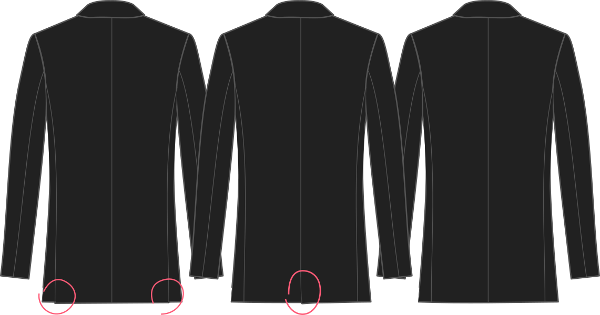

Comment aimez-vous vos fentes de dos ?

*   Deux fentes arrières (affichées à gauche)
*   Un panneau arrière central (affiché au milieu)
*   Pas de fentes arrière (affichées à droite)

## Effet de cette option sur le motif

