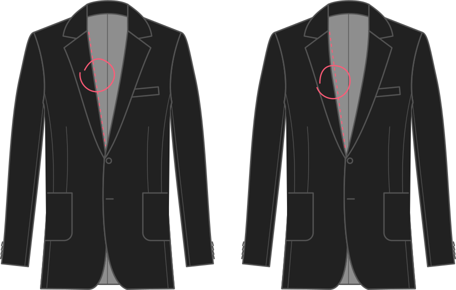

- - -
title: "Chest shaping"
- - -

The vertical amount to slash & spread the upper front panel to shape the chest, as a factor of your chest circumference.

## Effect of this option on the pattern

