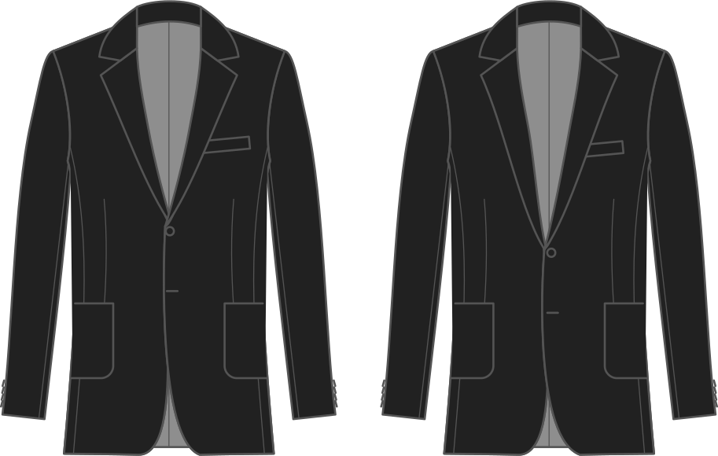

Die Lage des Hotels ist ideal für eine Städtereise oder für eine Städtereise. Niedrigere Werte sind näher an der Taille, höhere Werte näher an der Brustlinie.

## Effekt dieser Option auf das Muster

