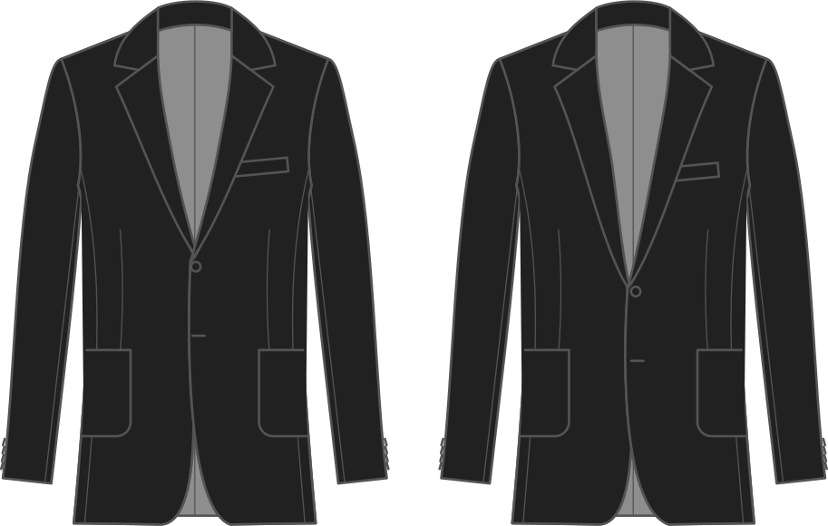

- - -
title: "Lapel start"
- - -

Ubicación del punto de ruptura del lapel (donde comienza la apertura delantera). Los valores más bajos están más cerca de la cintura, valores más altos más cercanos al castillo.

## Efecto de esta opción en el patrón

