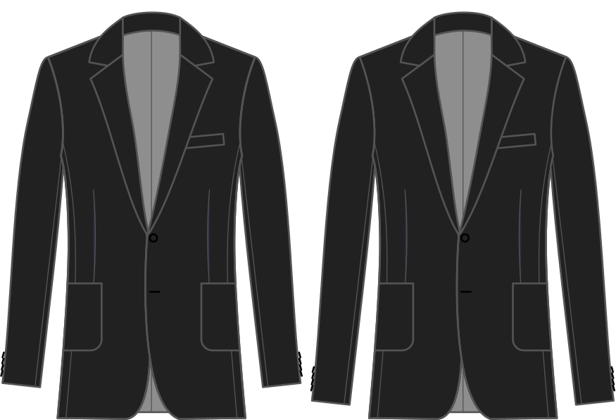

- - -
title: "Sleeve length bonus"
- - -

Der Betrag, um den Ärmel über die Länge des Ärmels im Basisblock hinaus zu verlängern.

<Note>

###### Dies soll nicht Null sein

Wenn diese Einstellung auf Null gesetzt wird, wird die Hülsenlänge gleich der Basislänge des Schloßblocks sein,
ist für einen Mantel sicher zu kurz.
Bitte beachten Sie den Standardwert und verwenden Sie dies als Grundlage, um den Ärmel zu verlängern oder zu verkürzen.

</Note>

## Effekt dieser Option auf das Schnittmuster

