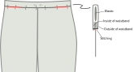

<Tip>

##### Eine Notiz über die Naht endet

bevor du loslegst, möchtest du über deine Nahtmethode entscheiden, oder wie Sie
die rohen Nähte entlang der Beine Ihrer Hosen aufräumen, um sie vor dem Ausbrüchen zu bewahren. Es gibt viele
Optionen dafür. Gewöhnliche Wahl ist die Beschichtung der rohen Kanten oder mit französischen Nähten, um
die rohen Kanten zu umhüllen.

Für diese Anweisungen gehen wir davon aus, dass Sie einen Serger für die Naht verwenden, aber wir
bieten auch Alternativen an. Weitere Optionen für die Bearbeitung von Nähten beinhalten das Schneiden von
Scheren mit rosa Scheren Das Nähen eines Zick-Zick-Zack am Rand der Naht, um ihn vor dem Ausziehen zu bewahren oder mit
Bänder zu binden. </Tip>

## Schritt 1: Baue die hinteren Taschen

Planen Sie den Einsatz von Welttaschen in die Rückseite Ihrer Paco Hosen? Das ist großartig! Dies ist wohl der schwierigste Teil, und wir werden es zuerst schaffen. If not, you can skip ahead to the next step, preparing the front pockets.

Bauen Sie die Taschen auf der Rückseite Ihrer Hose, einschließlich der Tasche Tasche.

<Tip>

##### Welt Taschen

Eine Welttasche zu bauen ist eine Technik, die verwendet wird ist verschiedene Kleidung. Aus diesem Grund ist es
in eine eigene Dokumentationsseite verzweigt.

Es gibt sowohl schriftliche Dokumentation als auch eine Videoserie, die Ihnen zeigt, wie Sie es machen können Selbst wenn
Sie noch nie Welttaschen gemacht haben, sind Sie in Ordnung.

[Zur Welt Taschendokumentation](https://freesewing.org/docs/sewing/double-welt-pockets/)

</Tip>

<!--- One tricky bit, this documentation is for double welts, but this is I think a single welt?
Does it need a note to that effect? --->

## Schritt 2: Bereiten Sie die Vordertaschen vor

Your pockets are cut from a lining material, which can save on weight and bulk, but also means that you'll want to hide them a little bit inside the side seam, so the lining doesn't show. Die Außennaht der Beine entlang der Außennaht dient genau diesem Zweck.

Wenn Sie einen Server, servieren Sie die geschwungenen Kanten Ihrer Taschen. Then, serge along the long edges of the pocket flaps.

## Schritt 3: Taschen an Hosen anhängen

With [good sides together](https://freesewing.org/docs/sewing/good-sides-together/), line up the markings on the edge of the pocket bag with the ends of the flap along the outside seam of the front leg. Nähen zusammen. Wiederholen für das zweite Bein.

Jetzt machen Sie das Gleiche mit den Hinterbeinen. With good sides together, line up the markings on the edge of the pocket bag with the ends of the flap along the outside seam of the back leg. Before sewing, make sure that your left leg front and back are attached to one pocket, and your right leg front and back are attached to the other. Nähen zusammen.

Drücken Sie alle Nähte auf die Hose (weg von der Tasche).

<Note>

Optional: Du kannst hier einen Millimeter oder zwei Millimeter aus der Naht auf jeder Seite der Tasche
unterstichen um die Klappen und Taschen so zu befestigen, wie Sie sie gedrückt haben.

</Note>

## Schritt 4: Bereiten Sie die Seitennaht und Tasche vor

Sie sollten jetzt zwei große Stücke haben, jedes mit einem Vorder- und Rückenbein, das an einer Tasche befestigt ist.

Nehmen Sie eines der Stücke und platzieren Sie die Vorder- und Rückseite gut nebeneinander. Align the outer side seam, so that the side seam of the leg pieces match up, and the pocket bag edges are aligned, with good sides together.

## Schritt 5: Nähte die Seitennaht

Sie nähen zwei Nähte, um die Seitennähte zu nähen, während Sie die Taschen offen lassen.

Beginnen Sie an der Spitze der Beinstücke. Nähen Sie entlang der Seitennaht, Schwenken, wenn Sie die Tasche zu erreichen. Sie können hier auch Ihre Nahtlänge verkürzen, um die Ecke der Taschenöffnung zu verstärken. Folgen Sie der Seitennaht, drehen Sie wieder und enden Sie an der Spitze der Tasche.

Als nächstes schließen Sie den Untergrund der Tasche und nähen den Rest der Seitennaht. Start at the bottom edge of the pocket bag, sewing along the bottom of the pocket, then pivoting when you get to the side seam of the pants. You can use a shorter stitch length for the first few stitches on the side seam, to reinforce the bottom of the pocket opening. Nähen Sie den ganzen Weg nach unten die Beinseitennaht.

Wiederholen für das zweite Bein.

## Schritt 6: Beende die Seitennaht

Die Fertigstellung dieser Nähte erfordert eine gewisse Delikatesse vor allem um die Hosentaschen herum.

It would be difficult to finish the top part of the side seam with a serger, so we'll use a zig-zag stitch. Starting at the top of the side seam, zig-zag stitch along the raw edge of the seam allowance, pivoting around the pocket opening. Continue the zig-zag stitch up the side of the pocket, unless you've serged your pockets already (in which case you can stop when you reach the pocket).

Die untere Öffnung der Tasche ist eine enge Ecke. To finish the seam around this corner, zig-zag stitch the raw edge of the seam allowance, starting where it joins the pocket, pivoting at the corner and continuing about 5 cm (2 in.) down the side seam. You can continue finishing the side seam with a zig-zag stitch all the way down. Alternatively, you can serge the side seam, making sure to stop the line of serger stitches a little ways from the pocket.

<Note>

Achten Sie darauf, diese Serger-Nähte zu sichern. Sie werden nicht in anderen Nähten gefangen, daher riskieren sie
aufzulösen, wenn sie unsicher bleiben.

</Note>

Wiederholen für das zweite Bein.

Drücken Sie die Seitennaht auf die Vorderseite.

<Note>

Dies kann sich als unintuitiv empfinden, da viele Hosen darauf hindeuten, dass die Seitennaht nach hinten gedrückt wird.
Mit Inseam-Taschen wollen Sie jedoch, dass die Taschen auf die Vorderseite der Hose gedrückt werden. Deine
Taschen kämpfen gegen deine Seitennaht, wenn du die Naht auf die Rückseite drückst so drücken wir es alles
nach vorne. Dies wird zu einem glatteren Ende führen.

</Note>

<Note>

Die Ecken einer Taschenöffnung sind einer der am wahrscheinlichsten verschleißenden Orte besonders
, wenn du deine Taschen viel verwendest. Wenn du Angst davor hast, an den Ecken deiner Taschen zu reißen, oder
, wenn dein Stoff delikater ist, Sie können die Taschenöffnungen mit Balken entlang der Nahtlinie
verstärken, direkt außerhalb der Taschenöffnungen.

</Note>

## Schritt 7: Ankertasche zum Taillen

Die Taschen in Paco sind an der Taille verankert. This means that you can put things in your pockets without them becoming unsightly bump that’s just dangling around in your trouser leg.

To anchor each pocket, align the top of the pocket with the mark along the waistline of your pattern. Nähen Sie eine Linie von Bastnähten innerhalb Ihrer Nahtzugabe, um die Tasche an der Stelle zu halten.

## Schritt 8: Nähen und beenden Sie die Inneams

Richten Sie die Inseams mit guten Seiten zusammen und nähen Sie dann die Inseams. Finish the seams the same way you finished the side seams. Drücken Sie InNaht auf die Rückseite.

## Schritt 9: Nähen und Fertigstellen der Schrittnaht

To attach the individual legs, flip one leg good side out (it doesn't matter which leg), then place it inside the other leg, good sides together. You should now have what looks like just one pant leg, with wrong sides visible. Align the center front, center back, and inseams of each leg, then pin along the length of the crotch seam. Nähen und fertig die Schrittnaht.

<Note>

Wenn Sie von der Mitte vorne nach hinten nähen es ist einfacher, Ihre Inseam-Nahtzustände
auf die Rückseite zu drücken, wenn sie durch die Maschine eingespeist werden.

</Note>

## Schritt 10: Stellen Sie die Ösen für die Zeichenfolge ein (optional)

Markieren Sie die Mitte Ihrer Taillenlänge. Fold one of your waistband pieces double, and mark the middle of the width (do not take the seam allowance into account).

Ein bisschen nach links und rechts davon können Sie zwei Ösen hinzufügen, um eine Zeichenfolge durchzulassen. Da deine Paco Hosen im Hüftgurt elastisches Band haben, ist dies ein schönes Detail, jedoch ist es nicht notwendig.

<Tip>

##### Es ist am besten, Verstärkung

hinzuzufügen, wenn du einen Stoff gewählt hast, der rutschig ist drapey, oder dünn, möchten Sie vielleicht einige Verstärkung
hinter diesen Ösen hinzufügen. Ein bisschen Schnittstellen oder ein übrig bleibendes Denim-Stück wird gut funktionieren.

</Tip>

## Schritt 11: Bereiten Sie die Taille elastisch vor

Es gibt keine Zauberformel für die Länge Ihrer Elastik. So you wrap it around your waist and pull it tight until you get a good fit. Paco is cut to sit at the high hip, so make sure your elastic is long enough to sit comfortably at the high hip.

Markieren Sie diese Länge, schneiden Sie die elastische und verbinden Sie die beiden Enden zusammen.

## Schritt 12: Betrete die Taille

Platzieren Sie die beiden Taillenbänder gut an den Seiten und richten Sie die kurzen Kanten aus. Sew the short edges together, then press open. These will be inside the waistband, so you don't need to finish the edges of these seams unless your fabric is particularly likely to fray.

Falten Sie die Taille doppelt entlang der Länge, mit guten Seiten aus, und drücken Sie sie. This fold will be the top of your waistband.

## Schritt 13: Hänge die Taille an

Sie haben zwei Optionen zum Befestigen Ihrer Taillenband. One is a bit simpler, but leaves an exposed seam on the inside. Der andere ist ein bisschen getrunkener, aber er schließt die rohen Kanten Ihres Stoffes ein.

### Die einfachere Methode

Halten Sie Ihre Taille gefaltet doppelt, und legen Sie die elastische Innenseite. Make sure to align the place where the elastic is joined with the back of the waistband (opposite the eyelets).

Find the center front of your waistband (easy if there are eyelets, if not just fold it double), and align that with the center front seam of your pants. Make sure that your waistband is outside of your pants, with good sides together. Pin-Platz.

<Tip>

##### Achte auf deine eyelets

wenn du die eyelets in deiner Taille gemacht hast überprüfen Sie, ob sie nach außen hin platziert sind,
nicht die Innenseite Ihrer Taille.

</Tip>

Als nächstes richten Sie die Mittenstützen und den Pin in der Mitte nach Bedarf mit zusätzlichen Pins um die Taille aus.

Nähen Sie die Taille an die Hose, so nah wie möglich an der Elastik, aber nicht in die Elastik.

It’s fine to not sew too close the first time around, and once your elastic is attached and encased, make a second round to sew it a bit more snugly.

Entfernen Sie alle Blasenstiche von den Hosentaschen.

Beenden Sie die Naht mit einem Serger oder einer anderen Methode.

### Die beigefügte Nahtmethode

Öffne die Baille. You will still be able to see the fold along its length, but you will be working with each side of the waistband individually.

Find the center front of your waistband (easy if there are eyelets, if not just fold it double), and align that with the center front seam of your pants. Make sure that your waistband is outside of your pants, with good sides together. Pin-Platz.

<Tip>

##### Mind your eyelets

To make sure your eyelets will end up on the outside, make sure they are closer to the top of your
waistband, above the fold, for now.

</Tip>

Als nächstes richten Sie die Mitte der Taille mit der Mitte hinten Naht aus. Pin-Platz. Then, add additional pins around the waistband as needed.

Nähen Sie die Taille an die Hose.

Drücke die Taille nach oben. Press the seam allowance in on the opposite side of the waistband, maintaining the fold along the center of the waistband.

Die Taille neu einklappen und die Hälfte des Taillenbandes nach innen drehen. Pin so that the seam allowance on the inside is just below the seam joining the waistband to the pants, and pin in place around the waistband. Von außen sticht man im Graben und fängt dabei die innere Taille.

<!--- Probably put a note here about stitching in the ditch? --->

## Schritt 14: Bereiten Sie die Manschette elastisch vor

As you did with the waistband elastic, wrap the elastic for your cuff around your ankle and pull it tight until you get a good fit.

Markieren Sie diese Länge, schneiden Sie die elastische und verbinden Sie die beiden Enden zusammen. Wiederholen für die andere Manschette elastisch.

## Schritt 15: Join the Manschetten

Fräsen Sie jede Manschette mit guten Seiten zusammen und richten Sie die kurzen Kanten aus. For each cuff, sew the short edges together, then press open. These will be inside the cuff, so you don't need to finish the edges of these seams unless your fabric is particularly likely to fray.

Falten Sie jede Manschette doppelt entlang der Länge, mit guten Seiten aus, und drücken Sie sie. This fold will be the bottom of your cuffs.

## Schritt 16: Füge die Manschetten hinzu

Sie werden Ihre Manschetten auf die gleiche Weise anbringen, wie Sie die Taille befestigt haben. As with the waistband, there are two options - a simpler choice, and a choice without exposed seams on the inside.

<Note>

Wenn Ihre Nähmaschine ein abnehmbares Bett hat (normalerweise entfernt, um den "freien Arm" für das Nähen von
Ärmelschellen auszusetzen), Dies wird das Nähen der Manschetten erleichtern.

 </Note>

### Die einfachere Methode

Halten Sie Ihre Manschetten doppelt, und legen Sie die elastische Innenseite.

Die Naht in der Manschette mit dem Inseam der Hose ausrichten. Make sure that your cuff is outside of your pants, with good sides together. Nähen Sie den Rest des Weges um die Manschette an.

<Tip>

##### Anlegen der Manschetten

wird die Manschetten schwieriger anzupinnen. Um sicherzustellen, dass deine Manschetten gleichmäßig
an die Hose gesteckt werden platzieren Sie den zweiten Pin auf der gegenüberliegenden Seite des Beins von der ersten Seite. Du kannst
die Elastik dehnen, um sicherzustellen, dass alles glatt ist, dann platzieren Sie Ihre nächsten Pins auf halbem Wege
zwischen den ersten beiden. Auf diese Weise fortfahren, auf halbem Weg zwischen anderen Pins fixieren, bis du sicher bist, dass
genug ist.

</Tip>

Nähen Sie die Manschette auf die Hose Öffnung, so nah wie möglich an der elastischen wie möglich, aber nicht in die Elastik.

Beenden Sie die Naht mit einem Serger oder einer anderen Methode.

### Die beigefügte Nahtmethode

Öffne die Manschette. You will still be able to see the fold along its length, but you will be working with each side of the cuff individually.

Die Naht in der Manschette mit dem Inseam der Hose ausrichten. Make sure that your cuff is outside of your pants, with good sides together. Nähen Sie den Rest des Weges um die Manschette an.

Nähen Sie die Manschette an die Hose.

Drücken Sie die Manschette weg von der Hose. Press the seam allowance in on the opposite side of the cuff, maintaining the fold along the center of the cuff.

Die Manschette neu einklappen und die Hälfte der Manschette nach innen drehen. Pin so that the seam allowance on the inside is just past the seam joining the cuff to the pants, and pin in place around the cuff. From the outside, stitch in the ditch, catching the inner cuff as you go.

## Schritt 17: Nähen der Manschetten und der Taille (optional)

Wenn Sie eine breitere Manschette elastisch haben, können Sie eine horizontale Linie auf halbem Weg nach oben stecken. This will hold your elastic in place and help keep it from folding or twisting. Make sure to stretch the elastic evenly as you sew, so that it gathers the fabric evenly. (If you sew without stretching the elastic, you risk lumpy gathers and a leg opening too narrow to get your foot through.)

<!--- You could also do a zig-zag stitch here, but I think straight probably looks nicer? --->

If you like the look, you can also sew more than one line of stitches, evenly spaced between the top and bottom of the cuff.

Das Gleiche können Sie auch für die Taille tun.

<Note>

Wenn du Ösen für eine Zeichenkette einfügst, nähst du eine Linie von Nähten über den Ösen und eine separate Linie
unter den Ösen lassen Sie einen Kanal breit genug für Ihre Zeichenkette.

</Note>

## Schritt 18: Thread eine Zeichenfolge um die Taille herum (optional)

If you put eyelets in your waistband, thread a drawstring through one eyelet, around the waist, and out of the other eyelet.

<Note>

Es gibt Werkzeuge, um diese Aufgabe zu erleichtern, aber eine, die fast jeder hat, ist ein einfacher Sicherheitsstift.
Den Sicherheitspin an einem Ende deiner Zeichenkette anheften und dann durch den Kanal drücken. Der Sicherheitspin
wird leichter durch den Stoff manövrieren, und er wird die Zeichenfolge mitziehen.

</Note>

## Schritt 19: Genießen Sie Ihre Paco Hose!

Du hast es getan! Wie geht's!

<!--- Maybe we want to put a fun gif here? --->
