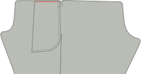
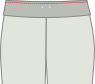
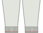
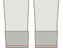

- - -
title: "Paco pants: Sewing Instructions"
- - -

<Tip>

##### Una nota sobre la costura termina

Antes de empezar, querrá decidir sobre el método de finalización de la costura, o cómo se aprieta
las costuras crudas a lo largo de las piernas de sus pantalones para evitar que se desgasten. Hay muchas
opciones para esto. Las opciones comunes son golpear los bordes crudos, o usar costuras francesas para encascarar
los bordes crudos.

Para estas instrucciones, asumiremos que está usando un serger para que finalice la costura, pero también proporcionaremos
alternativas. Otras opciones para terminar costuras incluyen traparlos con fragmentos de color
, enrollar un zig-zag a lo largo del borde de la costura para evitar que se descongele, o enlazar con
cinta de sesgo.

</Tip>

## Paso 1: Construir los bolsillos de respaldo

Are you planning to insert welt pockets in the back of your Paco pants? Is so, awesome! Is so, awesome! This is arguably the trickiest part, and we'll accomplish it first. If not, you can skip ahead to the next step, preparing the front pockets.

Construct the welt pockets at the back of your trousers, including the pocket bag.

<Tip>

##### Bolsillos de mundo

Construir un bolsillo de soldadura es una técnica que se utiliza es una ropa diferente. Ésa es la razón por la que
lo ramitió en su propia página de documentación.

Hay documentación escrita y una serie de vídeo que muestra cómo hacerlo, así que incluso si
nunca has hecho pockets de soldadura antes, estarás bien.

[A la documentación de pockets de soldado](https://freesewing.org/docs/sewing/double-welt-pockets/)

</Tip>

## Paso 2: Prepara los pockets frontales

Your pockets are cut from a lining material, which can save on weight and bulk, but also means that you'll want to hide them a little bit inside the side seam, so the lining doesn't show. The flap along the outside seam of each leg is for just this purpose.

If you are using a serger, serge the curved edges of your pocket pieces. Then, serge along the long edges of the pocket flaps.

## Paso 3: Adjuntar bolsillos a pantalones

With [good sides together](https://freesewing.org/docs/sewing/good-sides-together/), line up the markings on the edge of the pocket bag with the ends of the flap along the outside seam of the front leg. Sew together. Repeat for second leg.

Now do the same with the back legs. With good sides together, line up the markings on the edge of the pocket bag with the ends of the flap along the outside seam of the back leg. Before sewing, make sure that your left leg front and back are attached to one pocket, and your right leg front and back are attached to the other. Sew together.

Press all seams toward the pants (away from the pocket bag).

<Note>

Opcional: Puedes unirte aquí, un milímetro o dos desde la costura a cada lado de la bolsa
del bolsillo para asegurar las aletas y bolsas de bolsillo juntas de la manera en que las ha presionado.

</Note>

## Paso 4: Prepara las costuras laterales y bolsa de bolsillo

You should now have two big pieces, each with a front and back leg attached by a pocket.

Take one of the pieces, and place the front and back leg good sides together. Align the outer side seam, so that the side seam of the leg pieces match up, and the pocket bag edges are aligned, with good sides together.

## Paso 5: Aplasta las costuras del lado

You'll sew two separate seams to stitch up your side seams while leaving your pockets open.

Start at the top of the leg pieces. Sew along the side seam, pivoting as you reach the pocket bag. You can also shorten your stitch length here to reinforce the corner of the pocket opening. Follow the side seam, pivoting again and ending at the top of the pocket.

Next, you'll close the bottom of the pocket bag and stitch the rest of the side seam. Start at the bottom edge of the pocket bag, sewing along the bottom of the pocket, then pivoting when you get to the side seam of the pants. You can use a shorter stitch length for the first few stitches on the side seam, to reinforce the bottom of the pocket opening. Sew all the way down the leg side seam.

Repeat for second leg.

## Paso 6: Termina las costuras del lado

Finishing these seams requires a touch of delicacy, especially around the tops of the pockets.

It would be difficult to finish the top part of the side seam with a serger, so we'll use a zig-zag stitch. Starting at the top of the side seam, zig-zag stitch along the raw edge of the seam allowance, pivoting around the pocket opening. Continue the zig-zag stitch up the side of the pocket, unless you've serged your pockets already (in which case you can stop when you reach the pocket).

The bottom opening of the pocket is a tight corner. To finish the seam around this corner, zig-zag stitch the raw edge of the seam allowance, starting where it joins the pocket, pivoting at the corner and continuing about 5 cm (2 in.) down the side seam. You can continue finishing the side seam with a zig-zag stitch all the way down. Alternatively, you can serge the side seam, making sure to stop the line of serger stitches a little ways from the pocket.

<Note>

Asegúrate de asegurar estas cintas de serger. No serán capturados en ninguna otra costura, así que se arriesgan a
deshacer si se deja sin protección.

</Note>

Repeat for second leg.

Press the side seams toward the front.

<Note>

Esto puede sentirse contraintuitivo, ya que muchos pantalones sugieren presionar las costuras laterales hacia la espalda.
Sin embargo, con los bolsillos de costura, querrás que los bolsillos se aprieten hacia el frente de los pantalones. Tus
bolsillos lucharán contra tu costura si pulsas la costura hacia atrás, así que lo pulsaremos todo
al frente. Esto resultará en un acabado más suave.

</Note>

<Note>

Las esquinas de una abertura de bolsillo son uno de los lugares más probables para desgastarse o desgarrar, especialmente
si utilizas un montón de bolsillos. Si te preocupa rasgar en las esquinas de tus bolsillos, o
si tu tela es más delicada, puedes reforzar las aberturas de bolsillo con botas de barra a lo largo de la línea de costura
, justo fuera de las aberturas de bolsillo.

</Note>

## Paso 7: Bolsa de pocket de Anclaje a cintura

The pockets in Paco are anchored at the waist. This means that you can put things in your pockets without them becoming unsightly bump that’s just dangling around in your trouser leg.

To anchor each pocket, align the top of the pocket with the mark along the waistline of your pattern. Sew a line of basting stitches inside your seam allowance to hold the pocket in place.

## Paso 8: Aplasta y termina los incubadores

Align the inseams with good sides together, then sew up the inseams. Finish the seams the same way you finished the side seams. Press inseams to the back.

## Paso 9: Mezclar y terminar la costura de cromo

To attach the individual legs, flip one leg good side out (it doesn't matter which leg), then place it inside the other leg, good sides together. You should now have what looks like just one pant leg, with wrong sides visible. Align the center front, center back, and inseams of each leg, then pin along the length of the crotch seam. Sew and finish the crotch seam.

<Note>

Si coser de frente central al centro de espalda Es más fácil mantener tus permisos de costura incrustada
presionados al dorso mientras se alimentan a través de la máquina.

</Note>

## Paso 10: Coloca los eyelets para la cadena de dibujo (opcional)

Mark the middle of your waistband length. Fold one of your waistband pieces double, and mark the middle of the width (do not take the seam allowance into account).

A bit to the left and right of this, you can add two eyelets to pass a drawstring through. Because your Paco pants have elastic in the waistband, as well, this is a nice detail, but is not required.

<Tip>

##### Es mejor sumar algunos refuerzos

Si has elegido un tejido que es deslizante, drapey, o delgado, puede que desee añadir algunos refuerzos
detrás de estos amarillos. Un poco de interfaz o un pedazo restante de denim hará muy bien.

</Tip>

## Paso 11: Prepara el elástico de cintura

There’s no magic formula for the length of your elastic. So you wrap it around your waist and pull it tight until you get a good fit. Paco is cut to sit at the high hip, so make sure your elastic is long enough to sit comfortably at the high hip.

Mark this length, cut the elastic, and join the two ends together.

## Paso 12: Únete a la cintura

Place the two waistband pieces good sides together, and align the short edges. Sew the short edges together, then press open. These will be inside the waistband, so you don't need to finish the edges of these seams unless your fabric is particularly likely to fray.

Fold the waistband double along the length, with good sides out, and press. This fold will be the top of your waistband.

## Paso 13: Adjuntar la cintura

You have two options for attaching your waistband. One is a bit simpler, but leaves an exposed seam on the inside. The other is a bit more fiddly, but it encloses the raw edges of your fabric.

### El método más simple

Keep your waistband folded double, and place the elastic inside. Make sure to align the place where the elastic is joined with the back of the waistband (opposite the eyelets).

Find the center front of your waistband (easy if there are eyelets, if not just fold it double), and align that with the center front seam of your pants. Make sure that your waistband is outside of your pants, with good sides together. Pin in place.

<Tip>

##### Ten en cuenta tus eyelets

Si has hecho eyelets en tu cintura, doble comprobación de que se colocan hacia el exterior,
no hacia el interior de tu cintura.

</Tip>

Next, align the center backs and pin in place, adding additional pins around the waistband as needed.

Sew the waistband to the pants, as close to the the elastic as you can, but don’t sew into the elastic.

It’s fine to not sew too close the first time around, and once your elastic is attached and encased, make a second round to sew it a bit more snugly.

Remove any basting stitches from the tops of the pocket bags.

Finish the seam with a serger or other method.

### El método de costura adjunto

Open the waistband. You will still be able to see the fold along its length, but you will be working with each side of the waistband individually.

Find the center front of your waistband (easy if there are eyelets, if not just fold it double), and align that with the center front seam of your pants. Make sure that your waistband is outside of your pants, with good sides together. Pin in place.

<Tip>

##### Mind your eyelets

To make sure your eyelets will end up on the outside, make sure they are closer to the top of your
waistband, above the fold, for now.

</Tip>

Next, align the center back of your waistband with the center back seam. Pin in place. Then, add additional pins around the waistband as needed.

Sew the waistband to the pants.

Press the waistband up. Press the seam allowance in on the opposite side of the waistband, maintaining the fold along the center of the waistband.

Refold the waistband, turning half the waistband to the inside. Pin so that the seam allowance on the inside is just below the seam joining the waistband to the pants, and pin in place around the waistband. From the outside, stitch in the ditch, catching the inner waistband as you go.

## Paso 14: Prepara el elástico del corte

As you did with the waistband elastic, wrap the elastic for your cuff around your ankle and pull it tight until you get a good fit.

Mark this length, cut the elastic, and join the two ends together. Repeat for the other cuff elastic.

## Paso 15: Únete a los cuffs

Fold each cuff with good sides together, aligning the short edges. For each cuff, sew the short edges together, then press open. These will be inside the cuff, so you don't need to finish the edges of these seams unless your fabric is particularly likely to fray.

Fold each cuff double along the length, with good sides out, and press. This fold will be the bottom of your cuffs.

## Paso 16: Adjuntar los cortes

You will attach your cuffs the same way that you attached the waistband. As with the waistband, there are two options - a simpler choice, and a choice without exposed seams on the inside.

<Note>

If your sewing machine has a detachable bed (usually removed to expose the "free arm" for sewing
sleeve cuffs), this will make sewing the cuffs easier.

 </Note>

### El método más simple

Keep your cuffs folded double, and place the elastic inside.

Align the seam in the cuff with the inseam of the pants. Make sure that your cuff is outside of your pants, with good sides together. Pin in place, then pin the rest of the way around the cuff.

<Tip>

##### Fijar los cortes

El elástico hará que los cortes sean más difíciles de apilar. Para asegurarte de que tus tazas estén ancladas equitativamente
a los pantalones, Coloque su segundo pin en el lado opuesto de la pierna que se abre desde la primera. Puedes
estirar el elástico para asegurarnos de que todo está alineado sin problemas, luego coloque sus próximos pines a mitad de camino
entre los dos primeros. Continúa así, fijándote a mitad de camino entre otros pines hasta que te sientas confiado
hay suficiente.

</Tip>

Sew the cuff to the pants opening, as close to the the elastic as you can, but don’t sew into the elastic.

Finish the seam with a serger or other method.

### El método de costura adjunto

Open the cuff. You will still be able to see the fold along its length, but you will be working with each side of the cuff individually.

Align the seam in the cuff with the inseam of the pants. Make sure that your cuff is outside of your pants, with good sides together. Pin in place, then pin the rest of the way around the cuff.

Sew the cuff to the pants.

Press the cuff away from the pants. Press the seam allowance in on the opposite side of the cuff, maintaining the fold along the center of the cuff.

Refold the cuff, turning half the cuff to the inside. Pin so that the seam allowance on the inside is just past the seam joining the cuff to the pants, and pin in place around the cuff. From the outside, stitch in the ditch, catching the inner cuff as you go.

## Paso 17: Uniendo los cuffs y la cintura (opcional)

If you have wider cuff elastic, you may want to stitch a horizontal line halfway up the cuff. This will hold your elastic in place and help keep it from folding or twisting. Make sure to stretch the elastic evenly as you sew, so that it gathers the fabric evenly. (If you sew without stretching the elastic, you risk lumpy gathers and a leg opening too narrow to get your foot through.)

If you like the look, you can also sew more than one line of stitches, evenly spaced between the top and bottom of the cuff.

You can do the same for the waistband.

<Note>

Si pones eyelets para un dibujo, coser una línea de stitches sobre los eyelets y una línea separada
debajo de los eyelets, dejar un canal lo suficientemente ancho para su cuerda de dibujo.

</Note>

## Paso 18: Hilo de una cuerda de dibujo alrededor de la cintura (opcional)

If you put eyelets in your waistband, thread a drawstring through one eyelet, around the waist, and out of the other eyelet.

<Note>

Existen herramientas para hacer esta tarea más fácil, pero una que casi todo el mundo tiene es un simple pin de seguridad.
Anclar el pin de seguridad en un extremo de su cuerda de dibujo, luego empujarlo a través del canal. El pin de seguridad
será más fácil de maniobrar a través de la tela, y arrasará la cuerda de dibujo con ella.

</Note>

## Paso 19: ¡Disfruta de tus pantalones Paco!

You did it! Way to go!

