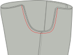

<Tip>

##### Une note sur la couture se termine

Avant de commencer, vous voudrez décider de votre méthode de finition de couture, ou comment vous rangez
les coutures crues le long des jambes de votre pantalon pour les empêcher de s'effilocher. Il y a beaucoup d'options
pour cela. Les choix communs sont le serrage des bords bruts, ou l'utilisation de coutures françaises pour enfermer
les bords bruts.

Pour ces instructions, nous supposerons que vous utilisez un sergeur pour les finitions de couture, mais
nous fournirons également des alternatives. Parmi les autres options pour la finition des coutures figurent la garniture avec des cisailles
roseuses, coudre un zig-zag le long du bord de la couture pour l'empêcher de s'effilocher, ou de lier avec
ruban adhésif.
 </Tip>

## Étape 1 : Construire les poches arrière

Avez-vous l'intention d'insérer des poches de soudure à l'arrière de votre pantalon Paco ? C'est génial ! C'est sans doute la partie la plus difficile, et nous allons d'abord l'accomplir. If not, you can skip ahead to the next step, preparing the front pockets.

Construisez les poches à l'arrière de votre pantalon, y compris le sac de poche.

<Tip>

##### Poches de Welt

Construire une poche de soudure est une technique qui est utilisée est différents vêtements. C'est la raison pour laquelle il est
branché sur sa propre page de documentation.

Il y a à la fois une documentation écrite et une série vidéo qui vous montre comment le faire, donc même si
vous n'avez jamais fait de poches soudées auparavant, vous allez vous passer.

[À la documentation des poches de soudure](https://freesewing.org/docs/sewing/double-welt-pockets/)

</Tip>

<!--- One tricky bit, this documentation is for double welts, but this is I think a single welt?
Does it need a note to that effect? --->

## Étape 2 : Préparez les poches avant
Your pockets are cut from a lining material, which can save on weight and bulk, but also means that you'll want to hide them a little bit inside the side seam, so the lining doesn't show. Le rabat le long de la couture extérieure de chaque jambe est à cet effet.

Si vous utilisez un serger, serrez les bords courbés de vos pièces de poche. Then, serge along the long edges of the pocket flaps.

## Étape 3 : Attacher des poches à un pantalon

With [good sides together](https://freesewing.org/docs/sewing/good-sides-together/), line up the markings on the edge of the pocket bag with the ends of the flap along the outside seam of the front leg. Coudre ensemble. Répéter pour la deuxième jambe.

Maintenant, faites la même chose avec les jambes arrière. With good sides together, line up the markings on the edge of the pocket bag with the ends of the flap along the outside seam of the back leg. Before sewing, make sure that your left leg front and back are attached to one pocket, and your right leg front and back are attached to the other. Coudre ensemble.

Appuyez sur toutes les coutures vers le pantalon (loin du sac de poche).

<Note>

Facultatif : Vous pouvez dessiner ici un millimètre ou deux à partir de la couture de chaque côté du sac
de poche, pour sécuriser les volets et le sac de poche ensemble de la façon dont vous les avez pressés.

</Note>

## Étape 4 : Préparez les coutures latérales et le sac de poche

Vous devriez maintenant avoir deux grosses pièces, chacune avec une jambe avant et arrière attachée par une poche.

Prenez l'une des pièces, et placez la jambe avant et arrière de bons côtés ensemble. Align the outer side seam, so that the side seam of the leg pieces match up, and the pocket bag edges are aligned, with good sides together.

## Étape 5 : Coudre les coutures latérales

Vous courez deux coutures séparées pour coudre vos coutures latérales tout en laissant vos poches ouvertes.

Commencez au sommet des pièces de la jambe. Coudre le long de la couture latérale, pivoter à mesure que vous atteignez le sac de poche. Vous pouvez également raccourcir la longueur de votre point ici pour renforcer le coin de l'ouverture de la poche. Suivre la couture latérale, se pivoter à nouveau et se terminer en haut de la poche.

Ensuite, vous fermerez le fond du sac de poche et coupez le reste de la couture latérale. Start at the bottom edge of the pocket bag, sewing along the bottom of the pocket, then pivoting when you get to the side seam of the pants. You can use a shorter stitch length for the first few stitches on the side seam, to reinforce the bottom of the pocket opening. Coudre tout le long de la couture côté jambe.

Répéter pour la deuxième jambe.

## Étape 6: Terminer les coutures latérales

La finition de ces coutures nécessite une touche de délicatesse, surtout autour du dessus des poches.

It would be difficult to finish the top part of the side seam with a serger, so we'll use a zig-zag stitch. Starting at the top of the side seam, zig-zag stitch along the raw edge of the seam allowance, pivoting around the pocket opening. Continue the zig-zag stitch up the side of the pocket, unless you've serged your pockets already (in which case you can stop when you reach the pocket).

L'ouverture du bas de la poche est un coin serré. To finish the seam around this corner, zig-zag stitch the raw edge of the seam allowance, starting where it joins the pocket, pivoting at the corner and continuing about 5 cm (2 in.) down the side seam. You can continue finishing the side seam with a zig-zag stitch all the way down. Alternatively, you can serge the side seam, making sure to stop the line of serger stitches a little ways from the pocket.

<Note>

Assurez-vous de sécuriser ces points de serger. Ils ne seront pas pris dans d'autres coutures, donc ils risquent
de se détricoter s'ils ne sont pas sécurisés.

</Note>

Répéter pour la deuxième jambe.

Appuyez sur les coutures latérales vers l’avant.

<Note>

Cela peut sembler contre-intuitif, car beaucoup de pantalons suggèrent de presser les coutures latérales vers le dos.
Cependant, avec les poches de seam, vous voudrez que les poches soient pressées vers l'avant du pantalon. Vos poches
se battront si vous appuyez sur la couture à l'arrière, donc nous appuierons tout sur
à l'avant. Cela se traduira par une finition plus lisse.

</Note>

<Note>

Les coins d'une ouverture de poche sont l'un des endroits les plus susceptibles d'usure ou d'usure surtout
si vous utilisez vos poches beaucoup. Si vous êtes inquiet de déchirer les coins de vos poches, ou
si votre tissu est plus délicat, vous pouvez renforcer les ouvertures de poche avec des tacks de barre le long de la ligne
de couture, juste en dehors des ouvertures de poche.

</Note>

## Étape 7 : Poche de l'ancre à la taille

Les poches de Paco sont ancrées à la taille. This means that you can put things in your pockets without them becoming unsightly bump that’s just dangling around in your trouser leg.

To anchor each pocket, align the top of the pocket with the mark along the waistline of your pattern. Coudre une ligne de points de fixation à l'intérieur de votre couture pour tenir la poche en place.

## Étape 8 : Coudre et finir les coutures

Alignez les coutures avec de bons côtés ensemble, puis cousez les coutures. Finish the seams the same way you finished the side seams. Appuyez sur les coutures à l'arrière.

## Étape 9 : Coudre et finir la couture de crotch

To attach the individual legs, flip one leg good side out (it doesn't matter which leg), then place it inside the other leg, good sides together. You should now have what looks like just one pant leg, with wrong sides visible. Align the center front, center back, and inseams of each leg, then pin along the length of the crotch seam. Coudre et finir la couture en crotte.

<Note>

Si vous coudez du centre avant au centre arrière, Il est plus facile de maintenir les droits de couture
au dos lorsqu'ils se nourrissent à travers la machine.

</Note>

## Étape 10 : Placer les oeillets pour la chaîne de dessin (optionnel)
Marquez le milieu de la longueur de votre ceinture. Fold one of your waistband pieces double, and mark the middle of the width (do not take the seam allowance into account).

Un peu à gauche et à droite de ceci, vous pouvez ajouter deux oeillets pour passer un cordon à travers. Because your Paco pants have elastic in the waistband, as well, this is a nice detail, but is not required.

<Tip>

##### Il vaut mieux ajouter un renfort

Si vous avez choisi un tissu glissant, drapey, ou mince, vous pourriez vouloir ajouter quelques renforts
derrière ces oeillets. Un peu d'interfaçage ou un reste de denim fera très bien.

</Tip>

## Étape 11 : Préparez l'élastique de la taille
Il n’y a pas de formule magique pour la durée de votre élastique. So you wrap it around your waist and pull it tight until you get a good fit. Paco is cut to sit at the high hip, so make sure your elastic is long enough to sit comfortably at the high hip.

Marquer cette longueur, couper l'élastique, et joindre les deux extrémités ensemble.

## Étape 12 : Rejoignez la ceinture
Placez les deux morceaux de ceinture de bons côtés ensemble et alignez les bords courts. Sew the short edges together, then press open. These will be inside the waistband, so you don't need to finish the edges of these seams unless your fabric is particularly likely to fray.

Plier la ceinture à double bande le long de la longueur, avec de bons côtés dehors et presser. This fold will be the top of your waistband.

## Étape 13 : Attacher la ceinture

Vous avez deux options pour fixer votre ceinture. One is a bit simpler, but leaves an exposed seam on the inside. L'autre est un peu plus violent, mais il contient les bords bruts de votre tissu.

### La méthode la plus simple
Gardez votre ceinture pliée double et placez l'élastique à l'intérieur. Make sure to align the place where the elastic is joined with the back of the waistband (opposite the eyelets).

Find the center front of your waistband (easy if there are eyelets, if not just fold it double), and align that with the center front seam of your pants. Make sure that your waistband is outside of your pants, with good sides together. Épingler en place.

<Tip>

##### Pensez à vos oeillets

Si vous avez fait des oeillets dans votre ceinture, vérifiez qu'elles sont placées vers l'extérieur,
pas l'intérieur de votre ceinture.

</Tip>

Ensuite, alignez le dos du centre et la broche en place, en ajoutant des épingles supplémentaires autour de la ceinture au besoin.

Coudre la ceinture au pantalon, aussi près que possible de l’élastique, mais ne pas coudre dans l’élastique.

It’s fine to not sew too close the first time around, and once your elastic is attached and encased, make a second round to sew it a bit more snugly.

Retirez les points de bâchage des dessus des sacs de poche.

Terminer la couture avec un serger ou une autre méthode.

### La méthode de couture fermée

Ouvre la ceinture. You will still be able to see the fold along its length, but you will be working with each side of the waistband individually.

Find the center front of your waistband (easy if there are eyelets, if not just fold it double), and align that with the center front seam of your pants. Make sure that your waistband is outside of your pants, with good sides together. Épingler en place.

<Tip>

##### Pensez à vos oeillets
Pour vous assurer que vos oeillets finiront à l'extérieur, Assurez-vous qu'ils sont plus proches du sommet de votre ceinture de
, au-dessus du pli.

</Tip>

Alignez ensuite le fond central de votre ceinture avec la couture centrale du dos. Épingler en place. Then, add additional pins around the waistband as needed.

Coudre la ceinture à la pantalon.

Appuyez sur la ceinture. Press the seam allowance in on the opposite side of the waistband, maintaining the fold along the center of the waistband.

Repliez la ceinture, en tournant la moitié de la ceinture vers l'intérieur. Pin so that the seam allowance on the inside is just below the seam joining the waistband to the pants, and pin in place around the waistband. De l'extérieur, coupez dans le fossé, accrochez la ceinture intérieure à mesure que vous allez.

<!--- Probably put a note here about stitching in the ditch? --->

## Étape 14 : Préparez l'élastique de manche

As you did with the waistband elastic, wrap the elastic for your cuff around your ankle and pull it tight until you get a good fit.

Marquer cette longueur, couper l'élastique, et joindre les deux extrémités ensemble. Répétez pour l'autre élastique de manche.

## Étape 15 : Rejoignez les poignets
Plier chaque manche avec de bons côtés ensemble, en alignant les bords courts. For each cuff, sew the short edges together, then press open. These will be inside the cuff, so you don't need to finish the edges of these seams unless your fabric is particularly likely to fray.

Pliez chaque manche en double le long de la longueur, avec de bons côtés dehors et pressez. This fold will be the bottom of your cuffs.

## Étape 16 : Attacher les poignets

Vous fixerez vos poignets de la même façon que vous fixez la ceinture. As with the waistband, there are two options - a simpler choice, and a choice without exposed seams on the inside.

<Note>

 Si votre machine à coudre a un lit amovible (habituellement retiré pour exposer le "bras libre" pour coudre des manches de
 poignées) Cela rendra la couture des poignets plus facile.

 </Note>

### La méthode la plus simple

Gardez vos poignets pliés en double et placez l'élastique à l'intérieur.

Alignez la couture dans le manchon avec la couture du pantalon. Make sure that your cuff is outside of your pants, with good sides together. Épingler en place, puis épingler le reste du chemin autour du poignet.

<Tip>

##### Épingler les poignées

L'élastique rendra les poignets plus difficiles à épingler. Pour vous assurer que vos poignets sont épinglés équitablement
au pantalon, placez votre deuxième épingle sur le côté opposé de la jambe qui s'ouvre du premier. Vous pouvez
étirer l'élastique pour vous assurer que tout est aligné en douceur, puis placez vos broches suivantes à mi-chemin
entre les deux premières. Continuez de cette façon, épinglant à mi-chemin entre les autres épingles, jusqu'à ce que vous vous sentiez confiant
il y en a assez.

</Tip>

Coudre le manchon à l'ouverture du pantalon, aussi près que possible de l'élastique, mais ne pas coudre dans l'élastique.

Terminer la couture avec un serger ou une autre méthode.

### La méthode de couture fermée

Ouvrez le poignet. You will still be able to see the fold along its length, but you will be working with each side of the cuff individually.

Alignez la couture dans le manchon avec la couture du pantalon. Make sure that your cuff is outside of your pants, with good sides together. Épingler en place, puis épingler le reste du chemin autour du poignet.

Coudre le manchon au pantalon.

Appuyez sur le manchon loin du pantalon. Press the seam allowance in on the opposite side of the cuff, maintaining the fold along the center of the cuff.

Replier le manchon en tournant la moitié du manchon vers l'intérieur. Pin so that the seam allowance on the inside is just past the seam joining the cuff to the pants, and pin in place around the cuff. From the outside, stitch in the ditch, catching the inner cuff as you go.

## Étape 17 : découper les poignets et la ceinture (facultatif)

Si vous avez une élastique de manche plus large, vous voudrez peut-être broder une ligne horizontale à mi-chemin vers le haut du manchon. This will hold your elastic in place and help keep it from folding or twisting. Make sure to stretch the elastic evenly as you sew, so that it gathers the fabric evenly. (If you sew without stretching the elastic, you risk lumpy gathers and a leg opening too narrow to get your foot through.)

<!--- You could also do a zig-zag stitch here, but I think straight probably looks nicer? --->

If you like the look, you can also sew more than one line of stitches, evenly spaced between the top and bottom of the cuff.

Vous pouvez faire la même chose pour la ceinture.

<Note>

Si vous mettez des oeillets pour un cordon, coupez une ligne de points au-dessus des oeillets et une ligne séparée
sous les oeillets, laissant un canal assez large pour votre cordon.

</Note>

## Étape 18 : Fil autour de la taille (facultatif)
If you put eyelets in your waistband, thread a drawstring through one eyelet, around the waist, and out of the other eyelet.

<Note>

Il y a des outils pour faciliter cette tâche, mais presque tout le monde a une épingle de sécurité simple.
Épingler la broche de sécurité à une extrémité de votre cordon, puis la pousser à travers le canal. La broche de sécurité
sera plus facile à manipuler à travers le tissu, et elle tirera le cordon avec elle.

</Note>

## Étape 19: Profitez de votre pantalon Paco !
Vous avez réussi ! C'est parti!

<!--- Maybe we want to put a fun gif here? --->
