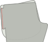

<Tip>

##### Een notitie op de afwerkingen van de naad

voordat je begint, zal je beslissen over je manier van naad, afwerking, of hoe je de onbewerkte naden
langs de benen van je broek opschont om te voorkomen dat ze rafelen. Er zijn hiervoor veel
opties. Gemeenschappelijke keuzes naaien de onbewerkte randen of gebruiken Franse naden om
de rauwe randen te omhelzen.

Voor deze instructies, gaan we ervan uit dat je een overlock gebruikt voor naadafstand, maar we
ook alternatieven aanbieden. Andere opties voor het afwerken van de naden zijn onder meer het knippen met een knijpende
schaar, stik een zigzag langs de rand van de naad om te voorkomen dat het uitrafelt, of koppel met
bias tape. </Tip>

## Stap 1: Maak de achterzakken

Ga je paspelzakken gebruiken op de achterkant van je Paco-broek? Top! Dit is misschien wel het lastige stuk van de constructie, en we gaan het als eerste aanpakken. Zo niet, kan je overslaan naar de volgende stap, de voorzakken voorbereiden.

Maak de paspelzakken aan de achterkant van de broekdelen, inclusief de broekzak.

<Tip>

##### Paspelzakken

Paspelzakken worden in verschillende kledingstukken gebruikt. Daarom is het
in zijn eigen documentatiepagina verdisconteerd.

Er is zowel geschreven documentatie als een videoserie die je laat zien hoe je het moet doen, dus zelfs als
je nog nooit paspelzakken hebt gemaakt, ben je in orde.

[Naar de documentatie voor paspelzakken (in het Engels)](https://freesewing.org/docs/sewing/double-welt-pockets/)

</Tip>

<!--- One tricky bit, this documentation is for double welts, but this is I think a single welt?
Does it need a note to that effect? --->

## Stap 2: Maak de voorzakken

Jouw zakken worden geknipt van een voering materiaal, dat kan sparen op gewicht en bulk, maar betekent ook dat je ze een beetje in de zijnaad wilt verbergen, zodat de voering niet zichtbaar is. Daarvoor dient de flap bovenaan de buitennaad van de broekspijp.

Als je een overlocker gebruikt, werk dan nu de gebogen randen van je zakstukken af. Verstop vervolgens langs de lange randen van de zakvlakken.

## Stap 3: Bevestig de zakken aan de broekspijpen

Met [goede kanten op elkaar](https://freesewing.org/docs/sewing/good-sides-together/), leg de markeringen op de rand van het zakdeel met de uiteinden van de flap langs de buitenste naad van het voorpand. Stik ze aan elkaar. Herhaal dit voor de andere pijp.

Doe nu hetzelfde met de achterpanden. Met de goede kanten op elkaar leg de markeringen op de rand van het zakdeel met de uiteindes van de flap langs de buitenste naad van het rugpand. Voordat je gaat naaien, zorg dat je linker beendeel en rugpand aan één zak zijn bevestigd, en je rechterbeen voorpand en achterkant zijn aan de ander bevestigd. Stik ze aan elkaar.

Pers de naadwaarde van de steekzak en de broekspijp weg van de zak, tegen de broekspijp.

<Note>

Optioneel: Vanaf elke kant van de zak kun je hier een millimeter of twee tussendoorstikken,
zak, onderstikken om de kleppen en het zakdeel helemaal samen te bevestigen op de manier waarop je ze hebt gedrukt.

</Note>

## Stap 4: Bereid de zijnaden en de steekzak voor

Je hebt nu twee grote delen voor elke pijp, elk met een voor- en achterpand die aan elkaar vasthangen met een zak.

Neem één van de pijpen en leg het voor- en achterpand op elkaar met de goede kant naar binnen. Leg de buitenste zijnaad, zodat de zijnaad van de broekspijpen overeenkomen, en de randen van het zakdeel staan op één lijn, met de goede kanten op elkaar.

## Stap 5: Stik de zijnaden

Stik twee afzonderlijke naden: eentje boven de zak en eentje eronder. Op die manier blijven je steekzakken open.

Begin aan de bovenkant van de broekspijpen. Stik langs de zijnaad. Om te draaien aan de steekzak, stop je met de naald in de stof. Hef de persvoet op en draai het werk. Hier kan je eventueel een kortere steeklengte gebruiken om de hoek van de zakopening te verstevigen. Volg de zijnaad, draai opnieuw en stop aan de bovenkant van de zak.

Nu ga je de onderkant van de steekzak sluiten en de rest van de zijnaad stikken. Begin aan de onderrand van het zakdeel en stik langs de onderkant van de zak, en beugel wanneer je de zijnaad van de broek bereikt. Je kan een kortere steeklengte instellen voor de eerste steken van de naad. Zo versterk je de zakopening. Stik de hele zijkant van de broekspijp naar beneden.

Herhaal dit voor de andere pijp.

## Stap 6: Werk de zijnaden af

De afwerking van deze naden vraagt een beetje extra aandacht, vooral rond de bovenkant van de zakken.

Het is moeilijk om het bovenste deel van de zijnaad af te werken met een serger, dus we gebruiken een zigzagsteek. Te beginnen aan de bovenkant van de zijnaad, zigzagsteek langs de onbewerkte rand van de naad allowance, draai rond de zakopening. Doorgaan met de zigzagsteek langs de zijkant van de zak, tenzij je al je zakken hebt vastgezet (in dat geval kan je stoppen wanneer je de zak bereikt).

De onderste opening van de steekzak is een lastig hoekje. Om de rafelrand aan deze hoek af te werken, gebruik je een zigzagsteek langs de onafgewerkte naadwaarde. Je begint waar de zijnaad de zak kruist, draait aan de hoek en gaat zo'n 5 centimeter (2 inch) verder langs de zijnaad naar beneden. Je kan doorgaan met het afwerken van de zijnaad met een zigzagsteek helemaal naar beneden. Als alternatief kan je de zijnaad verstikken. Let op dat je de lijn van de zandstiksel een beetje langs de zak stopt.

<Note>

Maak de overlockstiksels zeker goed vast. Ze zullen niet worden betrapt in andere naden, dus ze riskeren
onveilig te worden gelaten.

</Note>

Herhaal dit voor de andere pijp.

Pers de zijnaden naar het voorpand.

<Note>

Dat lijkt misschien geen logische manier van werken. Veel naaipatronen voor broeken laten je de zijnaden naar het achterpand persen.
Maar in dit geval heb je steekzakken in de naad verwerkt, en die moeten natuurlijk aan de voorkant van de broek zitten. Je
zakken gaan met je zijnaad strijden als je de naad aan de achterkant strijkt. dus strijken we alles
naar het voorpand. Het resultaat zal er mooier uitzien.

</Note>

<Note>

De hoeken van een opening van de zak zijn een van de meest waarschijnlijke plekken om uit te dragen of tranen, vooral
als je je zakken veel gebruikt. Als je je zorgen maakt over het scheuren aan de hoeken van je zakken, of
als je stof gevoeliger is, je kan de zakopeningen versterken met staven langs de naad
lijn, net buiten de zakopeningen.

</Note>

## Stap 7: Ankerzakdeel naar taille

De zakken in het Paco zijn geankerd aan de taille. Dit betekent dat je dingen in je zakken kan stoppen zonder dat ze onzichtbaar worden wat aan je broekspijp hangt.

Om elke zak te verankeren, leg je de bovenkant van de zak gelijk met het markering langs de taillelijn van je patroon. Stik een rand van driegsteek binnen je naadwaarde om de zak vast te houden.

## Stap 8: Stik en werk de innaden af

Leg de innaden gelijk met de goede kanten op elkaar, en stik de innaden dan op. Werk de naden op dezelfde manier af je hebt de zijnaden afgemaakt. Strijk de binnenste naar de achterkant.

## Stap 9: Stik en voltooi de kruisnaad

Om de individuele broekspijpen te bevestigen, draai een goede kant om (het maakt niet uit welke broekspijppen) dan plaats het in de andere broekspijp, met de goede kanten op elkaar. Je zou nu moeten laten zien hoe er maar één broekspijp is, met verkeerde kanten zichtbaar. Leg de middenvoorpand, de achterste en de naden van elke broekspijp gelijk en speld dan langs de lengte van de kruisnaad. Stik en werk de kruisnaad af.

<Note>

Als je van het midden naar het midden naait Het is makkelijker om je binnennaadwaarde
aan de achterkant te houden terwijl ze via de machine stromen.

</Note>

## Stap 10: Plaats veterzakken voor de tekenreeks (optioneel)

Markeer het midden van de lengte van je tailleband. Plooi één van je tailleband stukken dubbel, en markeer het midden van de breedte (neem de naadwaarde niet in de rekening).

Installeer twee vetergaten links en rechts van deze markering. Omdat je Paco pants hebben elastiek in de tailleband, ook is dit een mooi detail, maar niet nodig.

<Tip>

##### Het is het beste om wat versterking toe te voegen

Als je een stof gekozen hebt die glad is, droog, of dun, je wilt misschien wat versterking
toevoegen achter deze wenkels. Een beetje tussenvoering of een overblijfsel van denim doet het goed.

</Tip>

## Stap 11: Bereid de taille elastiek voor

Er is geen magische formule voor de lengte van je elastiek. Dus wikkel het rond je taille en trek het aan tot je vindt dat het goed past. Paco is geknipt om aan de hoge heupen te zitten, dus zorg ervoor dat je elastiek lang genoeg is om comfortabel aan de hoge heupen te zitten.

Markeer deze lengte, knip het elastiek en naai de uiteindes aan elkaar.

## Stap 12: Naai de tailleband

Leg de twee goede kanten van de tailleband op elkaar en leg de korte randen samen. Stik de korte randen samen, en strijk dan open. Deze zitten in de tailleband, Dus je hoeft de randen van deze naden niet af te werken tenzij je stof bijzonder waarschijnlijk frams wordt.

Vouw de tailleband dubbel in de lengte met de goede kanten naar buiten. Pers. Deze vouw is de bovenkant van je tailleband.

## Stap 13: Bevestig de tailleband

Je kan de tailleband op twee manieren vastmaken. Eén is een beetje eenvoudiger, maar laat een blootgestelde naad aan de binnenkant achter. De andere is wat lastiger, maar verbergt wel alle rafelranden aan de binnenkant van de tailleband.

### De eenvoudige methode

Houd je tailleband dubbelgevouwen en schuif de elastiek erin. Leg de plek waar het elastiek zit aan de achterkant van de tailleband (tegenover de ooglid).

Vind het midden van de voorkant van je tailleband (makkelijk als er oogdieren zijn, zo niet dubbel plooien), en leg dat gelijk met de middennaad van je broek. Zorg ervoor dat je tailleband buiten van je broek ligt, met de goede kanten op elkaar. Speld vast.

<Tip>

##### Knip je wandelaars

Als je vetergaatjes in je tailleband hebt gemaakt, dubbele controle of ze naar buiten worden geplaatst,
niet de binnenkant van je tailleband.

</Tip>

Leg vervolgens de middenruggen en speld samen en voeg extra pinnen om de tailleband toe indien nodig.

Stik de tailleband aan de spelers, zo dicht mogelijk bij het elastiek, maar stik niet in het elastiek.

Het is prima om de eerste keer niet te dicht te naaien, en zodra je elastiek is bevestigd en ingesloten maak een tweede ronde om wat strakker te naaien.

Verwijder alle driegsteek aan de bovenkant van de zakdelen.

Werk de naad af met een overlock of een andere methode.

### De naadmethode in de kast

Open de tailleband. Je kunt nog steeds de lengte van de vouw zien, maar je werkt met elke kant van de tailleband individueel.

Vind het midden van de voorkant van je tailleband (makkelijk als er oogdieren zijn, zo niet dubbel plooien), en leg dat gelijk aan de middennaad van je broek. Zorg ervoor dat je tailleband zich buiten je broekzak bevindt, met de goede kanten op elkaar. Speld vast.

<Tip>

##### Breng je veters

Om er zeker van te zijn dat je oogdieren aan de buitenkant zullen verschijnen, zorg ervoor dat ze voor dit moment dichter bij de bovenkant van je
tailleband staan, boven de vouw.

</Tip>

Leg vervolgens de middenrug van de tailleband gelijk met de middenmiddenachternaad. Speld vast. Voeg vervolgens extra spelden rond de tailleband toe indien nodig.

Stik de tailleband aan de broek.

Strijk de tailleband omhoog. Strijk de naadwaarde aan de andere kant van de tailleband in, met de vouw langs het midden van de tailleband.

Kort de tailleband, draai de helft van de tailleband naar binnen. Speld zodat de naadwaarde van de aan de binnenkant net onder de naad ligt die de tailleband aan de broekspijpen verbindt en vast speld rond de tailleband. Stik van buitenaf in de sloot door, terwijl je de tailleband van de binnenste vat.

<!--- Probably put a note here about stitching in the ditch? --->

## Stap 14: Bereid de manchet elastisch voor

Zoals je deed met de tailleband elastiek, pak het elastiek voor je manchet rond en pak hem op totdat je een goede pasvorm hebt.

Markeer deze lengte, knip het elastiek en naai de uiteindes aan elkaar. Herhaal voor de andere manchet elastisch.

## Stap 15: Bevestig de manchetten

Plooi elke manchet met de goede kanten op elkaar, leg de korte randen samen. Stik voor elke manchet de korte randen samen, en strijk dan open. Deze komen in de manchet, Dus je hoeft de randen van van deze naden niet af te werken, tenzij je stof bijzonder waarschijnlijk frams wordt.

Plooi elke manchet dubbel langs de lengte, met de goede kanten naar buiten, en strijk. Deze vouw is de onderste van je manchetten.

## Stap 16: Bevestig de manchetten

Je zal je manchetten op dezelfde manier bevestigen als je de tailleband bevestigd hebt. Zoals met de tailleband, zijn er twee opties - een eenvoudigere keuze en een keuze zonder blootgestelde naden aan de binnenzijde.

<Note>

Als je naaimachine een afneembaar bed heeft (meestal verwijderd om de "gratis arm" te tonen voor het naaien van
mouw manchets), Dit maakt het naaien van de manchetten eenvoudiger.

 </Note>

### De eenvoudige methode

Houd je manchetten dubbel, en plaats het elastiek erin.

Leg de naad in de manchet gelijk met de innaad van de broek. Zorg ervoor dat je manchet buiten zit met de goede kanten op elkaar. Speld de rest van de weg rond de manchet vast.

<Tip>

##### De manchetten spelden

De elastiek zal de manchetten moeilijker vastmaken. Om zeker te zijn dat je manchetten gelijk vastzitten
aan de pants, plaats je tweede speld vanaf de eerste kant van de opening van de broekspijp. Je kunt
het elastiek rekken om ervoor te zorgen dat alles soepel opgaat Plaats dan je volgende spelden halverwege
tussen de eerste twee. Ga zo door! Speld halverwege andere spullen, totdat je er vertrouwen in hebt
er genoeg zijn.

</Tip>

Stik de manchet aan de broek opening, zo dicht mogelijk bij het elastiek, maar stik niet in het elastiek.

Werk de naad af met een overlock of een andere methode.

### De naadmethode in de kast

Open de manchet. Je kunt nog steeds de lengte van de vouw zien, maar je werkt met elke kant van de manchet individueel.

Leg de naad in de manchet gelijk met de innaad van de broek. Zorg dat je manchet buiten je broekzak zit, met de goede kanten op elkaar. Speld de rest van de weg rond de manchet vast.

Stik de manchet aan de broek.

Strijk de manchet van de broek weg. Strijk de naadwaarde op de andere kant van de manchet in en houd de plooi langs het midden van de manchet.

Kort de manchet, draai de helft van de manchet naar binnen. Speld de naadwaarde aan de binnenkant net voorbij de naad aan de manchet aan de broekspijpen en speld vast rond de manchet. Van buitenaf, stik in de sloot door, pak de binnenmanchet terwijl je onderweg bent.

## Stap 17: Stik de manchetten en tailleband (optioneel)

Als je een breder manchet hebt, wil je misschien een horizontale lijn halverwege de manchet stikken. Dit zorgt ervoor dat je elastiek op zijn plaats blijft en voorkomt dat je vouwt of draait. Zorg ervoor dat je het elastische gelijkmatig uitrekt terwijl je naait, zodat het de stof gelijk verzamelt. (Als je stikt zonder de elastiek uit te rekken, riskeer je forse gathers en een been opening te smal om je voet door te krijgen.)

<!--- You could also do a zig-zag stitch here, but I think straight probably looks nicer? --->

Als je het uiterlijk leuk vindt, kun je ook meer dan één lijn stikken, Evenwichtig tussen de bovenkant en de onderkant van de manchet.

Je kunt hetzelfde doen voor de tailleband.

<Note>

Als je wenkbrauwen voor een koordje vaststikt, stik je een stiksel van stiksels boven de wandelgangen en een aparte lijn
onder de ogen verlaat een kanaal breed genoeg voor je tekenreeks.

</Note>

## Stap 18: Thread een tekenreeks rond de taille (optioneel)

Als je vezels in je tailleband stopt, draag dan een trekkoord door één wenkelet, rond de tailleband en uit het andere oogsel.

<Note>

Er zijn middelen om deze taak te vergemakkelijken, maar een die bijna iedereen heeft, is een eenvoudige veiligheidspanne.
Speld de veiligheidspeld vast aan één einde van je tekenreeks, en duwt deze vervolgens door het kanaal. De veiligheidspeld
is makkelijker te maneuveren door de stof, en het trekt de tekenreeks ermee op.

</Note>

## Stap 19: Geniet van je Pacotaarns!

Het is je gelukt! Hoe gaat het!

<!--- Maybe we want to put a fun gif here? --->
