Die Anzahl der Darts im Muster. Das Maximum ist 2, aber diese Option kann durch das Muster reduziert werden, wenn die Berechnungen zu kleine Darts erzeugen.

## Effect of this option on the pattern
