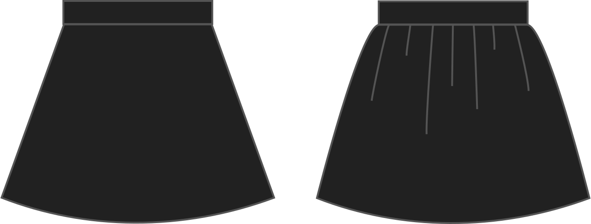

- - -
title: "Gathering"
- - -

Der Prozentsatz um welcher die Oberkante des Rockteils länger ist als die Unterkante des Bundes. Geben Sie einen Wert höher als 0, um den Rock zu verfehlen.

## Effekt dieser Option auf das Schnittmuster

