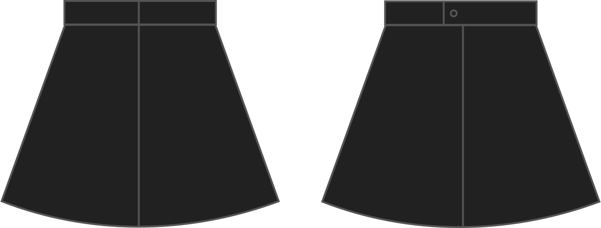

- - -
title: "Waistband overlap"
- - -

La longitud de la superposición entre los extremos de la cintura, para permitir un botón. 0 significa que no hay solapamiento, por ejemplo para colocar un zipper que vaya hasta la parte superior de la cintura.

## Efecto de esta opción en el patrón

