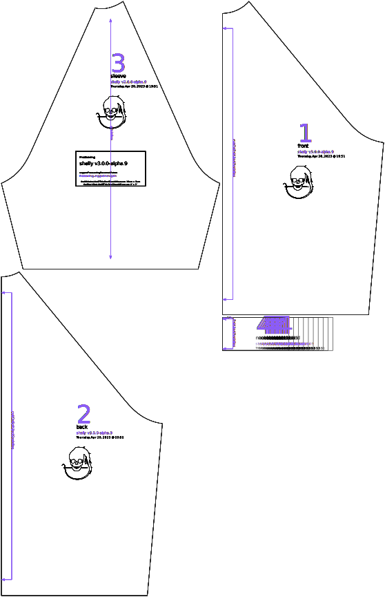

Controls how long the neckband is, as a percentage of the circumferance of the neckline. Recommended values for this option vary based on the material used for the neckband.

## Effect of this option on the pattern

