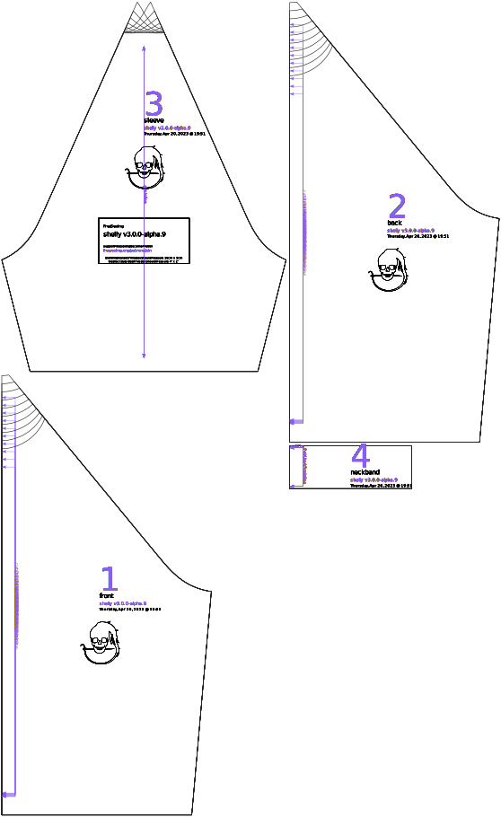

Controls where the neck hole is placed on the shirt. A value of 0% has the center of the neck hole exactly where the four raglan seams would intersect, with the front and back bodices being identical. A positive value shifts the neck towards the front of the shirt.

## Effect of this option on the pattern

