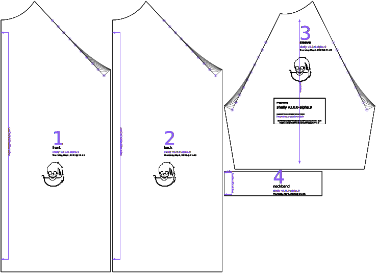

Controls how far out from the armhole the raglan seam starts to scoop. Larger arms and smaller chests will use slightly larger values for this option, but it can ususally be left at the default value without issue.

## Effect of this option on the pattern

