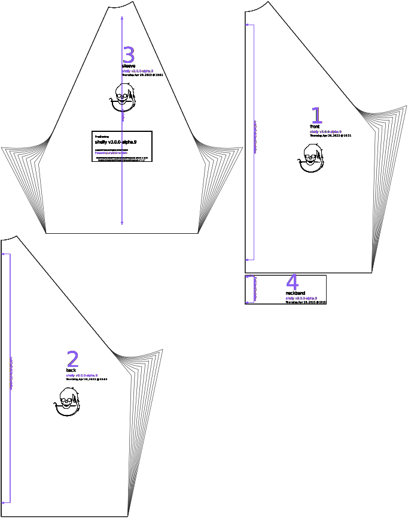

Controls how much extra material to place under the armpits. Larger values will generally provide better mobility and room in the armpits, while smaller values may give a more fitted look.

## Effect of this option on the pattern

