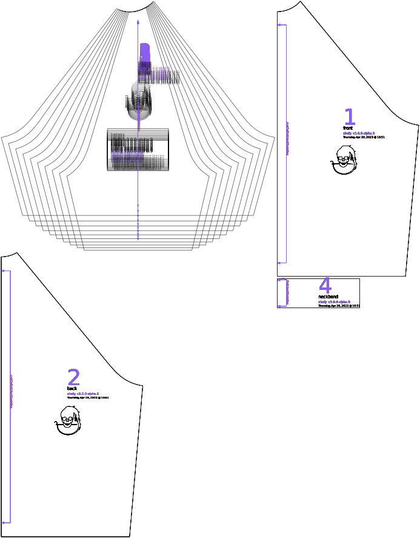

Affects how wide the sleeve is at the armpit on all shirts, and also affects how wide the sleeve is at the end of the sleeve on short-sleeved shirts (sleeve length of less than 100%), with this effect being greater on shorter sleeves.

## Effect of this option on the pattern

