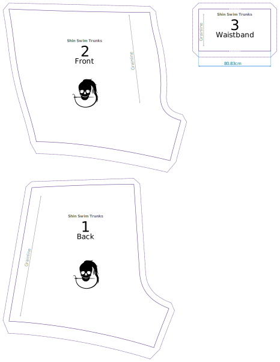

- - -
title: "Shin swim trunks: Cutting Instructions"
- - -

- **2 zurück** mit guten Seiten zusammen schneiden
- **4 Fronten** 2 x 2 mit guten Seiten schneiden
- Schneide **1 Taillenband**

## Achtung

- Um Papier zu sparen, ist das Taillenband nicht vollständig auf das Muster gedruckt, da es nur ein langes Rechteck ist. Suchen Sie also nach der Längenanzeige und schneiden Sie ein Rechteck dieser Größe.
- Die Saumzulage ist doppelt so hoch wie die Standardnahtleistung.

Shin is a very simply pattern, and consists of two main parts plus the waistband.

Below is a typical draft layout:

<Tip>

Die [Schnittmuster-Notation][1] erklärt alle verschiedenen Markierungen und Linien auf deinem Schnittbogen.

</Tip>
