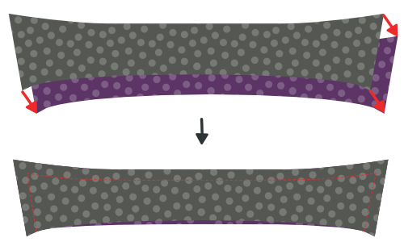
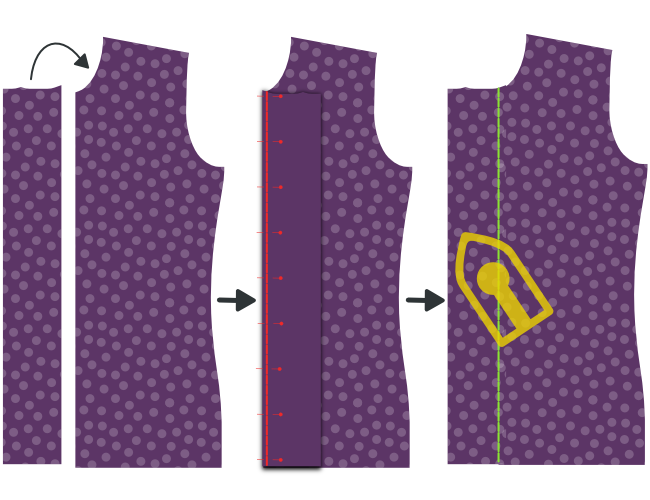
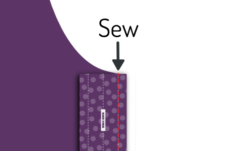
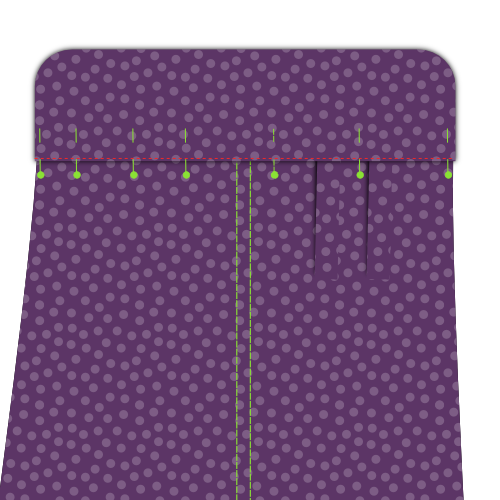

- - -
title: "Simon shirt: Sewing Instructions"
- - -

<Tip>

##### Folgen Sie dem Nähen mit Kelly und Julian

Kelly Hogaboom und Julian Collins haben eine Simon(e) mitnäht, und sie haben Videos von
alle Schritte.
Wenn Sie dieses Muster herstellen wollen, können Kelly und Julian Ihnen den Weg zum Ende weisen.

You can find all the material's on Kelly's
site: [#simonsayssew with kelly hogaboom & julian collins](https://kelly.hogaboom.org/2020/07/simon-says-sew-with-kelly-hogaboom-and-julian-collins/)

</Tip>

### Schritt 1: Sicherungsschnittstelle

 

#### Drücken Sie die Schnittstelle zu Manschetten

To make two cuffs, you have cut out your cuff piece four times in fabric, and twice in interfacing.

For each cuff, press the interfacing piece to the bad side of the cuff piece.

> Wenn die Innen- und Außenseite der Manschette der gleiche Stoff sind, spielt es keine Rolle, auf welche Manschette du sie drückst.
> 
> Ein beliebtes Detail im Stil ist jedoch, ein anderes Stoff für die Innenseite der Manschette zu haben. Achten Sie in diesem Fall darauf, die Schnittstelle zu dem Stück zu drücken, das Sie sein wollen, die Außenseite Ihrer Manschette zu sein.

> Je nachdem, welche Manschette Sie ausgewählt haben, ist die Form der Manschette unterschiedlich.
> 
> In the first illustration, you can see both a round barrel cuff and a French cuff as examples.
> 
> In den Illustrationen wird die runde Barrel Manschette nach vorn verwendet, aber der Prozess ist der gleiche für die anderen Manschetten.

#### Press interfacing to collar, undercollar and collar stand

To make your collar, you need to cut one undercollar, one collar, and two collar stands. All of this both in fabric and interfacing.

For each piece, press the interfacing piece to the bad side.

### Schritt 2: Bereiten Sie die Manschetten vor

#### Nähschicht zusammen

Place both parts of your cuff (one with interfacing, one without) together with the good sides, and sew them together at the standard seam allowance.

> **Ensure you**
> 
> - Nähen Sie nicht die Seite, die wir später an den Ärmel befestigen werden
> - Stoppe am Abstand der Naht von der Kante auf der Ärmelseite

#### Nahtzuweisung kürzen

Before we flip your cuff over, we need to trim back the seam allowance to remove bulk.

#### Drücken Sie die Naht zurück

Fold back the seam allowances on each side of the cuff where the cuff attaches to the sleeve, and press them down.

> Wenn man früher zu weit am Rand genäht ist, muss man ein paar Nähte aufnehmen.

#### Schalte Manschette um und drücke

Flip your cuff with the good sides out, and give it a good press.

> When pressing your cuffs, make sure to roll the seam a bit to the backside of the cuff to guarantee that the inner fabric of the cuff is not visible.

You can now put your cuffs aside, we'll attach them later.

### Schritt 3: Bereiten Sie den Kragen vor

#### Nähen Kragen und Unterkragen zusammen

Place both collar parts with the _good sides together_, and sew them together at the standard seam allowance.

#### Nahtzuweisung kürzen

Before we flip your collar over, we need to trim back the seam allowance to remove bulk.

#### Kragen drehen und drücken

Flip your collar with the good sides out, get those tips as pointy as possible, and give it a good press.

> Wenn Sie den Kragen drücken, denken Sie daran, dass der Unterkragen etwas enger ist.
> 
> Wenn du die nicht genähten Seiten ausrichtest, Dies führt dazu, dass die Naht nach der Rückseite des Kragens rollt, um zu gewährleisten, dass die Innenstruktur des Kragens nicht sichtbar ist.

#### Obere Stickkragen

Top-stitch along the edge of the collar. This locks down the seam allowance and makes for a crisp look.

> Wie weit Sie von der Kante oben sticken, ist eine Stilauswahl. Es ist oft ein bisschen weniger als die Standard Nahtzugabe. Werfen Sie einen Blick auf einige bestehende Hemden, um sich eine Idee zu machen.

### Schritt 4: Kragen- und Kragenstand verbinden

#### Platziere Kragen zwischen Kragen und Baste an Ort

Mark the middle point of your collar and your collar stands with a pin. The middle point of each collar stand is actually slightly off-center since one end is longer than the other. Instead, find the middle point between the two notches.

First place a collar stand with the good side up, then your collar with the undercollar facing up (and the non-sewn side at the top), and finally the second collar stand with the good side down.

Your collar should sit between your two collar stands, and the middles (where you placed your pin) should be aligned.

> Die Art und Weise, wie die Dinge aussehen, hängt ein wenig von Ihrer Kragenauswahl ab, aber im Allgemeinen wird Ihr Kragen nach unten gebogen, und Ihr Kragenstand wird nach oben gebogen.
> 
> Um das alles in Einklang zu bringen, werden wir das zusammenfügen und nicht anpinnen. Ihr Kragen ist ein wichtiger Teil Ihres Hemdes, daher lohnt es sich, diese zu backen.

First, replace the pins marking the middle with a pin that pins all parts together.

Now, start basting from this pin and work your way to the corner of the collar, making sure to align both edges of the fabric.

When you reach the corner of your collar, keep going and baste the end of both collar stands together.

When you've done one side, start from your pin in the middle again and do the other side. When you're done basting, you can take out the pin.

#### Nähen Sie Ihren Kragen an den Kragenständern

Sew along the edge of your collar stand, respecting the standard seam allowance.

> Achten Sie darauf, 2 cm vor der Kante zu stoppen (doppelt so viel wie die Standardnahterlaubnisse), da wir im nächsten Schritt die Naht überklappen. und wir müssen die Kragenständer ausreichend voneinander getrennt lassen, um das Hemd später zwischen ihnen hineinzurutschen.

#### Kantennahterlaubnis nach hinten drücken und den Kragen drücken

Fold back the seam allowance of your collar stand on the non-sewn side and press it down.

> Im mittleren Teil wird das Drücken des Nahtzuges leicht sein. Aber in Richtung der Spitzen Ihres Kragens, wird dies ohne Drücken von Falten in Ihrem Kragen schwierig sein.
> 
> Press it as best as you can without making folds in your collar. Wir drücken dies erneut, nachdem wir den Kragen raus geworfen haben.

#### Kragenstand drehen und drücken

Flip your collar stand with the good sides out, and give it a good press. Make sure to keep the seam allowance on the collar stand folded inwards.

You can now put your collar aside, we'll attach it later.

### Schritt 5: Optional: Nähen in Ihrem Label

Our next step is to attach the yoke. But the yoke is a great place to put your label. So if you'd like to do that, we might as well start with that.

Pick one yoke, and you can sew your label on it in the center (on the good side).

### Schritt 6: Trete den Yokes auf die Rückseite ein

 

Place one yoke with the good side up. On top of that, place your back with the good side up, aligning the seam where it needs to be attached to the yoke.

Finally, place your second yoke on top of the back, but with the good side down.

Your back should now be sandwiched between the good sides of your two yokes.

If that's the case, sew them in place along the back/yoke seam, making sure to respect the seam allowance.

> Wenn Sie ein Label in Schritt 1 hinzugefügt haben, stellen Sie sicher, dass das Joch mit Ihrem Label auf die schlechte Seite des Rückens gesetzt wird.

When you're done, don't forget to give it a good press to make the seam lie flat.

### Schritt 7: Kantenstich das Joch

With your yokes attached to the back, we are going to edge-stitch along the seam we just made, on the yoke side.

> Falte den inneren Joch aus dem Weg. Our edge stitching will catch the outer yoke, back and all the seam allowances, but not the inner yoke.

Just sew right next to the seam joining the outer yoke to the back.

> Kantenstich ist wie oben geheftet, aber direkt neben der Naht

### Schritt 8: Hintergrunddarts schließen

  

> Abhängig von Ihren Messungen kann es sein, dass Ihr Muster überhaupt keine Rückendarts hat. In diesem Fall fahren Sie mit dem nächsten Schritt fort.

Your pattern may or may not have back darts. If it has them, you should close them now.

Place your back down with the good side up, and fold it back from the side seam so the fold runs from the top to the bottom of your dart.

Do the same for the other dart, so that both sides are folded back.

Feel free to gently press in this crease, it will help you to neatly sew the darts.

Sew across the line marking the dart to close the darts. Be careful to make sure the top and bottom of your darts are precisely where they need to be. If one dart sits higher than the other, it will look bad.

When you're done, don't forget to give it a good press. Press the extra fabric of the dart towards the side seams.

### Schritt 9: Bereiten Sie den Tastenplatz vor

> Wenn du einen Platz gewählt hast, kannst du die ersten beiden Unterschritte überspringen und zum [Button-Platzhalter](#fold-the-button-placket) Falten gehen.

#### Nähen auf Knopf-Platzhalter

If you have chosen a separate button placket, sew it to the Front Right piece.

Place the Front Right (piece 1) down with the good side up, and place the Button Placket (piece 1b) on top of it with the good side down, making sure to align the seam.

Sew it in place with the default seam allowance.

#### Drücken Sie Nahtzugriff auf die Platzierungsseite

Place your front with the good side down, and press the seam allowance to the button placket side.

#### Tastenplatzierung falten

Now, fold over the button placket on the first fold line, and press this fold in place.

Then, fold the placket over again, making sure to have the fabric extend just beyond the seam that joins your placket to the front.

When you're happy, press the folded placket.

#### Nähen Sie den gefalteten Platzhalter

> Das ist der klassische Ansatz. Wenn Sie den nahtlosen Schaltflächen-Stil gewählt haben, müssen Sie das nicht tun.
> 
> Anstatt die Platte zu nähen, lassen Sie sie einfach falten. Wenn wir die Tasten später befestigen, werden die Falten gesichert.

From the good side of your shirt, sew down the folded placket by stitching in the ditch.

To do so, sew exactly on top of your earlier seam. Since you folded the fabric of your placket a bit past this seam, it will get caught at the back, fixing your folded placket in place, and locking the seam allowance inside.

### Schritt 10: Bereiten Sie das Buttonhole Placket vor

> Wenn Sie einen ausgewachsenen Platz gewählt haben, können Sie die ersten beiden Unterschritte überspringen und einen klassischen Knopflochplatz verstehen.

#### Nähen auf dem Knopflochplatz

If you have chosen a separate buttonhole placket, sew it to the Front Left piece.

Place the Front Left (piece 2) down with the good side up, and place the Buttonhole Placket (piece 2b) on top of it with the good side down, making sure to align the seam.

Sew it in place with the default seam allowance.

When you're done, don't forget to give it a good press. Press the seam allowance towards the placket side.

#### Drücken Sie die Naht Erlaubnis auf die Platzhalterseite

Place your front with the good side down, and press the seam allowance to the buttonhole placket side.

#### Ein klassisches Knopflochplacket verstehen

> Wenn Sie ein nahtloses Platzieren gewählt haben, sollten Sie die Schritte der Tastenplatzierung befolgen, da die Konstruktion identisch ist.
> 
> Die folgenden Schritte sind für einen klassischen Knopflochplatz vorgesehen.

Your placket has a bunch of lines on it, so let's first clarify what they are:

- Die Knopflochlinie hat lange Bindestriche mit Knöpfen. Es markiert, wohin die Buttonlöcher gehen sollen
- Die beiden Faltlinien haben lange Bindestriche und sitzen in gleicher Entfernung rechts und links von der Tastenlochlinie
- Die zwei+zwei Nählinien sind gepunktete Linien, die in gleicher Entfernung jeder Faltlinie sitzen

#### Rückennahterlaubnis kürzen

> Wenn Sie einen ausgewachsenen Platz gewählt haben, gilt dies nicht.

The seam allowance of where you sewed your buttonhole placket to your front should fit inside your folded placket.

For that, trim back the seam allowance so that it doesn't extend beyond the first fold line on the placket.

#### Knöpfchen-Platzhalter falten

 

Fold the placket on the first fold line. Press the fold in place.

Then, fold the part you just folded again, this time on the second fold line. Press this fold in place too.

> Wenn Ihr Platzhalter gefaltet und gedrückt wird, platzieren Sie ein paar Pins entlang der Länge Ihres Platzhalters, um zu verhindern, dass sich die Dinge umdrehen

#### Nähen Sie den Knopflochplatz

 

Sew on the first sew line, closest to the edge.

Then, flip your shirt over so that the good side is up, and your placket is up too. Then sew on the second sew line.

> Diese beiden Linien werden immer sichtbar sein, also achten Sie darauf, dass sie sauber bleiben

#### Drücken Sie den Knopflochplatz

Congratulations, you made a classic buttonhole placket.

Now press that baby. You know you want to.

### Schritt 11: Die Schulternähte schließen

> **Lass uns ein Burrito erschaffen**
> 
> We are going to close the shoulder seams with a technique that is commonly known as the **burrito method**.
> 
> Wenn Sie mit der Burrito-Methode vertraut sind, wissen Sie bereits, was zu tun ist. Wenn nicht, lesen Sie weiter für einen geschickten Weg, um die Schulternähte Ihres Hemdes sauber zu schließen und alle unvollendeten Kanten aus dem Blick zu sperren.

#### Pin die Fronten nach außen

 

Place your back down with the good side up, but be careful to fold the inner yoke downward (as illustrated by the dotted line.

Place your fronts on your back, with the good sides down. Pin fronts to the yoke at the shoulder seam, good sides together.

#### Rollen, rollen, Hemd rollen, Nähen und Nähen

Roll up your back and fronts starting at the hem. Roll them into a neat sausage upwards until you can see the entire turned down yoke.

Now, you can flip the inner yoke over your rolled sausage to align the shoulder seams with the other yoke and fronts.

Pin them in place, and then sew the shoulder seams, making sure to keep your sausage (or burrito stuffing) out of the way so it doesn't get caught in the seam.

> Hergestellt um die aktuelle Nahtlinie auszurichten. Durch die ungleichen Winkel an der Halsöffnung ist der Stoffrand oft länger als auf der anderen Seite.
> 
> However, the seamlines are the same length, so make sure to match them carefully using the notches.

#### Innen durch den Nackenöffner drehen

When you've sewn both shoulder seams, reach in through the neck opening, and pull out the back and front parts to inside-out your burrito.

#### Drücke die Schulternähte

You did all this work, so now make sure you make it look super sharp by giving it a good press. Make sure that the seam allowance between your yokes lies nice and flat for that.

### Schritt 12: Kantenstich die Schulternähte des Joch

Just as we've edge-stitched the bottom seam of the yoke in Step 3, we're going to edge-stitch the yoke at the shoulder seams too.

Since you've just pressed these shoulder seams, everything should lie nice and flat, and you just need to run a stitch right next to the seam.

> Vergewissern Sie sich, dass Sie die Naht nicht auf dem vorderen Teil, sondern auf dem Jokerteil einstichten.

### Schritt 13: Bauen Sie den Ärmelplatz

#### Nähen im Manschettenwächter

  

- Platzieren Sie Ihren Ärmel mit der guten Seite nach unten, und Ihre Manschettenwächter nach oben, auch mit der guten Seite.
- Legen Sie den Rand Ihres Manschettenwächters (alias Sleeve Placket Unterklappen) mit dem Schnitt in Ihrem Ärmel, auf der Seite kürzer zur Seitennaht.
- Nähen Sie nun entlang der Faltlinie, die auf der Manschettenwand markiert ist, näher an der Kante.

> Wenn du beim Ausschnitt deiner Musterstücke nicht in den Ärmel geschnitten hast, an dem der Ärmel eingefügt werden muss Sie müssen das zuerst tun.

- Falte über die Manschettenwache und drücke diese Naht.
- Drehen Sie Ihren Ärmel mit der guten Seite nach oben und bringen Sie Ihre Manschettenwächter durch den Schlitz in den Ärmel.
- Falten Sie es zweimal auf die Linien, so dass die unfertige Naht nach innen geklebt ist.
- Make your folds so that the upper fold sits ever so slightly further than the seam you already made.
- Drücken Sie alles nach unten und dann Kantenstich die Manschettenwache.

#### Falten und platzieren drücken

Origami time! We're going to fold the sleeve placket overlap using the marked fold lines as our guide. This will be a lot easier if you press between each fold.

- Zuerst die äußeren Kanten des Platzes nach innen falten.
- Next, fold the entire thing in half.
- Dann falten Sie beide Spitzen in eine schöne spitzige Form.
- Jetzt geben Sie ihr eine letzte gute Presse.

#### Platzhalter an Stelle anheften

 

Place your sleeve down with the good side up. The guard we have sewn in earlier sits against the other unfinished fabric edge of where you cut into your sleeve.

Place your placket around that edge, one side above it, one underneath.

You need to slide the placket onto your sleeve until the middle of it (the tip) aligns with the cut in your sleeve.

The idea is that the placket closes up the unfinished edge, but also covers the guard of the other edge.

When you've got it where you want it, pin the placket down.

#### Nähen Sie den Ärmel Placket

Start at the edge of the sleeve (the bottom of the sleeve placket) and edge-stitch along the edge upwards.

Go around the tip, and come down again on the other side (the fold side) until you have passed the point where your guard ends.

Then, sew horizontally to the other side of the placket to finish.

> Ich habe hier eine zusätzliche Illustration hinzugefügt, die nur die Umrisse des Platzhalters anzeigt. Sie können sehen, dass das Ende der Wache in unserem Heften des Platzes gefangen ist und somit sauber verklebt ist.

### Schritt 14: In Ärmeln setzen

#### Denken Sie daran, dies ist eine flachgelockte Naht

> **Careful with the extra seam allowance for the flat-felled seam** There is extra seam allowance on the sleeve to allow for the creation of the flat-felled seam.
> 
> Seien Sie also darauf bedacht, nicht den Stoffrand auszurichten, sondern die Naht so auszurichten, dass der Ärmel 1 cm aussetzt.

#### Pin sleeve in place

Spread your shirt open so that both fronts and back lie flat with their good sides up.

Now place your sleeve on top with the good side down, matching the top of the sleeve with the shoulder seam.

> Be careful, your sleeve is not symmetric, so be sure to have the back notch (⊗) and cuff guard on the back side, and the front notch (⊙) on the front side.
> 
> Also note that the back notch (⊗) on the sleeve does not have a corresponding notch on the back of the shirt. That's because it should match up with the seam where your yoke joins the back.

You now need to pin the sleeve to the armhole. To do so, make sure to:

- Stelle den Anfang und das Ende des Ärmelkopfes an den Anfang und das Ende des Armlochs fest
- Passen Sie die Noten auf dem Ärmelkopf an die Noten auf der Rückseite und auf der Vorderseite an
- Verteilen Sie die Ärmel Leichtigkeit auf die Noten wie gezeigt

#### Distribute sleevecap ease

The default sleevecap ease for this pattern is 0.5cm. If you have sleevecap ease, you need to distribute that extra length evenly between the notches as shown.

> If you are unsure what sleevecap ease is, have a look at the [documentation for the sleevecap ease pattern option](/docs/patterns/simon/options/sleevecapease).

#### Ärmel in Armloch nähen

When you've got your sleeve neatly pinned in your armhole, sew it in place. Be careful to avoid any pleats in the part between the notches where you need to ease in the sleevecap ease.

> Selbstredend zu sagen, aber ich sage es trotzdem: Wiederholen Sie diesen Schritt für den anderen Ärmel.

### Schritt 15: Flach fallende Rüstungsnaht

#### Drücken Sie die Naht Erlaubnis auf eine Seite

Lay down your freshly sewn sleeve seam with the good side down

We are going to press the seam allowance to one side. To do so, identify the seam allowance that is wider (for the flat-felled seam).

The longer seam allowance needs to lie on top of the shorter (standard seam allowance).

Once you have verified that, press down the seam allowance.

#### Unter zusätzlichem Nahtzuwachs falten

Now, fold the extra seam allowance for the flat-felled seam under the standard seam allowance.

You can use pins to hold this in place, but it's simpler to just press it.

> Das wird relativ einfach an den geraden Teilen der Naht sein, aber etwas komplizierter an den gebogenen Abschnitten. Nehmen Sie sich Zeit, und bei Bedarf können Sie in die zusätzliche Nahtmenge schneiden, um es zu ermöglichen, offen oder biegen.

#### Nähen Sie die flachgeschlagene Naht

Now, from the bad side of the fabric, sew the seam allowance down just at the edge where it folds under the other seam allowance.

Here it is important to keep an even distance from the seam of your sleeve. If you have a felling foot for your sewing machine, it will help you with that. But if not, just be careful.

> Es ist wichtiger, die Ärmelnaht zu halten und sogar zu entfernen, als genau am Fadenrand zu nähen. Im Idealfall sitzt die Falte ohnehin in gleichmäßiger Entfernung, aber wenn nicht, vergewissern Sie sich, dass sie parallel zur Ärmelnaht näht. Auch wenn das bedeutet, dass Sie ein bisschen von der gefalteten Kante abweichen.

#### Drücke die flache Naht

When it's all done, press the flat-felled seam from the good side so it lies nice and flat.

### Schritt 16: Schließen Sie die Seiten/Ärmel Nähte

 

Place your shirt with the good sides together, and sew the side and sleeve seams to close the shirt.

> Auf den Ärmeln und den Vorderseiten wird ein zusätzlicher Nahtzuschlag gewährt, um die flache Naht herzustellen. Achten Sie daher darauf, den Stoffrand nicht auszurichten, sondern die Naht so auszurichten, dass die zusätzliche Nahtmenge 1 cm beträgt.

### Schritt 17: Flach fiel die Seite/Ärmel Nähte

#### Drücken Sie die Naht Erlaubnis auf eine Seite

We are going to press the seam allowance to one side. To do so, identify the seam allowance that is wider (for the flat-felled seam).

The longer seam allowance needs to lie on top of the shorter (standard seam allowance).

Once you have verified that, press down the seam allowance.

#### Unter zusätzlichem Nahtzuwachs falten

Now, fold the extra seam allowance for the flat-felled seam under the standard seam allowance.

You can use pins to hold this in place, but it's simpler to just press it.

> Das wird relativ einfach an den geraden Teilen der Naht sein, aber etwas komplizierter an den gebogenen Abschnitten. Nehmen Sie sich Zeit, und bei Bedarf können Sie in die zusätzliche Nahtmenge schneiden, um es zu ermöglichen, offen oder biegen.

#### Nähen Sie die flachgeschlagene Naht

Now, from the bad side of the fabric, sew the seam allowance down just at the edge where it folds under the other seam allowance.

Important here is to keep an even distance from the seam of your sleeve. If you have a felling foot for your sewing machine, it will help you with that. But if not, just be careful.

> Es ist wichtiger, die Ärmelnaht zu halten und sogar zu entfernen, als genau am Fadenrand zu nähen. Im Idealfall sitzt die Falte ohnehin in gleichmäßiger Entfernung, aber wenn nicht, vergewissern Sie sich, dass sie parallel zur Ärmelnaht näht. Auch wenn das bedeutet, dass Sie ein bisschen von der gefalteten Kante abweichen.

#### Drücke die flache Naht

When it's all done, press the flat-felled seam from the good side so it lies nice and flat.

### Schritt 18: Befestige Manschetten an Ärmel

#### Pin Manschette an Stelle

You need to insert the sleeve between the two layers of your cuff, making sure that the good side of the fabric sits against the side of your cuff that has the interfacing applied to it.

You will need to pin this in place, because depending on how long your sleeve placket is, it might be hard or even impossible to get this to lie flat.

Also note that your sleeve edge will be longer than your cuff (how much longer depends on the sleeve drape). You need to make one or a few folds in your sleeve to accommodate for this.

> Your pattern contains helplines on the sleeve to help you place the folds.

> Nehmen Sie sich Zeit, alles sorgfältig zu fixieren. We are going to edge-stitch this later, so it's important that the front and back of your cuff align nicely.

#### Kantenstich Manschetten an Ärmel

Once everything is pinned in place, edge stitch along the edge of your cuff to attach it to your sleeve.

It's important to catch both the outer and inner layer of your cuff on the edge.

> Vergewissern Sie sich, dass die Kantenstich von der Außenseite (die gute Seite des Ärmels) und halten Sie sie parallel zur Manschettenkante.

When you're done, give your cuffs a good press.

#### Obere Stich die Manschetten

> Drücken Sie Ihre Manschetten bevor Sie dies tun.

Top-stitch around your cuff at a distance from the edge that is a bit less than your seam allowance. Go all the way around your cuff.

### Schritt 19: Den Kragen anhängen

#### Kragen an Ort einfügen

This is an important seam, so we are going to baste this in place to make sure it sits exactly right before we sew it.

Start at the center back, and place the seam allowance of your back part between your two collar stands. Work your way around one side, and then do the other.

Make sure to respect the standard seam allowance and - important - avoid any wrinkles.

> Während Ihr Kragenständer relativ geradlinig ist, werden wir es zu einem im Grunde genommen Loch in Ihrem Hemd nähen.
> 
> Das ist ein bisschen kompliziert, also achten Sie besonders auf die Teile, die am meisten gekrümmt sind: wo der Rücken verbindet die Fronten.

#### Kantenstichkragen an Stelle

 

When you're happy with how you've basted your collar in place, it's time to sew that thing down.

We're going to start at the center-back and sew all the way around the collar stand.

#### Nähen am Kragenrand

To give more body to your collar, and firmly secure it in place we're going to sew along the top edge of the collar stand.

Sew about half the seam allowance from your earlier edge-stitching. Make sure to stop a few cm before the end of the collar.

> Sie müssen ein paar cm vor dem Ende des Kragens stoppen (beachte: das Ende des Kragens, so dass diese Naht vollständig bedeckt ist, wenn der Kragen heruntergeklappt wird.

#### Drücke den Kragen

Now that your collar is attached, give it a good press.

### Schritt 20: Hem dein Hemd

  

Time to finish the hem (that's the part you tuck in your trousers).

Fold up half of the hem allowance and press down. Then, fold up again and press again.

Now, sew along the upper edge to finish the hem.

### Schritt 21: Tastenlöcher erstellen

If you haven't done so initially, mark all the places you should have buttonholes.

They sit along the front closure and at your cuffs.

When you've marked them, make buttonholes there.

### Schritt 22: Buttons anhängen

Pin your shirt closed to transfer the place of the buttonholes to the button sides.

When you've marked where buttons should go, sew them on.

> Anstatt die Position der Tasten aus dem Muster zu markieren, ziehe ich es vor, die Position der erzeugten Tasten zu übertragen.
> 
> Auf diese Weise, wenn ein Knopfloch ein bisschen an der Stelle sitzt, wird der Knopf einfach folgen.

