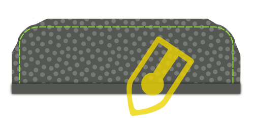
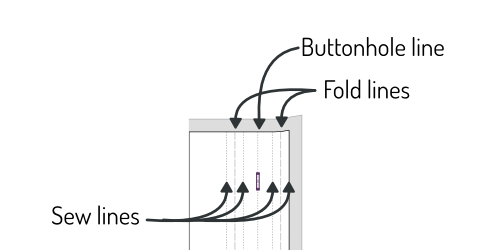
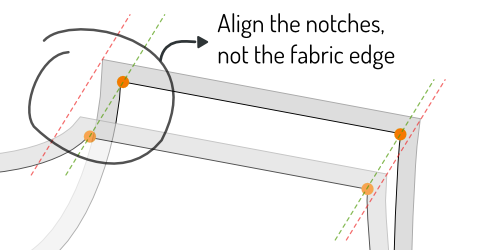
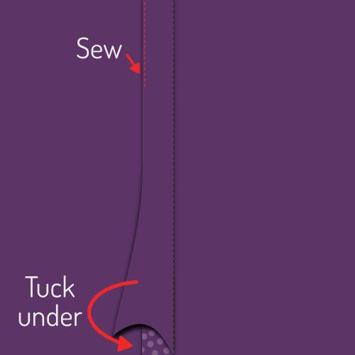

<Tip>

##### Folgen Sie dem Nähen mit Kelly und Julian

Kelly Hogaboom und Julian Collins haben eine Simon(e) mitnäht, und sie haben Videos von
alle Schritte.
Wenn Sie dieses Muster herstellen wollen, können Kelly und Julian Ihnen den Weg zum Ende weisen.

Du findest alle Materialien auf der 
-Seite von Kelly: [#simonsayssew mit kelly hogaboom-and-julian collins](https://kelly.hogaboom.org/2020/07/simon-says-sew-with-kelly-hogaboom-and-julian-collins/)

</Tip>

### Schritt 1: Sicherungsschnittstelle

 

#### Drücken Sie die Schnittstelle zu Manschetten
Um zwei Manschetten herzustellen, haben Sie Ihr Manschettenstück viermal im Gewebe und zweimal in der Schnittstelle ausgeschnitten.

Drücken Sie für jede Manschette das Schnittstück auf die schlechte Seite des Manschettenstücks.

> Wenn die Innen- und Außenseite der Manschette der gleiche Stoff sind, spielt es keine Rolle, auf welche Manschette du sie drückst.
> 
> Ein beliebtes Detail im Stil ist jedoch, ein anderes Stoff für die Innenseite der Manschette zu haben. Achten Sie in diesem Fall darauf, die Schnittstelle zu dem Stück zu drücken, das Sie sein wollen, die Außenseite Ihrer Manschette zu sein.

> Je nachdem, welche Manschette Sie ausgewählt haben, ist die Form der Manschette unterschiedlich.
> 
> In the first illustration, you can see both a round barrel cuff and a French cuff as examples.
> 
> In den Illustrationen wird die runde Barrel Manschette nach vorn verwendet, aber der Prozess ist der gleiche für die anderen Manschetten.

#### Press interfacing to collar, undercollar and collar stand
Um Ihren Kragen herzustellen, müssen Sie einen Unterkragen, einen Kragen und zwei Kragenständer schneiden. All dies sowohl im Gewebe als auch in der Schnittstelle.

Drücken Sie für jedes Stück auf die schlechte Seite.

### Schritt 2: Bereiten Sie die Manschetten vor

#### Nähschicht zusammen

Platzieren Sie beide Teile Ihrer Manschette (eine mit Schnittstelle, eine ohne Schnittstelle) zusammen mit den guten Seiten und nähen Sie sie an der Standardnaht zusammen.

> **Ensure you**
> 
> - Nähen Sie nicht die Seite, die wir später an den Ärmel befestigen werden
> - Stoppe am Abstand der Naht von der Kante auf der Ärmelseite

#### Nahtzuweisung kürzen

Before we flip your cuff over, we need to trim back the seam allowance to remove bulk.

#### Drücken Sie die Naht zurück

Fold back the seam allowances on each side of the cuff where the cuff attaches to the sleeve, and press them down.

> Wenn man früher zu weit am Rand genäht ist, muss man ein paar Nähte aufnehmen.

#### Schalte Manschette um und drücke

Drehen Sie Ihre Manschette mit den guten Seiten aus, und geben Sie ihr eine gute Presse.

> When pressing your cuffs, make sure to roll the seam a bit to the backside of the cuff to guarantee that the inner fabric of the cuff is not visible.

Du kannst nun deine Manschetten beiseite, wir werden sie später anhängen.

### Schritt 3: Bereiten Sie den Kragen vor

#### Nähen Kragen und Unterkragen zusammen

Legen Sie beide Kragenteile mit den guten Seiten zusammen und nähen Sie sie an der Standardnahtzugabe.

#### Nahtzuweisung kürzen

Before we flip your collar over, we need to trim back the seam allowance to remove bulk.

#### Kragen drehen und drücken

Drehen Sie Ihren Kragen mit den guten Seiten aus, erhalten Sie diese Tipps so Pointy wie möglich, und geben Sie ihm eine gute Presse.

> Wenn Sie den Kragen drücken, denken Sie daran, dass der Unterkragen etwas enger ist.
> 
> Wenn du die nicht genähten Seiten ausrichtest, Dies führt dazu, dass die Naht nach der Rückseite des Kragens rollt, um zu gewährleisten, dass die Innenstruktur des Kragens nicht sichtbar ist.

#### Obere Stickkragen

Obere Naht am Rand des Kragens. Dadurch wird die Nahtzulage versperrt und ein knuspriges Aussehen erreicht.

> Wie weit Sie von der Kante oben sticken, ist eine Stilauswahl. Es ist oft ein bisschen weniger als die Standard Nahtzugabe. Werfen Sie einen Blick auf einige bestehende Hemden, um sich eine Idee zu machen.

### Schritt 4: Kragen- und Kragenstand verbinden

#### Platziere Kragen zwischen Kragen und Baste an Ort

Markieren Sie den Mittelpunkt des Kragens und der Kragen steht mit einem Pin. Der mittlere Punkt jedes Kragenständers ist eigentlich etwas außerhalb der Mitte, da das eine Ende länger als das andere ist. Stattdessen finden Sie den mittleren Punkt zwischen den beiden Noten.

Platziere zuerst einen Kragen mit der guten Seite nach oben, dann deinen Kragen mit dem nach oben gerichteten Unterkragen (und die nicht genähte Seite oben), und schließlich der zweite Kragen stehen mit der guten Seite.

Your collar should sit between your two collar stands, and the middles (where you placed your pin) should be aligned.

> Die Art und Weise, wie die Dinge aussehen, hängt ein wenig von Ihrer Kragenauswahl ab, aber im Allgemeinen wird Ihr Kragen nach unten gebogen, und Ihr Kragenstand wird nach oben gebogen.
> 
> Um das alles in Einklang zu bringen, werden wir das zusammenfügen und nicht anpinnen. Ihr Kragen ist ein wichtiger Teil Ihres Hemdes, daher lohnt es sich, diese zu backen.

Ersetzen Sie zunächst die Pins mit der Markierung der Mitte durch einen Pin, der alle Teile zusammenpinnt.

Nun beginnen Sie mit dem Basten von diesem Pin und arbeiten Sie Ihren Weg in die Ecke des Kragens, um sicherzustellen, dass beide Kanten des Stoffes.

Wenn Sie die Ecke des Kragens erreichen, gehen Sie weiter und ziehen Sie das Ende der beiden Kragen zusammen.

When you've done one side, start from your pin in the middle again and do the other side. Wenn Sie mit dem Basten fertig sind, können Sie den Pin herausnehmen.

#### Nähen Sie Ihren Kragen an den Kragenständern

Nähen Sie am Rand Ihres Kragenständers unter Einhaltung der üblichen Nahtzugabe.

> Achten Sie darauf, 2 cm vor der Kante zu stoppen (doppelt so viel wie die Standardnahterlaubnisse), da wir im nächsten Schritt die Naht überklappen. und wir müssen die Kragenständer ausreichend voneinander getrennt lassen, um das Hemd später zwischen ihnen hineinzurutschen.

#### Kantennahterlaubnis nach hinten drücken und den Kragen drücken

Falten Sie die Naht des Kragenständers auf der nicht genähten Seite zurück und drücken Sie sie nach unten.

> Im mittleren Teil wird das Drücken des Nahtzuges leicht sein. Aber in Richtung der Spitzen Ihres Kragens, wird dies ohne Drücken von Falten in Ihrem Kragen schwierig sein.
> 
> Press it as best as you can without making folds in your collar. Wir drücken dies erneut, nachdem wir den Kragen raus geworfen haben.

#### Kragenstand drehen und drücken

Drehen Sie Ihren Kragen mit den guten Seiten aus, und geben Sie ihm eine gute Presse. Achten Sie darauf, dass die Naht auf dem Kragenständer nach innen gefaltet bleibt.

Sie können jetzt Ihren Kragen beiseite, wir befestigen ihn später.

### Schritt 5: Optional: Nähen in Ihrem Label

Unser nächster Schritt ist, das Joch zu befestigen. Aber das Joch ist ein großartiger Ort, um Ihr Label zu setzen. Wenn Sie das also tun möchten, können wir damit anfangen.

Wählen Sie ein Joch und Sie können Ihr Etikett in der Mitte (auf der guten Seite) nähen.

### Schritt 6: Trete den Yokes auf die Rückseite ein

 

Platziere ein Joch mit der guten Seite. Darüber hinaus legen Sie den Rücken mit der guten Seite nach oben, indem Sie die Naht dort ausrichten, wo sie am Joch angebracht werden muss.

Schließlich, platzieren Sie Ihr zweites Joch auf den Rücken, aber mit der guten Seite.

Your back should now be sandwiched between the good sides of your two yokes.

Wenn dies der Fall ist, nähen Sie sie entlang der Rückennähte und achten Sie darauf, dass die Nahtzuweisung eingehalten wird.

> Wenn Sie ein Label in Schritt 1 hinzugefügt haben, stellen Sie sicher, dass das Joch mit Ihrem Label auf die schlechte Seite des Rückens gesetzt wird.

Wenn Sie fertig sind, vergessen Sie nicht, ihm eine gute Presse zu geben, um die Naht flach zu machen.

### Schritt 7: Kantenstich das Joch

Mit Ihren Jokes auf der Rückseite werden wir Kantenstich entlang der Naht, die wir gerade gemacht haben, auf der Joch Seite.

> Falte den inneren Joch aus dem Weg. Our edge stitching will catch the outer yoke, back and all the seam allowances, but not the inner yoke.

Nähen Sie einfach direkt neben der Naht und verbinden Sie das äußere Joch zur Rückseite.

> Kantenstich ist wie oben geheftet, aber direkt neben der Naht

### Schritt 8: Hintergrunddarts schließen

  

> Abhängig von Ihren Messungen kann es sein, dass Ihr Muster überhaupt keine Rückendarts hat. In diesem Fall fahren Sie mit dem nächsten Schritt fort.

Ihr Muster kann Rückendart haben oder nicht. Wenn er sie hat, sollten Sie sie jetzt schließen.

Platziere deinen Rücken mit der guten Seite nach oben und falten Sie es von der Seitennaht zurück, so dass die Falte von oben bis unten läuft.

Machen Sie das gleiche für den anderen Dart, so dass beide Seiten geklappt werden.

Fühlen Sie sich frei zu drücken in dieser Kreise, es wird Ihnen helfen, sauber nähen die Darts.

Nähen Sie über die Linie, die den Dart markiert, um die Darts zu schließen. Achten Sie darauf, dass die Darts oben und unten genau dort sind, wo sie sein müssen. Wenn der eine Dart höher sitzt als der andere, wird er schlecht aussehen.

Wenn du fertig bist, vergiss nicht, ihm eine gute Presse zu geben. Drücken Sie den zusätzlichen Stoff des Darts in Richtung der Seitennaht.

### Schritt 9: Bereiten Sie den Tastenplatz vor

> Wenn du einen Platz gewählt hast, kannst du die ersten beiden Unterschritte überspringen und zum [Button-Platzhalter](#fold-the-button-placket) Falten gehen.

#### Nähen auf Knopf-Platzhalter

Wenn Sie eine separate Schaltflächenplatzierung gewählt haben, nähen Sie sie auf das Stück vorne rechts.

Platziere die Vorderseite rechts (Teil 1) mit der guten Seite nach oben und platzieren Sie den Button Placket (Teil 1b) mit der guten Seite nach unten, um die Naht auszurichten.

Nähen Sie es mit der standardmäßigen Nahtzugabe.

#### Drücken Sie Nahtzugriff auf die Platzierungsseite
Platzieren Sie Ihre Vorderseite mit der guten Seite nach unten und drücken Sie die Nahtmenge auf die Tastenseite.

#### Tastenplatzierung falten

Nun falten Sie über die Tastenplatzierung auf der ersten Faltlinie, und drücken Sie diese Falte an der Stelle.

Dann falten Sie die Platte noch einmal und sorgen Sie dafür, dass der Stoff sich über die Naht hinaus ausdehnt, die Ihr Platz an der Vorderseite verbindet.

Wenn Sie zufrieden sind, drücken Sie die gefaltete Platte.

#### Nähen Sie den gefalteten Platzhalter

> Das ist der klassische Ansatz. Wenn Sie den nahtlosen Schaltflächen-Stil gewählt haben, müssen Sie das nicht tun.
> 
> Anstatt die Platte zu nähen, lassen Sie sie einfach falten. Wenn wir die Tasten später befestigen, werden die Falten gesichert.

Von der guten Seite Ihres Hemdes nähen Sie das gefaltete Plakat durch Nähen im Graben.

Um dies zu tun, nähen Sie genau auf Ihrer früheren Naht. Since you folded the fabric of your placket a bit past this seam, it will get caught at the back, fixing your folded placket in place, and locking the seam allowance inside.

### Schritt 10: Bereiten Sie das Buttonhole Placket vor

> Wenn Sie einen ausgewachsenen Platz gewählt haben, können Sie die ersten beiden Unterschritte überspringen und einen klassischen Knopflochplatz verstehen.

#### Nähen auf dem Knopflochplatz

Wenn Sie einen separaten Knopflochplatz gewählt haben, nähen Sie ihn in das Stück vorne links.

Platziere die Vorderseite links (Teil 2) mit der guten Seite nach oben und platzieren Sie das Buttonhole Placket (Teil 2b) mit der guten Seite, um die Naht auszurichten.

Nähen Sie es mit der standardmäßigen Nahtzugabe.

Wenn du fertig bist, vergiss nicht, ihm eine gute Presse zu geben. Drücken Sie die Nahtmenge auf die Seitenseite.

#### Drücken Sie die Naht Erlaubnis auf die Platzhalterseite
Platzieren Sie Ihre Vorderseite mit der guten Seite nach unten und drücken Sie die Nahtzuweisung auf die Seite des Buttonlochs.

#### Ein klassisches Knopflochplacket verstehen

> Wenn Sie ein nahtloses Platzieren gewählt haben, sollten Sie die Schritte der Tastenplatzierung befolgen, da die Konstruktion identisch ist.
> 
> Die folgenden Schritte sind für einen klassischen Knopflochplatz vorgesehen.

Ihr Platzhalter hat einen Haufen Zeilen, also lassen Sie uns zuerst klarstellen, was sie sind:

 - Die Knopflochlinie hat lange Bindestriche mit Knöpfen. Es markiert, wohin die Buttonlöcher gehen sollen
 - Die beiden Faltlinien haben lange Bindestriche und sitzen in gleicher Entfernung rechts und links von der Tastenlochlinie
 - Die zwei+zwei Nählinien sind gepunktete Linien, die in gleicher Entfernung jeder Faltlinie sitzen

#### Rückennahterlaubnis kürzen

> Wenn Sie einen ausgewachsenen Platz gewählt haben, gilt dies nicht.

Die Nahtzugabe, wo Sie Ihren Knopflochplatz auf der Vorderseite genäht haben, sollte in Ihren gefalteten Platz passen.

Dazu die Nahtzuweisung zurückdrehen, so dass sie nicht über die erste Faltlinie auf dem Platzhalter hinausgeht.

#### Knöpfchen-Platzhalter falten

 

Falten Sie die Platte auf der ersten Faltlinie. Drücken Sie die Falte an der Stelle.

Dann falten Sie das Teil, das Sie gerade wieder gefaltet haben, dieses Mal auf der zweiten Faltlinie. Drücken Sie auch diese Falte.

> Wenn Ihr Platzhalter gefaltet und gedrückt wird, platzieren Sie ein paar Pins entlang der Länge Ihres Platzhalters, um zu verhindern, dass sich die Dinge umdrehen

#### Nähen Sie den Knopflochplatz

 

Nähen Sie die erste Nählinie, die der Kante am nächsten ist.

Dann drehen Sie Ihr Shirt um, damit die gute Seite aufwärts ist, und Ihr Stick ist auch hoch. Dann nähen Sie an der zweiten Nählinie.

> Diese beiden Linien werden immer sichtbar sein, also achten Sie darauf, dass sie sauber bleiben

#### Drücken Sie den Knopflochplatz

Herzlichen Glückwunsch, Sie haben einen klassischen Knopflochplatz gemacht.

Drücke nun das Baby. Sie wissen, dass Sie es wollen.

### Schritt 11: Die Schulternähte schließen

> **Lass uns ein Burrito erschaffen**
> 
> We are going to close the shoulder seams with a technique that is commonly known as the **burrito method**.
> 
> Wenn Sie mit der Burrito-Methode vertraut sind, wissen Sie bereits, was zu tun ist. Wenn nicht, lesen Sie weiter für einen geschickten Weg, um die Schulternähte Ihres Hemdes sauber zu schließen und alle unvollendeten Kanten aus dem Blick zu sperren.

#### Pin die Fronten nach außen

 

Platzieren Sie Ihren Rücken mit der guten Seite nach oben, aber achten Sie darauf, das innere Joch nach unten zu falten (wie die gepunktete Linie veranschaulicht.

Legen Sie Ihre Fronten auf den Rücken mit den guten Seiten nach unten. Pin vorne an der Schulternaht, gute Seiten zusammen.

#### Rollen, rollen, Hemd rollen, Nähen und Nähen

Roll den Rücken hoch und die Fronten beginnen am Sam. Bringe sie in eine saubere Wurst nach oben, bis du das gesamte abgewiesene Joch sehen kannst.

Jetzt können Sie das innere Joch über Ihre Walzwurst ziehen, um die Schulternähte mit dem anderen Joch und den anderen Fronten auszurichten.

Nähen Sie sie an Ort und nähen Sie dann die Schulternähte, Achten Sie darauf, Ihre Wurst (oder Burrito-Füllung) aus dem Weg zu räumen, damit sie nicht in der Naht gefangen wird.

> Hergestellt um die aktuelle Nahtlinie auszurichten. Durch die ungleichen Winkel an der Halsöffnung ist der Stoffrand oft länger als auf der anderen Seite.
> 
> However, the seamlines are the same length, so make sure to match them carefully using the notches.

#### Innen durch den Nackenöffner drehen
Wenn Sie beide Schulternaht nähen, erreichen Sie durch die Nackenöffnung und ziehen Sie die Rücken- und Frontteile nach innen aus.

#### Drücke die Schulternähte

Du hast all diese Arbeit gemacht, so jetzt stelle sicher, dass du es super scharf aussiehst, indem du ihm eine gute Presse gibt. Achten Sie darauf, dass die Naht zwischen Ihren Yokes schön und flach ist.

### Schritt 12: Kantenstich die Schulternähte des Joch

So wie wir in Schritt 3 die untere Naht des Joch mit Kanten geheftet haben, werden wir das Joch auch an den Schulternähten einnähen.

Da Sie gerade diese Schulternaht gedrückt haben, sollte alles schön und flach liegen, und Sie müssen nur einen Stitch direkt neben der Naht betreiben.

> Vergewissern Sie sich, dass Sie die Naht nicht auf dem vorderen Teil, sondern auf dem Jokerteil einstichten.

### Schritt 13: Bauen Sie den Ärmelplatz

#### Nähen im Manschettenwächter

  

 - Platzieren Sie Ihren Ärmel mit der guten Seite nach unten, und Ihre Manschettenwächter nach oben, auch mit der guten Seite.
 - Legen Sie den Rand Ihres Manschettenwächters (alias Sleeve Placket Unterklappen) mit dem Schnitt in Ihrem Ärmel, auf der Seite kürzer zur Seitennaht.
 - Nähen Sie nun entlang der Faltlinie, die auf der Manschettenwand markiert ist, näher an der Kante.

> Wenn du beim Ausschnitt deiner Musterstücke nicht in den Ärmel geschnitten hast, an dem der Ärmel eingefügt werden muss Sie müssen das zuerst tun.

 - Falte über die Manschettenwache und drücke diese Naht.
 - Drehen Sie Ihren Ärmel mit der guten Seite nach oben und bringen Sie Ihre Manschettenwächter durch den Schlitz in den Ärmel.
 - Falten Sie es zweimal auf die Linien, so dass die unfertige Naht nach innen geklebt ist.
 - Make your folds so that the upper fold sits ever so slightly further than the seam you already made.
 - Drücken Sie alles nach unten und dann Kantenstich die Manschettenwache.

#### Falten und platzieren drücken

Origami Zeit! Die Überlappung der Ärmel erfolgt mit den markierten Faltlinien als Anleitung. Dies wird viel einfacher sein, wenn Sie zwischen den beiden Seiten drücken.

 - Zuerst die äußeren Kanten des Platzes nach innen falten.
 - Next, fold the entire thing in half.
 - Dann falten Sie beide Spitzen in eine schöne spitzige Form.
 - Jetzt geben Sie ihr eine letzte gute Presse.

#### Platzhalter an Stelle anheften

 

Place your sleeve down with the good side up. The guard we have sewn in earlier sits against the other unfinished fabric edge of where you cut into your sleeve.

Place your placket around that edge, one side above it, one underneath.

You need to slide the placket onto your sleeve until the middle of it (the tip) aligns with the cut in your sleeve.

The idea is that the placket closes up the unfinished edge, but also covers the guard of the other edge.

When you've got it where you want it, pin the placket down.

#### Nähen Sie den Ärmel Placket

Start at the edge of the sleeve (the bottom of the sleeve placket) and edge-stitch along the edge upwards.

Go around the tip, and come down again on the other side (the fold side) until you have passed the point where your guard ends.

Then, sew horizontally to the other side of the placket to finish.

> Ich habe hier eine zusätzliche Illustration hinzugefügt, die nur die Umrisse des Platzhalters anzeigt. Sie können sehen, dass das Ende der Wache in unserem Heften des Platzes gefangen ist und somit sauber verklebt ist.

### Schritt 14: In Ärmeln setzen

#### Denken Sie daran, dies ist eine flachgelockte Naht

> **Careful with the extra seam allowance for the flat-felled seam** There is extra seam allowance on the sleeve to allow for the creation of the flat-felled seam.
> 
> Seien Sie also darauf bedacht, nicht den Stoffrand auszurichten, sondern die Naht so auszurichten, dass der Ärmel 1 cm aussetzt.

#### Pin sleeve in place

Spread your shirt open so that both fronts and back lie flat with their good sides up.

Now place your sleeve on top with the good side down, matching the top of the sleeve with the shoulder seam.

> Seien Sie vorsichtig, Ihr Ärmel ist nicht symmetrisch, also stellen Sie sicher, die doppelte Noch (und Manschetten) auf der Rückseite zu haben und die einzelne Note auf der Vorderseite.
> 
> Also note that the double notch on the back of your sleeve does not have a corresponding notch on the back. That's because it should match up with the seam where your yoke joins the back.

You now need to pin the sleeve to the armhole. To do so, make sure to:

 - Stelle den Anfang und das Ende des Ärmelkopfes an den Anfang und das Ende des Armlochs fest
 - Passen Sie die Noten auf dem Ärmelkopf an die Noten auf der Rückseite und auf der Vorderseite an
 - Verteilen Sie die Ärmel Leichtigkeit auf die Noten wie gezeigt

#### Distribute sleevecap ease

The default sleevecap ease for this pattern is 0.5cm. If you have sleevecap ease, you need to distribute that extra length evenly between the notches as shown.

> If you are unsure what sleevecap ease is, have a look at the [documentation for the sleevecap ease pattern option](/docs/patterns/simon/options/sleevecapease).

#### Ärmel in Armloch nähen
When you've got your sleeve neatly pinned in your armhole, sew it in place. Be careful to avoid any pleats in the part between the notches where you need to ease in the sleevecap ease.

> Selbstredend zu sagen, aber ich sage es trotzdem: Wiederholen Sie diesen Schritt für den anderen Ärmel.

### Schritt 15: Flach fallende Rüstungsnaht

#### Drücken Sie die Naht Erlaubnis auf eine Seite

Lay down your freshly sewn sleeve seam with the good side down

We are going to press the seam allowance to one side. To do so, identify the seam allowance that is wider (for the flat-felled seam).

The longer seam allowance needs to lie on top of the shorter (standard seam allowance).

Once you have verified that, press down the seam allowance.

#### Unter zusätzlichem Nahtzuwachs falten

Now, fold the extra seam allowance for the flat-felled seam under the standard seam allowance.

You can use pins to hold this in place, but it's simpler to just press it.

> Das wird relativ einfach an den geraden Teilen der Naht sein, aber etwas komplizierter an den gebogenen Abschnitten. Nehmen Sie sich Zeit, und bei Bedarf können Sie in die zusätzliche Nahtmenge schneiden, um es zu ermöglichen, offen oder biegen.

#### Nähen Sie die flachgeschlagene Naht
Now, from the bad side of the fabric, sew the seam allowance down just at the edge where it folds under the other seam allowance.

Important here is to keep an even distance from the seam of your sleeve. If you have a felling foot for your sewing machine, it will help you with that. But if not, just be careful.

> Es ist wichtiger, die Ärmelnaht zu halten und sogar zu entfernen, als genau am Fadenrand zu nähen. Im Idealfall sitzt die Falte ohnehin in gleichmäßiger Entfernung, aber wenn nicht, vergewissern Sie sich, dass sie parallel zur Ärmelnaht näht. Auch wenn das bedeutet, dass Sie ein bisschen von der gefalteten Kante abweichen.

#### Drücke die flache Naht
When it's all done, press the flat-felled seam from the good side so it lies nice and flat.

### Schritt 16: Schließen Sie die Seiten/Ärmel Nähte

 

Place your shirt with the good sides together, and sew the side and sleeve seams to close the shirt.

> Auf den Ärmeln und den Vorderseiten wird ein zusätzlicher Nahtzuschlag gewährt, um die flache Naht herzustellen. Achten Sie daher darauf, den Stoffrand nicht auszurichten, sondern die Naht so auszurichten, dass die zusätzliche Nahtmenge 1 cm beträgt.

### Schritt 17: Flach fiel die Seite/Ärmel Nähte

#### Drücken Sie die Naht Erlaubnis auf eine Seite

We are going to press the seam allowance to one side. To do so, identify the seam allowance that is wider (for the flat-felled seam).

The longer seam allowance needs to lie on top of the shorter (standard seam allowance).

Once you have verified that, press down the seam allowance.

#### Unter zusätzlichem Nahtzuwachs falten

Now, fold the extra seam allowance for the flat-felled seam under the standard seam allowance.

You can use pins to hold this in place, but it's simpler to just press it.

> Das wird relativ einfach an den geraden Teilen der Naht sein, aber etwas komplizierter an den gebogenen Abschnitten. Nehmen Sie sich Zeit, und bei Bedarf können Sie in die zusätzliche Nahtmenge schneiden, um es zu ermöglichen, offen oder biegen.

#### Nähen Sie die flachgeschlagene Naht
Now, from the bad side of the fabric, sew the seam allowance down just at the edge where it folds under the other seam allowance.

Important here is to keep an even distance from the seam of your sleeve. If you have a felling foot for your sewing machine, it will help you with that. But if not, just be careful.

> It is more important to keep an even distance from the sleeve seam than to sew exactly at the edge of the fold. Im Idealfall sitzt die Falte ohnehin in gleichmäßiger Entfernung, aber wenn nicht, vergewissern Sie sich, dass sie parallel zur Ärmelnaht näht. Auch wenn das bedeutet, dass Sie ein bisschen von der gefalteten Kante abweichen.

#### Drücke die flache Naht
When it's all done, press the flat-felled seam from the good side so it lies nice and flat.

### Schritt 18: Befestige Manschetten an Ärmel

#### Pin Manschette an Stelle

You need to insert the sleeve between the two layers of your cuff, making sure that the good side of the fabric sits against the side of your cuff that has the interfacing applied to it.

You will need to pin this in place, because depending on how long your sleeve placket is, it might be hard or even impossible to get this to lie flat.

Also note that your sleeve edge will be longer than your cuff (how much longer depends on the sleeve drape). You need to make one or a few folds in your sleeve to accommodate for this.

> Your pattern contains helplines on the sleeve to help you place the folds.

> Nehmen Sie sich Zeit, alles sorgfältig zu fixieren. We are going to edge-stitch this later, so it's important that the front and back of your cuff align nicely.

#### Kantenstich Manschetten an Ärmel

Once everything is pinned in place, edge stitch along the edge of your cuff to attach it to your sleeve.

It's important to catch both the outer and inner layer of your cuff on the edge.

> Vergewissern Sie sich, dass die Kantenstich von der Außenseite (die gute Seite des Ärmels) und halten Sie sie parallel zur Manschettenkante.

When you're done, give your cuffs a good press.

#### Obere Stich die Manschetten

> Drücken Sie Ihre Manschetten bevor Sie dies tun.

Top-stitch around your cuff at a distance from the edge that is a bit less than your seam allowance. Go all the way around your cuff.

### Schritt 19: Den Kragen anhängen

#### Kragen an Ort einfügen

This is an important seam, so we are going to baste this in place to make sure it sits exactly right before we sew it.

Start at the center back, and place the seam allowance of your back part between your two collar stands. Work your way around one side, and then do the other.

Make sure to respect the standard seam allowance and - important - avoid any wrinkles.

> Während Ihr Kragenständer relativ geradlinig ist, werden wir es zu einem im Grunde genommen Loch in Ihrem Hemd nähen.
> 
> Das ist ein bisschen kompliziert, also achten Sie besonders auf die Teile, die am meisten gekrümmt sind: wo der Rücken verbindet die Fronten.

#### Kantenstichkragen an Stelle

 

When you're happy with how you've basted your collar in place, it's time to sew that thing down.

We're going to start at the center-back and sew all the way around the collar stand.

#### Nähen am Kragenrand

To give more body to your collar, and firmly secure it in place we're going to sew along the top edge of the collar stand.

Sew about half the seam allowance from your earlier edge-stitching. Make sure to stop a few cm before the end of the collar.

> Sie müssen ein paar cm vor dem Ende des Kragens stoppen (beachte: das Ende des Kragens, so dass diese Naht vollständig bedeckt ist, wenn der Kragen heruntergeklappt wird.

#### Drücke den Kragen

Now that your collar is attached, give it a good press.

### Schritt 20: Hem dein Hemd

  

Time to finish the hem (that's the part you tuck in your trousers).

Fold up half of the hem allowance and press down. Then, fold up again and press again.

Now, sew along the upper edge to finish the hem.

### Schritt 21: Tastenlöcher erstellen

If you haven't done so initially, mark all the places you should have buttonholes.

They sit along the front closure and at your cuffs.

When you've marked them, make buttonholes there.

### Schritt 22: Buttons anhängen

Pin your shirt closed to transfer the place of the buttonholes to the button sides.

When you've marked where buttons should go, sew them on.

> Anstatt die Position der Tasten aus dem Muster zu markieren, ziehe ich es vor, die Position der erzeugten Tasten zu übertragen.
> 
> Auf diese Weise, wenn ein Knopfloch ein bisschen an der Stelle sitzt, wird der Knopf einfach folgen.

