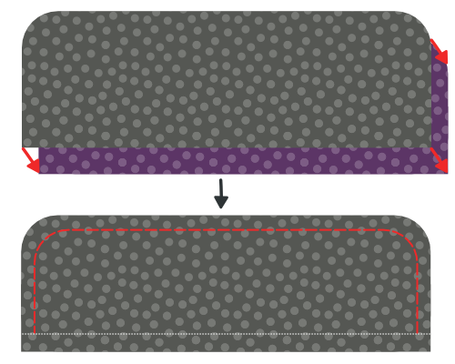
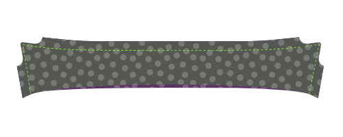
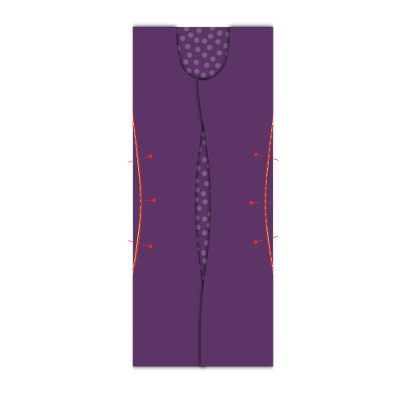
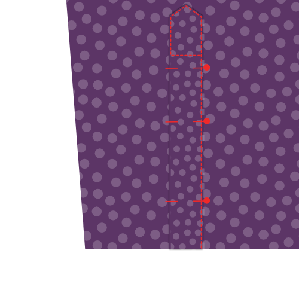
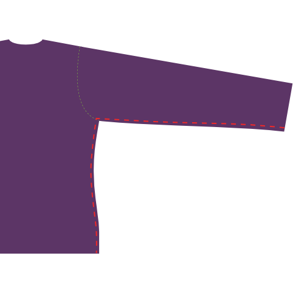

<Tip>

##### Siga la costura junto con Kelly y Julian

Kelly Hogaboide y Julian Collins hicieron una costura Simon(e) , y tienen videos de
todos los pasos.
Si estás buscando este patrón, Kelly y Julian pueden guiarte a empezar a terminar.

Puedes encontrar todo el material en el sitio
de Kelly: [#simonsayssew con colinetes kelly Hulkaboom](https://kelly.Firstaboom.org/2020/07/simon-says-sew-with-kelly-Øaboom-and-ú-únian-collins/)

</Tip>

### Paso 1: Fusionar interfaz

 

#### Interfaz de prensa a tazas

Para hacer dos tacos, has cortado tu pieza de corte cuatro veces en tela y dos veces en interfaz.

Para cada tazón, presione la pieza de enganche hacia el lado malo de la pieza.

> Si el interior y el exterior de tu taza son el mismo tejido, no importa a qué pieza de corte lo pulsas.
>
> Sin embargo, un detalle de estilo popular es tener un tejido diferente para el interior del tazón. En este caso, asegúrese de pulsar la interfaz con la pieza que desea ser el exterior de su taza.

> Dependiendo de qué corte haya elegido, la forma del corte será diferente.
>
> In the first illustration, you can see both a round barrel cuff and a French cuff as examples.
>
> En el futuro, el cubo redondo se utilizará en las ilustraciones, pero el proceso es el mismo para las otras tazas.

#### Press interfacing to collar, undercollar and collar stand

Para hacer tu collar, tienes que cortar un collar, un collar y dos soportes de collar. Todo esto tanto en tela como en interfaces.

Para cada picoteo, presione la pieza de enlace hacia el lado malo.

### Paso 2: Prepara los cuffs

#### Difunde juntos

Coloque ambas partes del corte (una con interfaces, otra sin interfaz) junto con los lados buenos, y coser juntos en la costura estándar.

> **Ensure you**
>
> -   No coser juntos el lado que nos uniremos a la manga más tarde
> -   Detener en la distancia de costura desde el borde del lado de la manga

#### Recortar permisos de costura

Before we flip your cuff over, we need to trim back the seam allowance to remove bulk.

#### Presione la costura posterior

Fold back the seam allowances on each side of the cuff where the cuff attaches to the sleeve, and press them down.

> Si te has costado demasiado a lo largo del borde antes, tendrás que deseleccionar unas cuantas stitches.

#### Da la vuelta y presiona

Invierte el coño con los lados buenos, y dale una buena prensa.

> When pressing your cuffs, make sure to roll the seam a bit to the backside of the cuff to guarantee that the inner fabric of the cuff is not visible.

Ahora puedes dejar tus cortes a un lado, los adjuntaremos más tarde.

### Paso 3: Prepara el cuello

#### Difunde cuello y cuello bajo

Coloque ambas partes de cuello junto con los lados buenos, y coser juntos en la costura estándar.

#### Recortar permisos de costura

Before we flip your collar over, we need to trim back the seam allowance to remove bulk.

#### Gira el collar y presiona

Voltee el cuello con los lados buenos, obtenga esos consejos tan puntiagudos como sea posible, y le dé una buena prensa.

> Cuando presione el cuello, recuerde que el guante inferior es un poco más estrecho.
>
> Cuando alineas los lados no cocidos, esto hará que la costura se mueva hacia la parte trasera del cuello para garantizar que la tela interna del cuello no es visible.

#### Cuello de empate

Mezclar a lo largo del borde del cuello. Esto bloquea la costura y hace un aspecto crujiente.

> Qué tan lejos de la parte superior del borde es una elección de estilo. A menudo es un poco menor que la franquicia de costura estándar. Echa un vistazo a algunas camisetas existentes para hacerte una idea.

### Paso 4: Únete al collar y al collar

#### Coloca el cuello entre los soportes de cuello y baste en su lugar

Marque el punto medio de su cuello y su cuello esté con un pin. El punto medio de cada stand de cuello está en realidad ligeramente fuera de centro, ya que un extremo es más largo que el otro. En cambio, se encuentra el punto medio entre las dos notas.

Primero coloca un soporte de cuello con el lado bueno, luego tu cuello con el guante hacia arriba (y el lado no coser en la parte superior), y finalmente el segundo cuello con el lado bueno abajo.

Your collar should sit between your two collar stands, and the middles (where you placed your pin) should be aligned.

> La forma en que las cosas se vean dependerá un poco de tus opciones de cuello, pero en general su cuello se va a doblar hacia abajo, y su soporte de cuello se doblará hacia arriba.
>
> Para alinear todo esto, vamos a bastarlo juntos, en lugar de fijarlo. Tu cuello es una parte importante de tu camiseta, así que vale la pena degustar esto.

Primero, sustituya los pines marcando el medio por un pin que engancha todas las partes juntos.

Ahora, comience a tocar desde este alfiler y trabaje hasta el rincón del cuello, asegurándose de alinear ambos bordes de la tela.

Cuando llegues a la esquina de tu cuello, sigue bajando y golpeando el final de ambas paradas de cuello juntos.

When you've done one side, start from your pin in the middle again and do the other side. Cuando termines de cocido, puedes sacar el pin.

#### Difunde tu cuello hasta los stands de cuello

Diviértete en el borde de tu quiosco de cuello respetando la franquicia de costura estándar.

> Asegúrate de parar 2cm antes del borde (dos veces la franquicia estándar de costura) ya que en el siguiente paso vamos a doblar la franquicia de costura y tenemos que dejar los soportes de cuello lo suficientemente separados para deslizar la camisa entre ellos más adelante.

#### Doble hacia atrás y presiona la franquicia de costura

Doblar la costura de su cuello en el lado no coser y presionarlo hacia abajo.

> En la parte central, pulsar hacia abajo la franquicia de costura será fácil. Pero hacia las puntas de su cuello, hacerlo será complicado sin pulsar pliegues en su cuello.
>
> Press it as best as you can without making folds in your collar. Presionaremos esto de nuevo después de voltear el cuello.

#### Da la vuelta al collar y presiona

Invierte tu pie de cuello con los lados buenos, y dale una buena prensa. Asegúrate de mantener la franquicia de costura en el stand de cuello doblada hacia dentro.

Ahora puedes dejar tu cuello a un lado, lo adjuntaremos más tarde.

### Paso 5: Opcional: Empuje en su etiqueta

Nuestro siguiente paso es adjuntarlo. Pero el yugo es un buen lugar para poner tu etiqueta. Así que si quieres hacer eso, podríamos empezar con eso.

Elige un yoque, y puedes coser tu etiqueta en el centro (en el lado bueno).

### Paso 6: Únete a la espalda

 

Coloque un yugo con el lado bueno arriba. Por encima de eso, coloque la espalda con el lado bueno, alineando la costura donde se debe sujetar al yugo.

Por último, coloque su segundo yugo en la parte superior de la espalda, pero con el lado bueno abajo.

Your back should now be sandwiched between the good sides of your two yokes.

Si ese es el caso, coser en su lugar a lo largo de la costura/yuga, asegurándose de respetar la costura permitida.

> Si ha añadido una etiqueta en el paso 1, asegúrese de poner el yugo con la etiqueta en el lado malo de la espalda.

Cuando hayas terminado, no olvides darle una buena prensa para que la costura sea plana.

### Paso 7: Enrollar el yugo

Con tus yemas pegados a la espalda, vamos a doblar a lo largo de la costura que acabamos de hacer, en el lado del yugo.

> Doble el yugo interior fuera del camino. Our edge stitching will catch the outer yoke, back and all the seam allowances, but not the inner yoke.

Sólo coser justo al lado de la costura uniendo el yugo exterior a la espalda.

> Encender los bordes es como la parte superior, pero justo al lado de la costura

### Paso 8: Cierra los dardos traseros

  

> Dependiendo de sus mediciones, es posible que su patrón no tenga dardos atrás. En ese caso, pasemos al siguiente paso.

Tu patrón puede o no tener miedo de atrás. Si los tiene, debería cerrarlos ahora.

Coloca la espalda hacia abajo con el buen lado arriba, y llévalo desde la costura lateral para que el pliegue pase de la parte superior a la parte inferior del dardo.

Haga lo mismo con el otro dardo, para que ambos lados se doblen.

Siéntete libre de pulsar suavemente en este pliegue, te ayudará a coser bien los oscuros.

Diviértete a través de la línea marcando el dardo para cerrar las tinieblas. Ten cuidado de asegurarte de que la parte superior e inferior de tus dardos estén exactamente donde tienen que estar. Si un dardo se sienta más alto que el otro, se verá mal.

Cuando haya terminado, no olvide darle una buena prensa. Presione la tela extra del dardo hacia las costuras laterales.

### Paso 9: Prepara la posición del botón

> Si has elegido un placket de grown-on, puedes saltar los dos primeros sub-pasos y saltar a [Plegar el placket de botón](#fold-the-button-placket).

#### Difusión en la placket de botones

Si ha elegido un botón separado, coser en la parte frontal derecha.

Coloca la parte delantera derecha (pieza 1) abajo con el lado bueno arriba, y coloque el Button Placket (pieza 1b) en la parte superior con el lado bueno, asegurándose de alinear la costura.

Lo conserva en su lugar con la posibilidad de costura predeterminada.

#### Presione el permiso de costura al lado del placket

Coloque su frente con el lado bueno abajo, y presione el permiso de costura en el lado de la placet.

#### Plegar la placket de botones

Ahora, plíquese sobre la placket del botón en la primera línea de plegado y presione este pliegue en su lugar.

Luego, doblar la placa otra vez, asegurándose de que la tela se extienda justo más allá de la costura que une tu placket al frente.

Cuando estés feliz, presiona la placa plegada.

#### Navegar por la placa plegada

> Este es el enfoque clásico. Si ha elegido el estilo de placket sin costuras, no tiene que hacer esto.
>
> En lugar de coser la placa, simplemente déjala doblada. Los pliegues se asegurarán cuando sujetemos los botones más tarde.

Desde el lado bueno de la camiseta, coser la placa plegada cruzando la zanja.

Para ello, coser exactamente encima de su costura anterior. Since you folded the fabric of your placket a bit past this seam, it will get caught at the back, fixing your folded placket in place, and locking the seam allowance inside.

### Paso 10: Prepara el conjunto de posición del botón

> Si ha elegido un placket, puede omitir los dos primeros subpasos y saltar a Enderstanding un clásico placket.

#### Difusión en la placa del agujero del botón

Si ha elegido una placa separada del botón, coser en la parte frontal izquierda.

Coloca la parte delantera izquierda (pieza 2) abajo con el lado bueno arriba, y coloque el buzón (pieza 2b) en la parte superior con el lado bueno, asegurándose de alinear la costura.

Lo conserva en su lugar con la posibilidad de costura predeterminada.

Cuando haya terminado, no olvide darle una buena prensa. Presione la costura hacia el lado de la placa.

#### Presione el permiso de costura al lado del placket

Coloque su frente con el lado bueno abajo, y presione el permiso de costura en el lado de la placeta del orificio.

#### Entendiendo un clásico conjunto de agujero de botón

> Si ha elegido una placa sin fisuras, debe seguir los pasos de la placa del botón, ya que la construcción es idéntica.
>
> Los siguientes pasos son para una placa clásica de agujero de botón.

Tu placket tiene un montón de líneas en él, así que primero aclaremos cuáles son:

-   La línea del agujero del botón tiene guiones largos con agujeros de botones en ella. Marca a dónde deben ir los agujeros de los botones
-   Las dos líneas plegables tienen guiones largos y se sientan a una distancia igual a la derecha e izquierda de la línea del orificio del botón
-   Las dos líneas de coser son líneas punteadas que se sientan a la misma distancia de cada línea plegable

#### Recortar la costura posterior

> Si ha elegido una placa para crecer, esto no es aplicable.

La franquicia de costura de donde coser la placa del orificio en la parte delantera debe caber dentro de la placa doblada.

Para eso, recorte la franquicia de costura para que no se extienda más allá de la primera línea plegable de la placket.

#### Plegar la placket del agujero del botón

 

Doblar la placa en la primera línea plegable. Presione el pliegue en su lugar.

Después, doblar la parte que acabas de doblar de nuevo, esta vez en la segunda línea doblada. Presione este pliegue también en su lugar.

> Cuando tu placket esté plegado y presionado, coloca unos cuantos pines a lo largo de la longitud de tu placket para evitar que las cosas cambien de lugar

#### Mantiene la placa del agujero del botón

 

En la primera línea de coser, más cercana al borde.

Luego, voltee la camisa para que el lado bueno esté arriba, y tu placket esté arriba también. Luego coser en la segunda línea de coser.

> Estas dos líneas de la parte superior siempre serán visibles, así que asegúrate de mantenerlas bien claras

#### Pulsar la placket del botón

Enhorabuena, has hecho una placa clásica de agujero de botón.

Ahora presione a ese bebé. Sabes que quieres.

### Paso 11: Cierra las costuras del hombro

> **Cosas un burrito**
>
> We are going to close the shoulder seams with a technique that is commonly known as the **burrito method**.
>
> Si estás familiarizado con el método burrito, ya sabes qué hacer. Si no es así, sigue leyendo una manera inteligente de cerrar las costuras hombreras de tu camisa mientras bloquea todos los bordes inacabados fuera de la vista.

#### Anclar el frente al yugo exterior

 

Coloque la espalda hacia abajo con el buen lado hacia arriba, pero tenga cuidado de doblar el yugo interior hacia abajo (como se ilustra por la línea punteada.

Coloca tus frentes en la espalda, con los buenos lados hacia abajo. Pin frente al yugo en la costura del hombro, buenos lados juntos.

#### Rellenar, rodar y girar la camiseta, alfilar y coser tu costura

Arriba la espalda y los frentes comenzando por el sombrero. Róllalas en un saludo claro hacia arriba hasta que puedas ver todo el giro hacia abajo.

Ahora, puede voltear el yugo interior sobre su salvamento enrollado para alinear las costuras del hombro con el otro yugo y frentes.

Anclarlos en su lugar, y luego coser las costuras del hombro, Asegúrate de mantener tu salvamento (o relleno de burritos) fuera del camino para que no se quede atrapado en la costura.

> Asegúrese de alinear la línea de costura real. Debido a los ángulos desiguales en la apertura del cuello, el borde de la tela es a menudo más largo en un lado que en el otro.
>
> However, the seamlines are the same length, so make sure to match them carefully using the notches.

#### Voltear hacia fuera a través de la apertura del cuello

Cuando hayas cosido ambas costuras de hombro, alcance a través de la apertura del cuello, y retire la parte trasera y frontal para salir de tu burrito.

#### Presione las costuras del hombro

Has hecho todo este trabajo, así que ahora asegúrate de que parezca súper afilado dándole una buena prensa. Asegúrate de que la franquicia de costura entre tu yugo es agradable y plana para eso.

### Paso 12: Une el borde de las costuras del hombro del yugo

De la misma manera que hemos empacado la costura inferior del yugo en el paso 3, vamos a doblar el yugo también en las costuras del hombro.

Como acabas de presionar estas costuras de hombro, todo debería ser agradable y plano, y sólo tienes que correr una stitch justo al lado de la costura.

> Asegúrate de enganchar en la parte del yugo, donde cogerás toda la franquicia de costura, y no en la parte delantera.

### Paso 13: Construir la placa de manga

#### Difunde en la guardia de corte

  

-   Coloca tu manga con el lado bueno hacia abajo, y tu guardia de taza en la parte superior, también con el lado bueno hacia abajo.
-   Alínea el borde de tu guardia de taza (parte inferior de placket de manga) con el corte en la manga, en el lado más corto a la costura lateral.
-   Ahora coser a lo largo de la línea plegable marcada en la guardia de la corte, más cercana al borde.

> Si durante el corte de las piezas de tu patrón no has cortado en la manga en la línea en la que la placa de manga necesita ser colocada, necesita hacer eso primero.

-   Doble sobre la guardia y presiona esta costura.
-   Da la vuelta a la manga con el lado bueno y trae tu guardia a través de la cortada en la manga.
-   Doble dos veces en las líneas para que la costura inacabada sea escondida hacia dentro.
-   Make your folds so that the upper fold sits ever so slightly further than the seam you already made.
-   Presiona todo hacia abajo, y luego tira el guardia de corte en su lugar.

#### Plegar y pulsar el placket

¡Hora del originami! Vamos a doblar la superposición de la placa de manga usando las líneas de plegado marcadas como nuestra guía. Esto será mucho más fácil si pulsas entre cada doblez.

-   Primero, doblar los bordes externos de la placeta hacia dentro.
-   Next, fold the entire thing in half.
-   Luego, doblézcalo ambos consejos en una forma puntiaguda.
-   Ahora démosle una buena prensa final.

#### Fijar placket en su lugar

 

Place your sleeve down with the good side up. The guard we have sewn in earlier sits against the other unfinished fabric edge of where you cut into your sleeve.

Place your placket around that edge, one side above it, one underneath.

You need to slide the placket onto your sleeve until the middle of it (the tip) aligns with the cut in your sleeve.

The idea is that the placket closes up the unfinished edge, but also covers the guard of the other edge.

When you've got it where you want it, pin the placket down.

#### Difunde la placa de manga

Start at the edge of the sleeve (the bottom of the sleeve placket) and edge-stitch along the edge upwards.

Go around the tip, and come down again on the other side (the fold side) until you have passed the point where your guard ends.

Then, sew horizontally to the other side of the placket to finish.

> He incluido aquí una ilustración extra que sólo muestra el contorno de la placket. Usted puede ver que el final de la guardia se encuentra atrapado en nuestro enganche de la placeta, y por lo tanto está bien escondido.

### Paso 14: Establecer en mangas

#### Recuerda, esta es una costura plana

> **Careful with the extra seam allowance for the flat-felled seam** There is extra seam allowance on the sleeve to allow for the creation of the flat-felled seam.
>
> Como tal, tenga cuidado de no alinear el borde de la tela, pero alinear la costura para que la manga se sienta por 1cm.

#### Pin sleeve in place

Spread your shirt open so that both fronts and back lie flat with their good sides up.

Now place your sleeve on top with the good side down, matching the top of the sleeve with the shoulder seam.

> Ten cuidado, tu manga no es simétrica, así que asegúrate de tener la doble fuerza (y la guardia de corte) en la parte trasera. y la nitidez simple en la parte delantera.
>
> Also note that the double notch on the back of your sleeve does not have a corresponding notch on the back. That's because it should match up with the seam where your yoke joins the back.

You now need to pin the sleeve to the armhole. To do so, make sure to:

-   Haz coincidir el inicio y el final de la cabeza de manga con el principio y el final del orificio
-   Coincide las muñecas en la cabeza de manga con las muñecas en la parte trasera y frontales
-   Distribuye la facilidad de manga entre las muñecas como se muestra

#### Distribute sleevecap ease

The default sleevecap ease for this pattern is 0.5cm. If you have sleevecap ease, you need to distribute that extra length evenly between the notches as shown.

> If you are unsure what sleevecap ease is, have a look at the [documentation for the sleevecap ease pattern option](/docs/patterns/simon/options/sleevecapease).

#### Golpea la manga en el orificio

When you've got your sleeve neatly pinned in your armhole, sew it in place. Be careful to avoid any pleats in the part between the notches where you need to ease in the sleevecap ease.

> No hace falta decir, pero lo diré de todos modos: Repita este paso para la otra manga.

### Paso 15: Costura plana del orificio

#### Presione el permiso de costura a un lado

Lay down your freshly sewn sleeve seam with the good side down

We are going to press the seam allowance to one side. To do so, identify the seam allowance that is wider (for the flat-felled seam).

The longer seam allowance needs to lie on top of the shorter (standard seam allowance).

Once you have verified that, press down the seam allowance.

#### Plegar bajo la costura extra

Now, fold the extra seam allowance for the flat-felled seam under the standard seam allowance.

You can use pins to hold this in place, but it's simpler to just press it.

> Esto será relativamente fácil en las partes rectas de la costura, pero un poco más complicado en las secciones curvadas. Tómese su tiempo y, si es necesario, puede cortar en la franquicia extra de costura para permitirle abrir o doblar.

#### Difunde la costura plana

Now, from the bad side of the fabric, sew the seam allowance down just at the edge where it folds under the other seam allowance.

Important here is to keep an even distance from the seam of your sleeve. If you have a felling foot for your sewing machine, it will help you with that. But if not, just be careful.

> Es más importante mantener e incluso alejarse de la costura de manga que coser exactamente al borde del plegado. Idealmente, el pliegue se sienta a una distancia uniforme de todos modos, pero si no lo hace, asegúrese de coser paralelo a la costura de manga. Incluso si eso significa que se desvia un poco del borde doblado.

#### Presione la costura plana

When it's all done, press the flat-felled seam from the good side so it lies nice and flat.

### Paso 16: Cierre las costuras laterales/manga

 

Place your shirt with the good sides together, and sew the side and sleeve seams to close the shirt.

> En la manga y en los lados delanteros hay una franquicia extra de costura que permite la creación de la costura llana. Como tal, tenga cuidado de no alinear el borde del tejido, pero alinear la costura para que la costura adicional se sienta hacia fuera 1cm.

### Paso 17: La costura lateral o manga

#### Presione el permiso de costura a un lado

We are going to press the seam allowance to one side. To do so, identify the seam allowance that is wider (for the flat-felled seam).

The longer seam allowance needs to lie on top of the shorter (standard seam allowance).

Once you have verified that, press down the seam allowance.

#### Plegar bajo la costura extra

Now, fold the extra seam allowance for the flat-felled seam under the standard seam allowance.

You can use pins to hold this in place, but it's simpler to just press it.

> Esto será relativamente fácil en las partes rectas de la costura, pero un poco más complicado en las secciones curvadas. Tómese su tiempo y, si es necesario, puede cortar en la franquicia extra de costura para permitirle abrir o doblar.

#### Difunde la costura plana

Now, from the bad side of the fabric, sew the seam allowance down just at the edge where it folds under the other seam allowance.

Important here is to keep an even distance from the seam of your sleeve. If you have a felling foot for your sewing machine, it will help you with that. But if not, just be careful.

> It is more important to keep an even distance from the sleeve seam than to sew exactly at the edge of the fold. Idealmente, el pliegue se sienta a una distancia uniforme de todos modos, pero si no lo hace, asegúrese de coser paralelo a la costura de manga. Incluso si eso significa que se desvia un poco del borde doblado.

#### Presione la costura plana

When it's all done, press the flat-felled seam from the good side so it lies nice and flat.

### Paso 18: Adjunta los cortes para mangas

#### Fijar corte en su lugar

You need to insert the sleeve between the two layers of your cuff, making sure that the good side of the fabric sits against the side of your cuff that has the interfacing applied to it.

You will need to pin this in place, because depending on how long your sleeve placket is, it might be hard or even impossible to get this to lie flat.

Also note that your sleeve edge will be longer than your cuff (how much longer depends on the sleeve drape). You need to make one or a few folds in your sleeve to accommodate for this.

> Your pattern contains helplines on the sleeve to help you place the folds.

> Tómese su tiempo para fijar todo cuidadosamente en su lugar. We are going to edge-stitch this later, so it's important that the front and back of your cuff align nicely.

#### Unir filos para mangas

Once everything is pinned in place, edge stitch along the edge of your cuff to attach it to your sleeve.

It's important to catch both the outer and inner layer of your cuff on the edge.

> Asegúrate de enganchar desde el lado de la capa exterior (el lado bueno de la manga) y mantenerlo paralelo con el borde de la manga.

When you're done, give your cuffs a good press.

#### Unir las vajillas

> Asegúrate de pulsar tus tazas antes de hacer esto.

Top-stitch around your cuff at a distance from the edge that is a bit less than your seam allowance. Go all the way around your cuff.

### Paso 19: Adjuntar el collar

#### Baste el cuello en su lugar

This is an important seam, so we are going to baste this in place to make sure it sits exactly right before we sew it.

Start at the center back, and place the seam allowance of your back part between your two collar stands. Work your way around one side, and then do the other.

Make sure to respect the standard seam allowance and - important - avoid any wrinkles.

> Mientras que su soporte de cuello está relativamente recto, vamos a coser a lo que es esencialmente un agujero en su camisa.
>
> Eso es un poco complicado, así que ten mucho cuidado en aquellas partes que están más curvadas: donde la parte trasera se une a los frentes.

#### Collar el borde en su lugar

 

When you're happy with how you've basted your collar in place, it's time to sew that thing down.

We're going to start at the center-back and sew all the way around the collar stand.

#### Divertirse a lo largo del borde del cuello

To give more body to your collar, and firmly secure it in place we're going to sew along the top edge of the collar stand.

Sew about half the seam allowance from your earlier edge-stitching. Make sure to stop a few cm before the end of the collar.

> Tienes que parar unos pocos cm antes del final del collar (nota: el final del collar, no el final del soporte de cuello) para que esta costura esté completamente cubierta cuando el cuello se pliegue.

#### Presione el cuello

Now that your collar is attached, give it a good press.

### Paso 20: Maneja tu camisa

  

Time to finish the hem (that's the part you tuck in your trousers).

Fold up half of the hem allowance and press down. Then, fold up again and press again.

Now, sew along the upper edge to finish the hem.

### Paso 21: Crear botones

If you haven't done so initially, mark all the places you should have buttonholes.

They sit along the front closure and at your cuffs.

When you've marked them, make buttonholes there.

### Paso 22: Adjuntar botones

Pin your shirt closed to transfer the place of the buttonholes to the button sides.

When you've marked where buttons should go, sew them on.

> En lugar de marcar la ubicación de los botones del patrón, prefiero transferir la ubicación de los agujeros de botones creados.
>
> De esta manera, si un orificio de botón se sienta un poco fuera de lugar, el botón simplemente lo seguirá.

