<Tip>

##### Suivez la couture avec Kelly et Julian

Kelly Hogaboom et Julian Collins ont fait une couture de Simone, et ils ont des vidéos de
toutes les étapes.
Si vous cherchez à créer ce modèle, Kelly et Julian peuvent vous guider vers la fin.

Vous pouvez trouver tout le matériel sur le site
de Kelly's : [#simonsayssew avec kelly hogaboom & julian collins](https://kelly.hogaboom.org/2020/07/simon-says-sew-with-kelly-hogaboom-and-julian-collins/)

</Tip>

### Étape 1 : Thermocoller l'entoilage

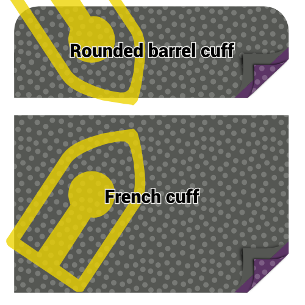 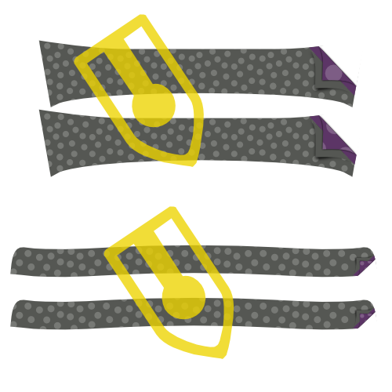

#### Thermocoller au fer l'entoilage sur les poignets

Pour faire les deux poignets, vous avez coupé 4 pièces dans le tissu et 2 pièces dans l'entoilage.

Pour chaque poignet, repassez l'entoilage sur l'envers du poignet.

> Si l'envers et l'endroit de votre poignet sont coupés dans le même tissu, peu importe le côté sur lequel vous collez l'entoilage.
>
> Cependant, un détail prisé consiste à utiliser un tissu différent pour l'intérieur du poignet. Dans ce cas, assurez vous de thermocoller l'entoilage sur la pièce qui se trouvera à l'extérieur du poignet. Dans ce cas, assurez-vous de thermocoller l'entoilage sur la pièce du poignet qui sera côté extérieur.

> Selon le poignet que vous avez choisi, la forme du poignet sera différente.
>
> In the first illustration, you can see both a round barrel cuff and a French cuff as examples.
>
> Ci dessous, les images montrent un poignet arrondi, mais le processus est le même pour les autres types de poignets.

#### Press interfacing to collar, undercollar and collar stand

Pour faire votre col, vous devez couper 1 sous-col, 1 col, et 2 pieds de col. Le tout dans le tissu, et dans l'entoilage thermocollant.

Poser l'entoilage thermocollant sur l'envers de chaque pièce et repassez le.

### Préparer les poignets

#### Coudre les poignets ensemble

Placez les 2 pièces de vos poignets (l'une entoilée, l'autre non) endroit contre endroit, et cousez les ensemble en respectant la marge de couture.

> **Ensure you**
>
> -   -   ne pas coudre le côté qui sera assemblé à la manche plus tard
> -   -   vous arrêter de coudre à la marge de couture, à partir du bord qui sera assemblé à la manche

#### Dégarnir la marge de couture

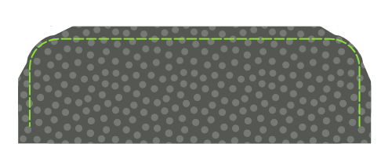

Before we flip your cuff over, we need to trim back the seam allowance to remove bulk.

#### Repasser la marge de couture

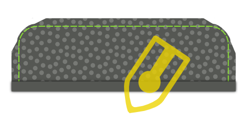

Fold back the seam allowances on each side of the cuff where the cuff attaches to the sleeve, and press them down.

> Si vous avez cousu trop loin, décousez quelques points.

#### Retourner le poignet et repasser

Retournez votre poignet sur l'endroit, et donnez un bon coup de fer.

> When pressing your cuffs, make sure to roll the seam a bit to the backside of the cuff to guarantee that the inner fabric of the cuff is not visible.

Vous pouvez maintenant mettre vos poignets de côté, nous les attacherons plus tard.

### Etape 3 : Préparer le col

#### Coudre ensemble le col et le sous-col

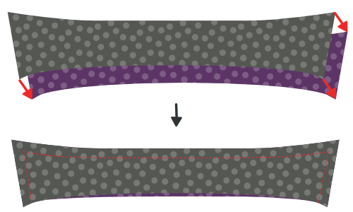

Placez les deux pièces du col endroit contre endroit, et cousez les ensemble en respectant la marge de couture.

#### Dégarnir la marge de couture

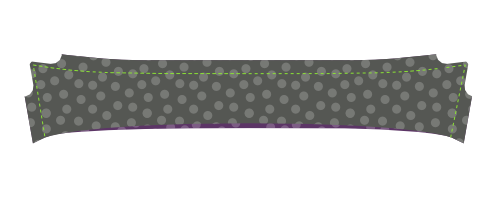

Before we flip your collar over, we need to trim back the seam allowance to remove bulk.

#### Retourner le col et repasser

Retournez votre col sur l'endroit, rendez les pointes aussi pointues que possible, et donnez un bon coup de fer.

> Quand vous repassez votre col, souvenez vous que le sous-col est un peu plus étroit.
>
> Quand vous alignez les côtés non cousus, ceci fera rouler la couture au dos du col, et garantira que la face interne du col ne soit pas visible.

#### Surpiquer le col

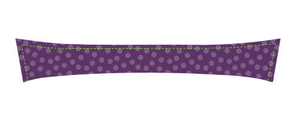

Surpiquez les bords du col. Ceci maintient la marge de couture et donne un aspect impeccable.

> La distance à partir du bord à laquelle vous surpiquez est une question de choix personnel. C'est souvent un peu moins que la marge de couture. Jetez un coup d'oeil sur des chemises existantes pour vous faire une idée.

### Etape 4 : assembler le col et le sous-col

#### Placer le col entre les deux pieds de col et bâtir

Marquez le milieu de votre col et de votre pied de col avec une épingle. Le milieu de chaque pied de col est en fait légèrement décentré car un côté est plus long que l'autre. Marquez le point se trouvant au milieu des deux crans.

Placez d'abord un pied de col sur l'envers, puis votre col, côté entoilé sur le dessus (et côté non cousu en haut), et enfin le deuxième pied de col, sur l'endroit.

Your collar should sit between your two collar stands, and the middles (where you placed your pin) should be aligned.

> L'aspect dépend un peu du col que vous avez choisi, mais en général votre col est courbé vers le bas, et votre pied de col est courbé vers le haut.
>
> Pour ajuster le tout, nous allons bâtir, plutôt qu'épingler. Votre col est une partie importante de votre chemise, donc il le mérite.

D'abord, remplacer les épingles marquant le milieu par une épingle prenant toutes les pièces ensemble.

Maintenant, commencez à bâtir à partir de cette épingle jusqu'au coin du col, en vous assurant d'aligner les deux bords du tissu.

Lorsque vous atteignez le coin de votre col, continuez et bâtissez les deux pieds de col ensemble.

When you've done one side, start from your pin in the middle again and do the other side. Une fois que vous avez fini de bâtir, vous pouvez retirer l'épingle.

#### Coudre votre col sur les pieds de col

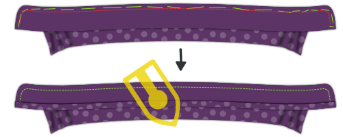

Cousez le long du bord de votre pied de col, en respectant la marge de couture standard.

> Assurez-vous de vous arrêter 2 cm avant le bord (deux fois la marge de couture standard) car à l'étape suivante, nous allons replier ce bord, et nous avons besoin de laisser les pieds de col suffisamment séparés pour glisser la chemise entre eux plus tard.

#### Replier la marge de couture du pied de col et repassez là

Repliez la marge de couture du côté non cousu de votre pied de col et repassez.

> Au milieu, ce sera facile. Mais vers les pointes de votre col, ce sera difficile de ne pas faire de plis.
>
> Press it as best as you can without making folds in your collar. Nous repasserons à nouveau quand le col sera retourné.

#### Retourner le col et repasser

Retournez votre pied de col sur l'endroit, et donnez un bon coup de fer. Assurez vous de laisser les marges de couture du pied de col repliées à l'intérieur. Voys pouvez maintenant mettre votre col de côté, nous l'attacherons plus tard.

Vous pouvez maintenant mettre votre col de côté, nous l'attacherons plus tard.

### Etape 5 : Coudre votre étiquette

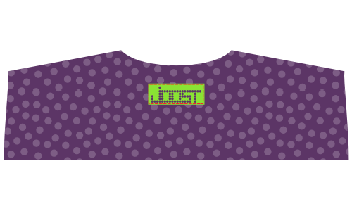

La prochaine étape consiste à assembler l'empiècement dos. Mais l'empiècement dos est l'endroit idéal pour mettre votre étiquette. Donc si vous voulez le faire, nous pouvons commencer par cela.

Prenez un des deux empiècements, cousez votre étiquette au milieu (sur l'endroit).

### Étape 6 : Assembler les empiècements dos au dos

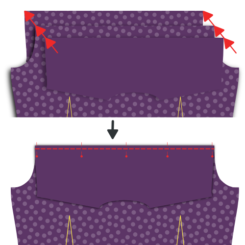 

Placez un empiècement dos sur l'envers. Placez dessus votre dos sur l'envers, en l'alignant sur le haut de l'empiècement.

Enfin, placez sur le tout votre deuxième empiècement, sur l'endroit.

Your back should now be sandwiched between the good sides of your two yokes.

Si c'est le cas, cousez le dos et les empiècements ensemble, en respectant la marge de couture.

> Si vous avez ajouté une étiquette à l'étape 5, assurez-vous de mettre l'empiècement portant l'étiquette sur l'envers.

Quand vous avez terminé, n'oubliez pas de donner un bon coup de fer pour que la couture soit bien plate.

### Étape 7 : Surpiquer l'empiècement dos

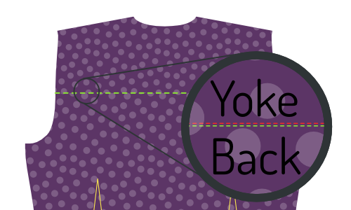

Votre empiècement étant attaché au dos, nous allons faire une surpiqûre de renfort le long de la couture que nous venons de faire, côté empiècement.

> Pliez la partie de l'empiècement dos située à l'intérieur de la chemise hors du chemin, vers le bas. Our edge stitching will catch the outer yoke, back and all the seam allowances, but not the inner yoke.

Surpiquez juste à côté de la couture qui joint empiècement dos et dos.

> La surpiqûre de renfort est comme une simple surpiqûre mais elle se fait juste à côté de la couture.

### Étape 8 : Fermer les pinces du dos

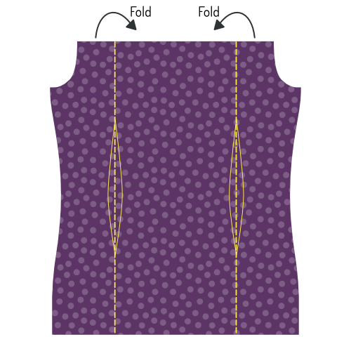 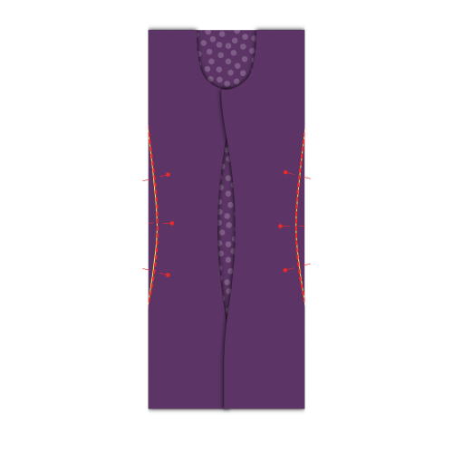 

> Selon vos mesures, votre patron peut ne pas avoir de pinces. Dans ce cas, passez à l'étape suivante.

Votre patron peut avoir ou non des pinces au dos. S'il en a, vous devez les fermer maintenant.

Placez votre dos sur l'envers, et repliez un côté en faisant en sorte que le pli passe par les points situés aux deux exrémités de la pince.

Faites de même pour l'autre pince, de sorte que les deux côtés soient repliés.

N’hésitez pas à appuyer doucement sur ce pli, cela vous aidera à bien coudre les pinces.

Coudre sur la ligne marquant les pinces pour les fermer. Veillez à positionner précisément le haut et le bas de vos pinces. Si une pince est plus haute que l'autre, ce sera vilain.

Quand vous avez terminé, n'oubliez pas de donner un bon coup de fer. Couchez le tissu excédentaire de la pince vers ce qui sera les coutures latérales.

### Étape 9 : Préparez la patte de boutonnage (côté boutons)

> Si vous avez choisi une patte de boutonnage intégrée, vous pouvez passer les deux premières sous-étapes et passer à [Replier la patte de boutonnage](#fold-the-button-placket).

#### Coudre la patte de boutonnage

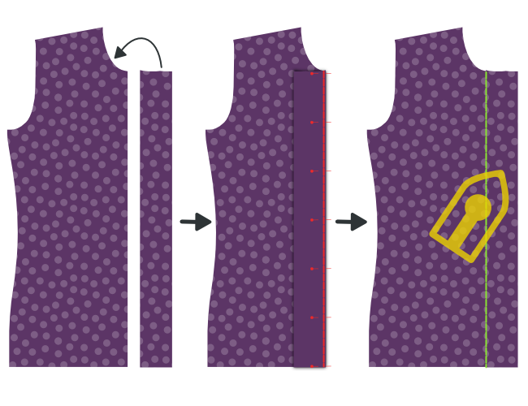

Si vous avez choisi une patte de boutonnage séparée, cousez-la sur le devant droit.

Placez le devant gauche (pièce 1) sur l'envers, et placez dessus la patte de boutonnage (pièce boutonnières, 1b) endroit contre endroit, en veillant à aligner la couture.

Cousez les 2 pièces ensemble en repectant la marge de couture standard.

#### Repassez la couture en couchant la marge de couture côté patte de boutonnage

Placez votre devant sur l'endroit, et repassez en couchant la marge de couture du côté de la patte de boutonnage.

#### Replier la patte de boutonnage

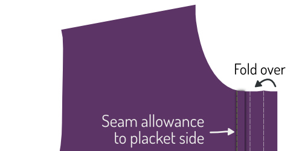

Maintenant, pliez la patte de boutonnage sur la première ligne en pointillé, et repassez sur ce pli.

Ensuite, pliez à nouveau la patte en veillant à ce que le tissu arrive juste après la couture qui relie votre patte au devant.

Quand vous êtes satisfait, repassez la patte pliée.

#### Fixer la patte de boutonnage

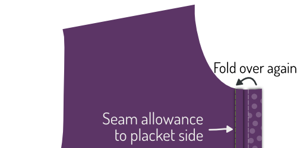

> Ce qui suit est l'approche classique. Si vous avez choisi une patte de boutonnage intégrée (sans couture), passez cette étape.
>
> Plutôt que de coudre la patte de boutonnage, laissez-la pliée. Les plis seront fixés en place par les boutons lorsqu'ils seront cousus plus tard.

Retourner la pièce sur l'endroit, et fixer la patte repliée en piquant dans la rainure.

Pour cela, coudre exactement sur votre couture précédente. Since you folded the fabric of your placket a bit past this seam, it will get caught at the back, fixing your folded placket in place, and locking the seam allowance inside.

### Etape 10: Préparer la patte de boutonnage (côté boutonnières)

> Si vous avez choisi une patte intégrée, vous pouvez passer les deux premières sous-étapes et passer à "Replier la patte de boutonnage".

#### Fixer la patte de boutonnage (côté boutonnières)

Si vous avez choisi une patte séparée, cousez-la sur le devant gauche.

Placer le devant gauche (pièce 2) sur l'envers, et placez dessus la patte de boutonnage (pièce boutonnières, 2b) endroit contre endroit, en veillant à aligner la couture.

Cousez les 2 pièces ensemble en repectant la marge de couture standard.

Quand vous avez terminé, n'oubliez pas de donner un bon coup de fer. Repassez la couture en couchant la marge de couture côté patte de boutonnage.

#### Repassez la couture en couchant la marge de couture côté patte de boutonnage

Placez votre devant sur l'endroit, et repassez la marge de couture en la couchant du côté de la patte de boutonnage.

#### Comprendre une patte de boutonnage classique (côté boutonnière)

> Si vous avez choisi une patte sans couture, suivez les étapes de la patte de boutonnage côté boutons, car le principe est le même.
>
> Les étapes ci-dessous sont celles d'une patte de boutonnage (côté boutonnières) classique.

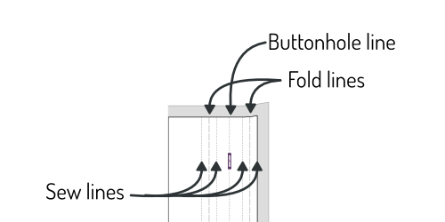

Votre patte a un tas de lignes, alors clarifions d'abord à quoi elles correspondent :

-   La ligne de boutonnières est en pointillés longs et des boutonnières y figurent. Elle indique la position des boutonnières
-   Les deux lignes de plis sont en pointillés longs et sont à égale distance à droite et à gauche de la ligne de boutonnière
-   Les deux + deux lignes de couture sont en pointillés courts, à égale distance de chaque ligne de pli

#### Dégarnir la marge de couture

> (Si vous avez choisi une patte intégrée, passez cette étape).

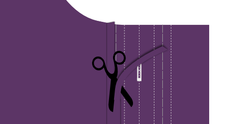

La marge de couture de l'endroit où vous avez cousu votre patte côté boutonnière doit être intégrée à l'intérieur de votre patte repliée.

Pour cela, coupez l'excédent de marge de couture afin qu'elle ne dépasse pas la première ligne de pli sur la patte.

#### Replier la patte de boutonnières

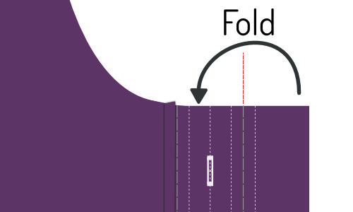 

Repliez la patte sur le premier pointillé long. Repassez le pli.

Ensuite, pliez à nouveau, cette fois sur le deuxième pointillé long. Repassez le pli.

> Lorsque votre patte est pliée et repassée, mettez quelques épingles sur toute la longueur pour maintenir en place

#### Fixer la patte de boutonnage (côté boutonnières)

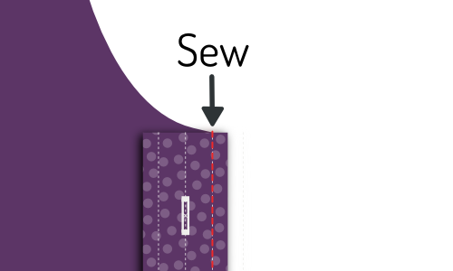 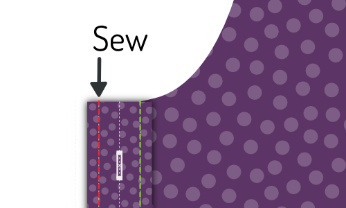

Coudre sur la première ligne de couture (la plus proche du bord).

Ensuite, retournez votre chemise endroit sur le dessus. Coudre alors sur la deuxième ligne de couture.

> Ces deux lignes de couture seront visibles, alors faites-les bien nettes

#### Repasser la patte de boutonnières

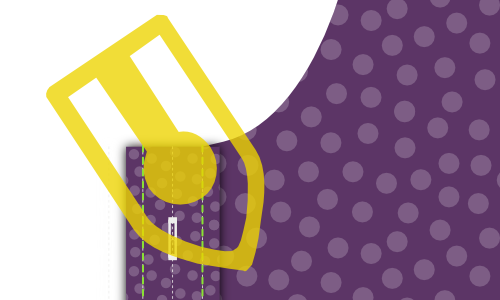

Félicitations, vous venez de réaliser une patte de boutonnière classique.

Maintenant repassez-moi tout ça mon ami. Avouez qu'on en a envie.

### Etape 11: Assemblez les coutures d'épaule

> **Faisons un burrito**
>
> We are going to close the shoulder seams with a technique that is commonly known as the **burrito method**.
>
> Si vous connaissez la méthode du burrito, vous savez déjà comment faire. Si ce n'est pas le cas, lisez ce qui suit pour découvrir une méthode astucieuse pour assembler les coutures d'épaule de votre chemise tout en emprisonnant de façon invisible tous les bords bruts.

#### Épingler les devants à la partie extérieure de l'empiècement dos

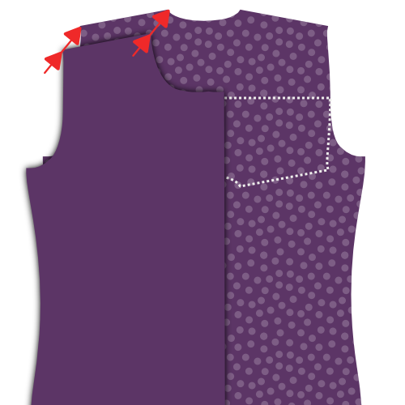 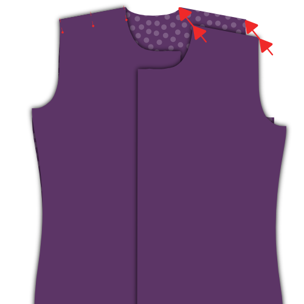

Placez le dos sur l'envers, en faisant attention à plier vers le bas la partie de l'empiècement dos qui sera à l'intérieur de la chemise (comme l'illustre la ligne en pointillés).

Placez vos devants sur le dos, endroits contre endroit. Épingler les devants à l'empiècement dos au niveau de la couture des épaules, endroits contre endroit.

#### Roulez, roulez, roulez, roulez votre chemise, épinglez et cousez vos épaules

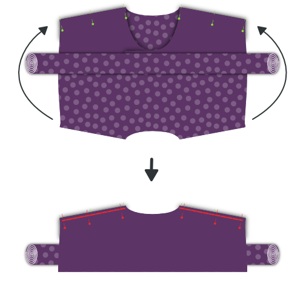

Enroulez ensemble dos et vos devants en partant du bas de la chemise. Faites une belle petite saucisse en enroulant jusqu'en haut, jusqu'à ce que vous puissiez voir l'empiècement dos que nous avions précédemment replié vers le bas.

Maintenant, faites passer cet empiécement dos par dessus votre saucisse, et aligner les coutures d'épaule avec l'autre partie de l'empiècement dos et les devants.

Épinglez le tout en place, puis cousez les coutures des épaules, Assurez-vous de ne pas prendre votre saucisse (la farce de votre burrito) dans la couture des épaules.

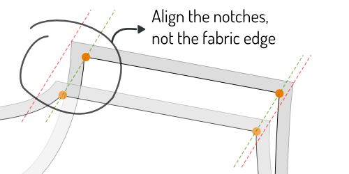

> Assurez-vous d'aligner la vraie ligne de couture. En raison des angles inégaux à l'encolure, le bord du tissu est souvent plus long d'un côté que de l'autre.
>
> However, the seamlines are the same length, so make sure to match them carefully using the notches.

#### Retournez-le à l'intérieur à travers l'encolure

Lorsque vous avez cousu les deux coutures d'épaule, attrapez votre burrito en passant par l'encolure, et faites le sortir.

#### Repassez les coutures d'épaule

Après tout ce travail, assurez vous maintenant de lui donner une aspect impeccable avec un bon coup de fer. Assurez-vous que la marge de couture entre vos empiècements est belle et bien plate.

### Etape 12: Surpiquer l'empiècement aux coutures d'épaule

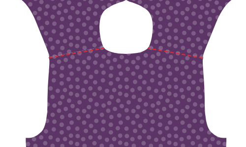

Tout comme nous avons surpiqué le bas de l'empiècement dos à l'étape 3, nous allons aussi le surpiquer aux coutures d'épaule.

Puisque vous venez de repasser ces coutures d'épaule, tout devrait être beau et plat, et vous n'avez qu'à surpiquer gentiment juste à côté de la couture.

> Assurez-vous de surpiquer sur la partie empiècement, ce qui permet d'emprisonner la marge de couture, et non sur la partie avant.

### Etape 13 : Faire la patte de manche

#### Coudre la sous-patte de poignet

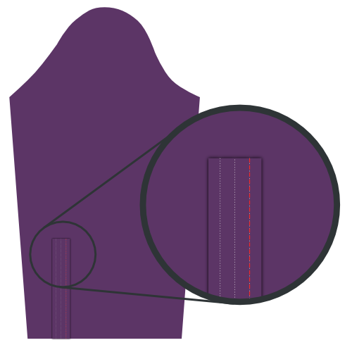  

-   Placez votre manche sur l'endroit, et votre sous-patte de poignet dessus, également sur l'endroit.
-   Alignez le bord de votre sous-patte avec la fente de votre manche, en plaçant la sous patte sur le côté le plus court par rapport à la fente.
-   Coudre maintenant le long de la ligne de pli indiquée sur la sous-patte la plus proche du bord.

> Si vous n'aviez pas encore coupé dans votre manche la ligne sur laquelle la patte de manche doit être placée, vous devez le faire maintenant.

-   Repliez la sous-patte, et repasser la couture.
-   Retournez votre manche sur l'endroit, et ramenez votre sous-patte par dessus la fente de votre manche.
-   Plier deux fois sur les lignes de façon à emprisonner le bord brut.
-   Make your folds so that the upper fold sits ever so slightly further than the seam you already made.
-   Repassez le tout, puis surpiquez la sous-patte.

#### Plier et repasser la patte

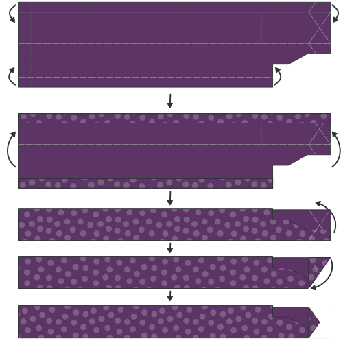

C'est le moment Origami ! Nous allons plier la patte de manche en utilisant les lignes comme repères. Cela sera beaucoup plus facile si vous repassez entre chaque pli.

-   Tout d'abord, pliez les bords extérieurs de la patte vers l'intérieur.
-   Next, fold the entire thing in half.
-   Puis faites deux plis à l'extrémité pour obtenir une belle forme pointue.
-   Maintenant donnez un bon coup de fer.

#### Épingler la patte en place

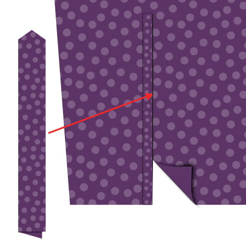 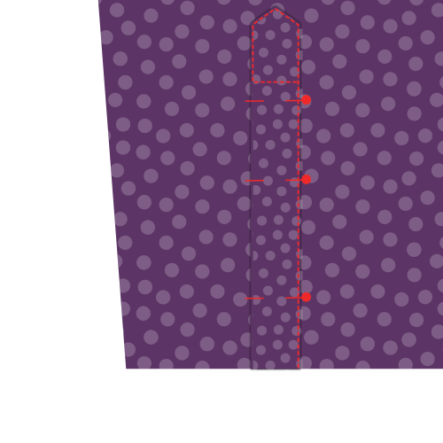

Place your sleeve down with the good side up. The guard we have sewn in earlier sits against the other unfinished fabric edge of where you cut into your sleeve.

Place your placket around that edge, one side above it, one underneath.

You need to slide the placket onto your sleeve until the middle of it (the tip) aligns with the cut in your sleeve.

The idea is that the placket closes up the unfinished edge, but also covers the guard of the other edge.

When you've got it where you want it, pin the placket down.

#### Coudre la patte de manche

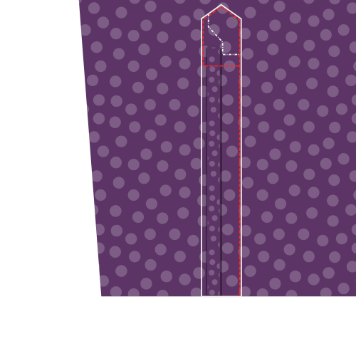

Start at the edge of the sleeve (the bottom of the sleeve placket) and edge-stitch along the edge upwards.

Go around the tip, and come down again on the other side (the fold side) until you have passed the point where your guard ends.

Then, sew horizontally to the other side of the placket to finish.

> J'ai inclus ici une illustration supplémentaire qui ne montre que le contour de la patte. Vous pouvez voir que l'extrémité de la sous-patte est prise dans la couture de la patte, et est ainsi bien cachée.

### Etape 14: Assembler les manches

#### Rappelez vous, il s'agit d'une couture plate rabattue

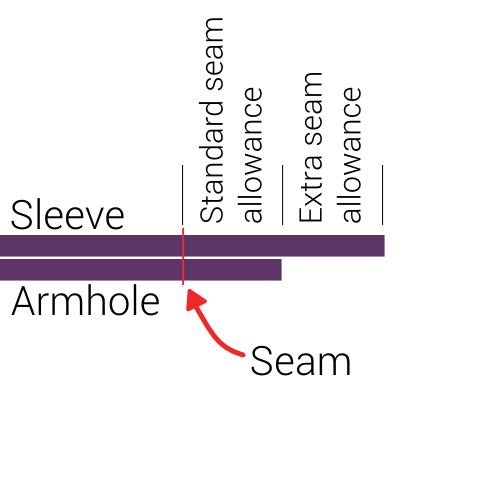

> **Attention avec la marge de couture supplémentaire pour la couture plat rabattue**. Une marge de couture supplémentaire est prévue sur la manche pour permettre la réalisation d'une couture plate rabattue.
>
> Par conséquent, ce sont les coutures et non les bords qui doivent être alignés, donc il faut positionner la manche de façon à ce qu'elle dépasse du bord de 1 cm.

#### Pin sleeve in place

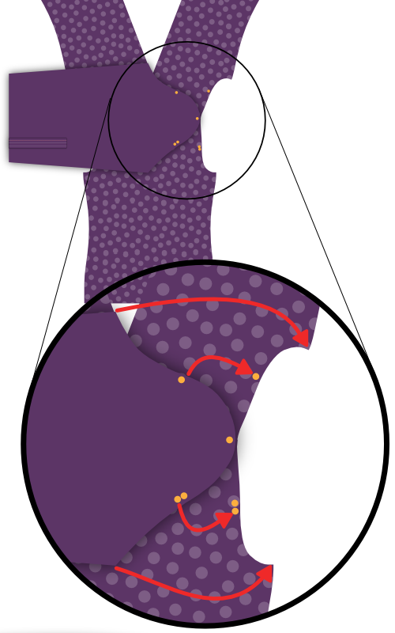

Spread your shirt open so that both fronts and back lie flat with their good sides up.

Now place your sleeve on top with the good side down, matching the top of the sleeve with the shoulder seam.

> Attention, votre manche n'est pas symétrique, alors assurez-vous d'avoir les deux repères (et la patte de boutonnage du poignet) à l'arrière. et le repère simple à l'avant.
>
> Also note that the double notch on the back of your sleeve does not have a corresponding notch on the back. That's because it should match up with the seam where your yoke joins the back.

You now need to pin the sleeve to the armhole. To do so, make sure to:

-   Faire correspondre le début et la fin de la tête de manche au début et à la fin de l'emmanchure
-   Faire correspondre les repères de la tête de manche aux repères du dos et des devant
-   Distribuer l'embu entre les repères comme indiqué

#### Distribute sleevecap ease

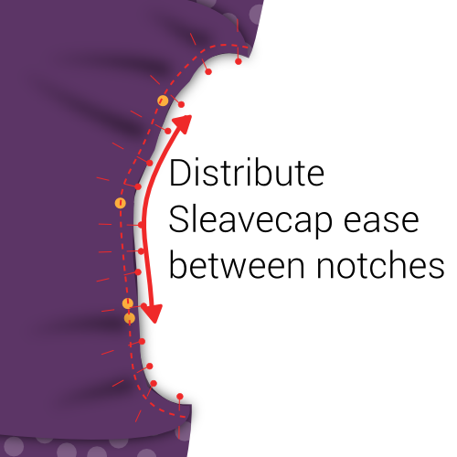

The default sleevecap ease for this pattern is 0.5cm. If you have sleevecap ease, you need to distribute that extra length evenly between the notches as shown.

> If you are unsure what sleevecap ease is, have a look at the [documentation for the sleevecap ease pattern option](/docs/patterns/simon/options/sleevecapease).

#### Coudre les manches aux emmanchures

When you've got your sleeve neatly pinned in your armhole, sew it in place. Be careful to avoid any pleats in the part between the notches where you need to ease in the sleevecap ease.

> Inutile de le dire, mais je le dis quand même: répétez cette étape pour l'autre manche.

### Etape 15: Couture plate rabattue aux emmanchures

#### Coucher la marge de couture d'un côté au fer

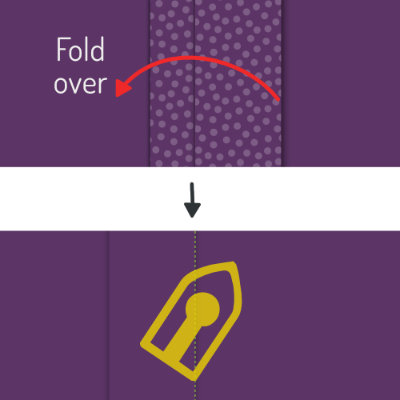

Lay down your freshly sewn sleeve seam with the good side down

We are going to press the seam allowance to one side. To do so, identify the seam allowance that is wider (for the flat-felled seam).

The longer seam allowance needs to lie on top of the shorter (standard seam allowance).

Once you have verified that, press down the seam allowance.

#### Replier la marge de couture excédentaire

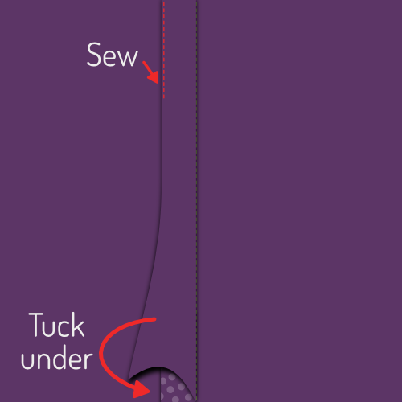

Now, fold the extra seam allowance for the flat-felled seam under the standard seam allowance.

You can use pins to hold this in place, but it's simpler to just press it.

> Cela sera relativement facile sur les parties droites de la couture, mais un peu plus délicat sur les parties courbes. Prenez votre temps, et au besoin, couper l'excédent de tissu dans la marge de couture pour lui permettre de s'évaser ou se courber.

#### Coudre la couture plate rabattue

Now, from the bad side of the fabric, sew the seam allowance down just at the edge where it folds under the other seam allowance.

Important here is to keep an even distance from the seam of your sleeve. If you have a felling foot for your sewing machine, it will help you with that. But if not, just be careful.

> Il est plus important de rester à la même distance de la couture de manche que de coudre exactement au bord du pli. Idéalement, le pli est censé être aussi à distance constante de la couture, mais si ce n'est pas le cas, assurez-vous juste de coudre parallèlement à la couture de manche. Même si cela implique de s'écarter un peu du bord plié.

#### Repasser la couture plate rabattue

When it's all done, press the flat-felled seam from the good side so it lies nice and flat.

### Etape 16: : Fermer les côtés et les manches

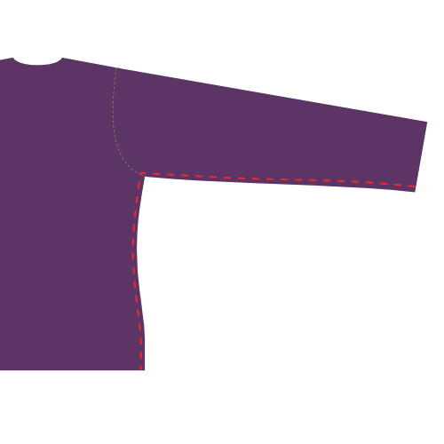 

Place your shirt with the good sides together, and sew the side and sleeve seams to close the shirt.

> Il y a une marge de couture supplémentaire sur la manche et les côtés pour permettre la réalisation d'une couture plate rabattue. Par conséquent, n'alignez pas les bords, mais laissez dépasser d'1 cm le côté avec la marge de couture supplémentaire.

### Etape 17: Coudre les côtés et les manches avec une couture plate rabattue

#### Coucher la marge de couture d'un côté au fer

We are going to press the seam allowance to one side. To do so, identify the seam allowance that is wider (for the flat-felled seam).

The longer seam allowance needs to lie on top of the shorter (standard seam allowance).

Once you have verified that, press down the seam allowance.

#### Replier la marge de couture excédentaire

Now, fold the extra seam allowance for the flat-felled seam under the standard seam allowance.

You can use pins to hold this in place, but it's simpler to just press it.

> Cela sera relativement facile sur les parties droites de la couture, mais un peu plus délicat sur les parties courbes. Prenez votre temps, et au besoin, couper l'excédent de tissu dans la marge de couture pour lui permettre de s'évaser ou se courber.

#### Coudre la couture plate rabattue

Now, from the bad side of the fabric, sew the seam allowance down just at the edge where it folds under the other seam allowance.

Important here is to keep an even distance from the seam of your sleeve. If you have a felling foot for your sewing machine, it will help you with that. But if not, just be careful.

> It is more important to keep an even distance from the sleeve seam than to sew exactly at the edge of the fold. Idéalement, le pli est censé être aussi à distance constante de la couture, mais si ce n'est pas le cas, assurez-vous juste de coudre parallèlement à la couture de manche. Même si cela implique de s'écarter un peu du bord plié.

#### Repasser la couture plate rabattue

When it's all done, press the flat-felled seam from the good side so it lies nice and flat.

### Assembler les poignets aux manches

#### Épingler les poignets en place

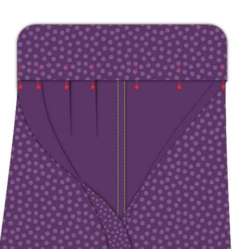

You need to insert the sleeve between the two layers of your cuff, making sure that the good side of the fabric sits against the side of your cuff that has the interfacing applied to it.

You will need to pin this in place, because depending on how long your sleeve placket is, it might be hard or even impossible to get this to lie flat.

Also note that your sleeve edge will be longer than your cuff (how much longer depends on the sleeve drape). You need to make one or a few folds in your sleeve to accommodate for this.

> Your pattern contains helplines on the sleeve to help you place the folds.

> Prenez votre temps pour épingler tout ceci avec soin. We are going to edge-stitch this later, so it's important that the front and back of your cuff align nicely.

#### Piquer les poignets aux manches

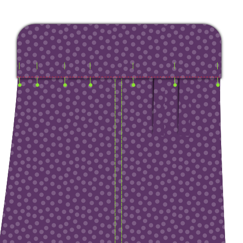

Once everything is pinned in place, edge stitch along the edge of your cuff to attach it to your sleeve.

It's important to catch both the outer and inner layer of your cuff on the edge.

> Assurez-vous de piquer sur la face extérieure (endroit de votre manche) en restant parallèle au bord du poignet.

When you're done, give your cuffs a good press.

#### Surpiquez les poignets

> Assurez-vous que vos poignets ont été repassés au préalable.

Top-stitch around your cuff at a distance from the edge that is a bit less than your seam allowance. Go all the way around your cuff.

### Etape 19: Attacher le col

#### Bâtir le col en place

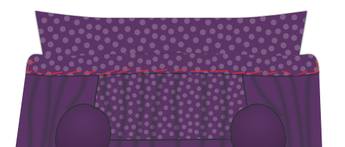

This is an important seam, so we are going to baste this in place to make sure it sits exactly right before we sew it.

Start at the center back, and place the seam allowance of your back part between your two collar stands. Work your way around one side, and then do the other.

Make sure to respect the standard seam allowance and - important - avoid any wrinkles.

> Bien que votre pied de col soit relativement droit, nous allons le coudre à ce qui est en fait un trou dans votre chemise.
>
> C'est un peu délicat, donc faites très attention aux parties les plus courbées : là où le dos rejoint les devants.

#### Piquer le col en place

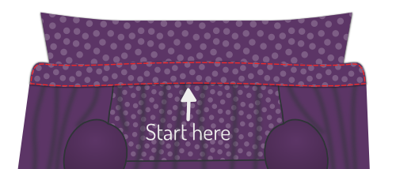 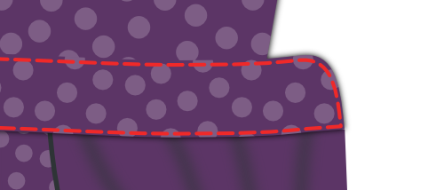

When you're happy with how you've basted your collar in place, it's time to sew that thing down.

We're going to start at the center-back and sew all the way around the collar stand.

#### Coudre le long du bord du col

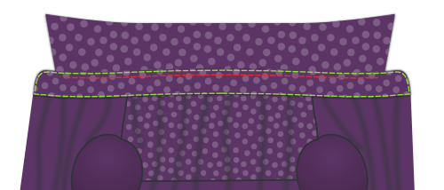

To give more body to your collar, and firmly secure it in place we're going to sew along the top edge of the collar stand.

Sew about half the seam allowance from your earlier edge-stitching. Make sure to stop a few cm before the end of the collar.

> Vous devez arrêter quelques cm avant la fin du col (note: fin du col, et non fin du pied de col) de façon à ce que cette couture soit entièrement recouverte lorsque le col est plié.

#### Repasser le col

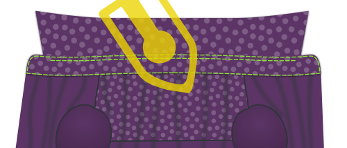

Now that your collar is attached, give it a good press.

### Étape 20 : Ourler votre chemise

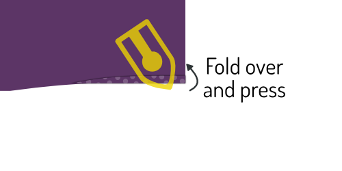 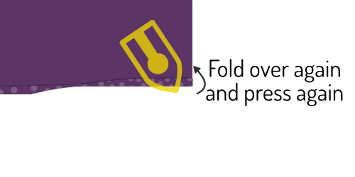 

Time to finish the hem (that's the part you tuck in your trousers).

Fold up half of the hem allowance and press down. Then, fold up again and press again.

Now, sew along the upper edge to finish the hem.

### Etape 21 : Faire les boutonnières

If you haven't done so initially, mark all the places you should have buttonholes.

They sit along the front closure and at your cuffs.

When you've marked them, make buttonholes there.

### Étape 22: Coudre les boutons

Pin your shirt closed to transfer the place of the buttonholes to the button sides.

When you've marked where buttons should go, sew them on.

> Plutôt que de marquer les emplacements des boutons à partir du patron, je préfère les repérer à l'aide des boutonnières une fois faites.
>
> De cette façon, si une boutonnière a un peu dévié, le bouton la suivra tout simplement.

