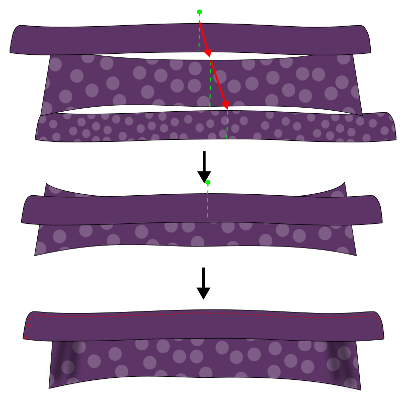
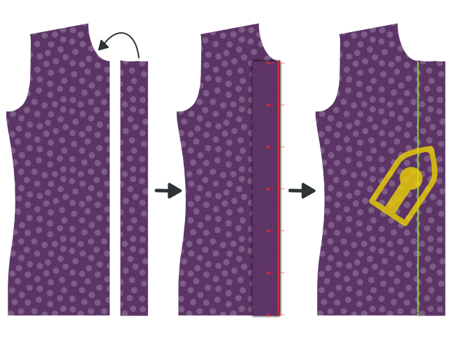
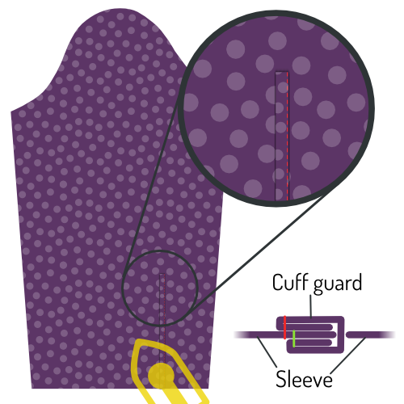
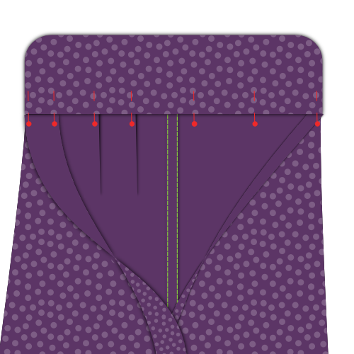
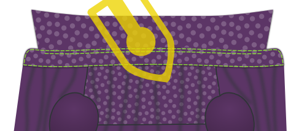

<Tip>

##### Volg de naad met Kelly en Julian

Kelly Hogaboom en Julian Collins deden een Simon(e) naadong, en ze hebben video's van
alle stappen.
Als je dit patroon wilt maken, kan Kelly en Julian je begeleiden om te beginnen.

Je kunt al het materiaal vinden op
\-site: [#simonsayssew met kelly hogaboom-& juliaanse collins](https://kelly.hogaboom.org/2020/07/simon-says-sew-with-kelly-hogaboom-and-julian-collins/)

</Tip>

### Stap 1: Bevestig tussenvoering

 

#### Kleef tussenvoering aan manchetten

Om twee manchetten te maken heb je je patroondeel vier keer uit stof geknipt, en twee keer uit tussenvoering.

Strijk de tussenvoering op de slechte kant van twee van de manchetstukken.

> Als je stof geen slechte kant heeft maakt het niet uit aan welke twee stukken je de tussenvoering kleeft.
>
> Het is echter een leuk detail om de binnenkant van je manchet van een andere stof te maken. In dat geval moet je zeker zijn dat je de tussenvoering aan het stuk kleeft dat je als buitenkant wil gebruiken.

> De vorm van je manchet zal anders zijn, afhankelijk van welke soort je gekozen hebt.
>
> In the first illustration, you can see both a round barrel cuff and a French cuff as examples.
>
> Vanaf nu gebruiken we de klassieke manchet in de illustraties, maar het proces is hetzelfde voor de andere soorten manchetten.

#### Press interfacing to collar, undercollar and collar stand

Om je kraag te maken heb je één onderkraag, één kraag en twee kraagstaanders nodig. Dit alles zowel in stof als in tussenvoering.

Strijk de tussenvoering tegen de slechte kant van elk deel.

### Stap 2: bereid de manchetten voor

#### Stik de manchet aan elkaar

Leg beide delen van je manchet (één met tussenvoering, één zonder) op elkaar met de goede kanten samen, en stik ze samen met de standaard naadwaarde.

> **Ensure you**
>
> -   Laat de kant die later aan de mouw bevestigd wordt open
> -   Stop aan de naadwaarde van de rand die aan de mouw bevestigd wordt

#### Knip naadwaarde bij

Before we flip your cuff over, we need to trim back the seam allowance to remove bulk.

#### Strijk de naadwaarde terug

Fold back the seam allowances on each side of the cuff where the cuff attaches to the sleeve, and press them down.

> Als je eerder iets te ver langs de rand gestikt hebt ga je nu een paar steken moeten lostornen.

#### Keer manchet en strijk

Keer je manchet met de goede kant naar buiten, en strijk grondig.

> When pressing your cuffs, make sure to roll the seam a bit to the backside of the cuff to guarantee that the inner fabric of the cuff is not visible.

Je mag je manchetten nu opzij leggen, we komen hier later op terug.

### Stap 3: Bereid de kraag voor

#### Stik de kraag en onderkraag samen

Leg de twee kraagdelen op elkaar met goede kanten samen en stik ze vast met de standaard naadwaarde.

#### Knip naadwaarde bij

Before we flip your collar over, we need to trim back the seam allowance to remove bulk.

#### Keer kraag en strijk

Keer de goede kanten van je kraag naar buiten, maak de puntjes zo scherp mogelijk, en strijk grondig.

> Denk er bij het strijken aan dat de onderkraag een beetje smaller is dan de bovenkraag.
>
> Wanneer je de niet-gestikte randen op elkaar legt zorgt dit dat de naad naar de onderkant van de kraag rolt zodat deze niet zichtbaar is aan de goede kant.

#### Stik de kraag door

Geef een sierstiksel langs de rand van de kraag. Dit houdt de naadwaarde op z'n plaats en zorgt dat alles er scherp uitziet.

> Hoe ver je van de rand stikt is een stijlkeuze. Het is meestal een beetje minder dan de standaard naadwaarde. Kijk eens naar een paar bestaande hemden om een idee te krijgen.

### Stap 4: Bevestig kraag aan kraagstaander

#### Leg de kraag tussen de kraagstaanders en drieg vast

Geef het middelpunt van je kraag en kraagstaanders aan met een speld. Het middelpunt van elke kraagstaander is eigenlijk net niet in het midden, aangezien één kant langer is dan de andere. Zoek dus naar het middelpunt tussen de twee merktekens.

Leg eerst een kraagstaander met de goede kant omhoog, dan je kraag met de onderkraag naar omhoog (en de ongestikte rand bovenaan), en uiteindelijk de tweede kraagstaander met de goede kant naar beneden.

Your collar should sit between your two collar stands, and the middles (where you placed your pin) should be aligned.

> Hoe dit eruitziet hangt wat al van je keuzes, maar over het algemeen zal je kraag naar beneden buigen, en je kraagstaander naar boven.
>
> Om dit allemaal mooi gelijk te krijgen gaan we het driegen, in plaats van te spelden. Je kraag is een belangrijk deel van je hemd, dus het is de moeite om dit te driegen.

Vervang eerst de spelden die de middelpunten markeren door één speld die alle lagen samenhoudt.

Begin nu vanaf deze speld te driegen en werk zo in de richting van de hoek van de kraag. Zorg dat je de randen van de stof netjes gelijk legt.

Blijf driegen als je aan de hoek van je kraag komt, en drieg de uiteindes van de kraagstaanders samen.

When you've done one side, start from your pin in the middle again and do the other side. Zodra je klaar bent met driegen kan je de speld verwijderen.

#### Stik je kraag aan de kraagstaanders

Stik langs de rand van je kraagstaander, met de standaard naadwaarde.

> Let op dat je 2 cm voor de rand stopt (twee keer de standaard naadwaarde) aangezien we de naadwaarde omplooien in de volgende stap, en we de kraagstaander nog open genoeg moeten laten om het hemd ertussen te krijgen.

#### Plooi en strijk de naadwaarde van de kraagstaander

Plooi de naadwaarde van de bovenste kraagstaander om en strijk.

> In het midden zal het makkelijk zijn om de naadwaarde te strijken. Maar naar de punten toe zal dit moeilijk worden zonder plooien in je kraag te strijken.
>
> Press it as best as you can without making folds in your collar. We strijken dit opnieuw zodra de kraagstaander gekeerd is.

#### Keer de kraagstaander en strijk

Keer de goede kanten van je kraagstaander naar buiten en strijk grondig. Let op dat de naadwaarde van de kraagstaander naar binnen gekeerd blijft.

Je kan je kraag nu opzij leggen, we komen hier later op terug.

### Stap 5: Optioneel: Bevestig je label

De volgende stap is het vastnaaien van de schouderpas. Maar deze schouderpas is een ideale plek om een label te hangen. Dus als je dat graag wil doen, doen we het best nu.

Kies een schouderpas, en je kan het label in het midden vastnaaien (aan de goede kant).

### Stap 6: Bevestig de schouderpassen aan het rugpand

 

Leg één schouderpas met de goede kant omhoog. Leg hier het rugpand op, met de goede kant naar boven, en leg de aanzetnaad van de schouderpas gelijk.

Leg hier dan de tweede schouderpas bovenop, met de goede kant naar beneden.

Your back should now be sandwiched between the good sides of your two yokes.

Als dat zo is, stik dan door de drie lagen van aanzetnaad. Let op dat je de juiste naadwarde respecteert.

> Let op dat de schouderpas met het label aan de verkeerde kant van je rugpand zit, mocht je een label hebben toegevoegd.

Vergeet niet deze naad goed te strijken zodat hij plat ligt.

### Stap 7: Stik de schouderpas door

Als je schouderpassen aan het rugpand bevestigd zijn gaan we ze doorstikken langs de aanzetnaad, aan de kant van de schouderpas.

> Vouw de binnenste schouderpas uit de weg. Our edge stitching will catch the outer yoke, back and all the seam allowances, but not the inner yoke.

Stik net naast de aanzetnaad.

> Doorstikken is als een sierstiksel, maar heel dicht bij de rand

### Stap 8: Sluit de achterste nepen

  

> Afhankelijk van je maten heeft je patroon wel of geen nepen. Indien geen nepen, ga dan voort met de volgende stap.

Je patroon heeft misschien nepen in het rugpand. Als er nepen zijn, zou je ze nu moeten sluiten.

Leg je rugpand met de goede kant omhoog, en plooi het langs de zijkant om zodat de vouw van de bovenste naar de onderste punt van de neep loopt.

Doe hetzelfde voor de andere neep, zodat beide kanten teruggeplooid zijn.

Het is ok om deze vouw lichtjes te strijken, dat helpt om de nepen accuraat te stikken.

Stik langs de lijn die de nepen aangeeft om ze te sluiten. Probeer op te letten dat de bovenste en onderste punten exact zijn waar ze moeten zijn. Als één neep hoger zit dan de andere ziet het er niet uit.

Vergeet niet grondig te strijken! Strijk de stof van de neep naar de zijnaden.

### Stap 9: Bereid het knopenpat voor

> Als je een aangeknipt knopenpat gekozen heb kan je de eerste twee substapjes overslaan en verdergaan met [Plooi het knopenpat](#fold-the-button-placket).

#### Stik het knopenpat vast

Als je een apart knopenpat gekozen hebt stik je het nu vast aan het rechtervoorpand.

Leg het rechtervoorpand (deel 1) neer met de goede kant omhoog, en leg het knopenpat (deel 1b) erop met de goede kant naar beneden. Leg de randen netjes gelijk.

Stik vast met de standaard naadwaarde.

#### Strijk de naadwaarde in de richting van het knopenpat

Leg je voorpand met de goede kant naar beneden, en strijk de naadwaarde naar het knopenpat toe.

#### Plooi het knopenpat

Plooi nu het knopenpat aan de eerste vouwlijn, en strijk deze vouw.

Plooi het knopenpat opnieuw om, en let op dat de stof tot net voorbij de aanzetnaad aan het voorpand komt zodat deze bedekt is.

Als je daarmee blij bent, strijk dan het geplooide knopenpat.

#### Stik het geplooide knopenpat

> Dit is de klassieke aanpak. Als je voor het naadloze knopenpat gekozen heb moet je dit niet doen.
>
> In plaats van het knopenpat door te stikken, laat je het gewoon geplooid. De plooien worden op hun plaats gehouden wanneer we later de knopen aannaaien.

Stik het geplooide knopenpat vast door langs de goede kant van je hemd in de naad te stikken.

Om dit te doen stik je exact bovenop je eerdere naad. Since you folded the fabric of your placket a bit past this seam, it will get caught at the back, fixing your folded placket in place, and locking the seam allowance inside.

### Stap 10: Bereid het knoopsgatenpat voor

> Als je een aangeknipt knoopsgatenpat gekozen heb kan je de eerste twee substapjes overslaan en verdergaan met Hoe werkt een klassiek knopenpat.

#### Stik het knoopsgatenpat vast

Als je een apart knoopsgatenpat gekozen hebt stik je het nu vast aan het linkervoorpand.

Leg het linkervoorpand (deel 2) neer met de goede kant omhoog, en leg het knoopsgatenpat (deel 2b) erop met de goede kant naar beneden. Leg de randen netjes gelijk.

Stik vast met de standaard naadwaarde.

Vergeet niet grondig te strijken! Strijk de naadwaarde in de richting van het knoopsgatenpat.

#### Strijk de naadwaarde in de richting van het knoopsgatenpat

Leg je voorpand met de goede kant naar beneden, en strijk de naadwaarde naar het knoopsgatenpat toe.

#### Hoe werkt een klassiek knopenpat

> Als je een naadloos knopenpat gekozen hebt moet je de stappen voor het knopenpat volgen, aangezien de constructie identiek is.
>
> De stappen hieronder zijn voor een klassiek knopenpat.

Er staan een hoop lijnen op het knopenpat, dus laat ons eerst eens kijken wat die betekenen:

-   De knoopsgatenlijn heeft is een lange stippellijn met knoopsgaten op. Ze geeft aan waar de knoopsgaten moeten komen
-   De twee vouwlijnen zijn lange stippellijnen en zitten op gelijke afstand rechts en links van de knoopsgatenlijn
-   De twee+twee stiklijnen zijn stippellijntjes die op gelijke afstand van elke vouwlijn zitten

#### Knip naadwaarde bij

> Als je een aangesneden knopenpat gekozen hebt is dit niet van toepassing.

De naadwaarde van de aanzetnaad van het knoopsgatenpat zou in je geplooide knoopsgatenpat moeten passen.

Om dat te verkrijgen knip je de naadwaarde bij zodat ze niet verder komt dan de eerste vouwlijn op het knoopsgatenpat.

#### Plooi het knoopsgatenpat

 

Plooi het knoopsgatenpat langs de eerste vouwlijn. Strijk de vouw.

Plooi dan het deel dat je net plooide nog een keer, nu op de tweede vouwlijn. Strijk deze vouw ook.

> Als je knoopsgatenpat geplooid en gestreken is helpen een paar spelden wel eens om te voorkomen dat dingen gaan verschuiven

#### Stik het geplooide knoopsgatenpat

 

Stik op de eerste stiklijn, het dichtst bij de rand.

Draai dan je hemd om zodat de goede kant naar boven ligt, en je knoopsgatenpat ook. Stik dan op de tweede stiklijn.

> Deze twee rijen stiksel gaan altijd zichtbaar zijn, dus hou het netjes

#### Strijk het knoopsgatenpat

Gefeliciteerd, je hebt een klassiek knopenpat gemaakt.

Strijk het nu naar de verdoemenis. You know you want to.

### Stap 11: Sluit de schoudernaden

> **Laten we een burrito maken**
>
> We are going to close the shoulder seams with a technique that is commonly known as the **burrito method**.
>
> Als dit je bekend in de oren klinkt weet je al wat te doen. Indien niet, lees dan even verder voor een slimme manier om de schoudernaden van je hemd te stikken en tegelijk alle naadwaarde weg te stoppen.

#### Speld de voorpanden aan de buitenste schouderpas

 

Leg het rugpand neer met de goede kant omhoog, maar let op dat je de binnenste schouderpas naar beneden plooit (zoals aangeduid met de stippellijn).

Leg de voorpanden op het rugpand, met de goede kanten naar beneden. Speld de voorpanden aan de schouderpas langs de schoudernaad, met de goede kanten samen.

#### Rol hemden, geen zakken

Rol je achterpand en voorpanden op, beginnend aan de zoom. Rol alles in een strakke worst naar boven tot je de volledige binnenste schouderpas kan zien.

Nu kan je die schouderpas over het opgerolde hemd leggen om de schoudernaden gelijk te leggen met de buitenste schouderpas.

Speld de naden vast en stik de schoudernaden. Let op dat je de hemdworst (of burritovulling) uit de weg houdt zodat ze niet in de naad terechtkomt.

> Let op dat je de eigenlijke stiklijn gelijk legt. Door de hoeken van de halsopening kan het zijn dat de rand van de stof aan één kant langer is dan aan de andere.
>
> However, the seamlines are the same length, so make sure to match them carefully using the notches.

#### Keer het binnenstebuiten door de halsopening

Wanneer je de twee schoudernaden gestikt hebt haal je de voorpanden en het achterpand naar buiten door de halsopening van je burrito.

#### Strijk de schoudernaden

Dit was veel werk, dus zorg ook dat het er superscherp uitziet door het flink te strijken. Zorg dat de naadwaarde tussen je schouderpassen mooi plat ligt.

### Stap 12: Stik de schoudernaden van de schouderpas door

We gaan de schouderpas ook aan de schoudernaden doorstikken, net zoals we met de aanzetnaad van het rugpand in Stap 3 gedaan hebben.

Aangezien je deze schoudernaden gestreken hebt zou alles mooi plat moeten liggen, en moet je gewoon recht naast de naad stikken.

> Zorg dat je op de schouderpas doorstikt, waar je alle naadwaarde mee vastzet, en niet op het voorpand.

### Stap 13: Maak het mouwsplit

#### Stik de mouwsplitreep

  

-   Leg je mouw met de goede kant naar beneden, en de mouwsplitreep bovenop, ook met de goede kant naar beneden.
-   Leg de rand van de mouwsplitreep (de onderlap van het mouwsplit) gelijk met de knip in de mouw, aan de kant het dichtst bij de zijnaad.
-   Stik nu op de vouwlijn die op de mouwsplitreep aangeduid is, het dichtst bij de rand.

> Als je bij het uitknippen van je patroondelen het mouwsplit nog niet ingeknipt had volgens de aangegeven lijn, moet je dat eerst doen.

-   Plooi de mouwsplitreep om, en strijk deze naad.
-   Leg je mouw met de goede kant naar boven, en haal de mouwsplitreep door de knip in de mouw.
-   Plooi twee keer op de aangegeven lijnen zodat de naadwaarde ingepakt zit.
-   Make your folds so that the upper fold sits ever so slightly further than the seam you already made.
-   Strijk alles goed plat, en stik de mouwsplitreep door aan de zijkant, door alle lagen heen.

#### Plooi en strijk de mouwsplitbies

Tijd voor origami! We gaan de mouwsplitbies plooien, met de aangegeven vouwlijnen als gids. Dit is veel makkelijker als je elke plooi strijkt voor je de volgende maakt.

-   Plooi eerst de buitenste randen van de mouwsplitbies naar binnen.
-   Next, fold the entire thing in half.
-   Plooi daarna de twee hoekjes tot een mooie punt.
-   Strijk alles nog eens grondig.

#### Speld de mouwsplitbies

 

Place your sleeve down with the good side up. The guard we have sewn in earlier sits against the other unfinished fabric edge of where you cut into your sleeve.

Place your placket around that edge, one side above it, one underneath.

You need to slide the placket onto your sleeve until the middle of it (the tip) aligns with the cut in your sleeve.

The idea is that the placket closes up the unfinished edge, but also covers the guard of the other edge.

When you've got it where you want it, pin the placket down.

#### Stik de mouwsplitbies

Start at the edge of the sleeve (the bottom of the sleeve placket) and edge-stitch along the edge upwards.

Go around the tip, and come down again on the other side (the fold side) until you have passed the point where your guard ends.

Then, sew horizontally to the other side of the placket to finish.

> Ik heb hier een extra illustratie gemaakt die enkel de omlijning van de mouwsplitbies toont. Je ziet dat het einde van de mouwsplitreep vastzit in het stiksel van de mouwsplitbies, en dus netjes weggewerkt wordt.

### Stap 14: Zet de mouwen in

#### Belangrijk! Dit is een platte naad

> **Let op met de extra naadwaarde voor de platte naad**. Er is extra naadwaarde aan de mouw om de platte naad te kunnen maken.
>
> Zorg dus dat je niet de rand van de stof gelijk legt, maar leg de stiklijnen zo op elkaar dat de mouw een extra centimeter uitsteekt.

#### Pin sleeve in place

Spread your shirt open so that both fronts and back lie flat with their good sides up.

Now place your sleeve on top with the good side down, matching the top of the sleeve with the shoulder seam.

> Let op: je mouw is niet symmetrisch, dus zorg dat de het dubbele merkteken (en de kant met het mouwsplit) aan de rug legt, en het enkele merkteken aan het voorpand.
>
> Also note that the double notch on the back of your sleeve does not have a corresponding notch on the back. That's because it should match up with the seam where your yoke joins the back.

You now need to pin the sleeve to the armhole. To do so, make sure to:

-   Het begin en het einde van de mouwkop overeenkomen met het begin en het einde van het armsgat
-   De merktekens op de mouwkop overeenkomen met die op de voorpanden en het rugpand
-   De extra stof in de mouwkop tussen de merktekens verdeeld wordt, zoals getoond

#### Distribute sleevecap ease

The default sleevecap ease for this pattern is 0.5cm. If you have sleevecap ease, you need to distribute that extra length evenly between the notches as shown.

> If you are unsure what sleevecap ease is, have a look at the [documentation for the sleevecap ease pattern option](/docs/patterns/simon/options/sleevecapease).

#### Stik mouw in armsgat

When you've got your sleeve neatly pinned in your armhole, sew it in place. Be careful to avoid any pleats in the part between the notches where you need to ease in the sleevecap ease.

> Het zou niet nodig moeten zijn, maar ik ga het toch doen: Herhaal deze stap voor de andere mouw.

### Stap 15: Platte armsgatnaad

#### Strijk naadwaarde naar één kant

Lay down your freshly sewn sleeve seam with the good side down

We are going to press the seam allowance to one side. To do so, identify the seam allowance that is wider (for the flat-felled seam).

The longer seam allowance needs to lie on top of the shorter (standard seam allowance).

Once you have verified that, press down the seam allowance.

#### Plooi de extra naadwaarde weg

Now, fold the extra seam allowance for the flat-felled seam under the standard seam allowance.

You can use pins to hold this in place, but it's simpler to just press it.

> Dit zal redelijk eenvoudig zijn aan de rechte stukken van de naad, maar een beetje lastiger aan de afgeronde stukken. Neem je tijd, en indien nodig kan je kleine knipjes in de extra naadwaarde geven zodat ze de curves mooier kan volgen.

#### Stik de platte naad

Now, from the bad side of the fabric, sew the seam allowance down just at the edge where it folds under the other seam allowance.

Important here is to keep an even distance from the seam of your sleeve. If you have a felling foot for your sewing machine, it will help you with that. But if not, just be careful.

> Het is belangrijker om op gelijke afstand van de naad te blijven dan om exact op de rand van de plooi te stikken. In een ideale wereld zit die plooi al op een gelijke afstand, maar als dit niet zo is, zorg dan gewoon dat je stiksel tenminste gelijk is. Zelfs al betekent dit dat je een beetje van de geplooide rand afwijkt.

#### Strijk de platte naad

When it's all done, press the flat-felled seam from the good side so it lies nice and flat.

### Stap 16: Sluit de zij- en mouwnaden

 

Place your shirt with the good sides together, and sew the side and sleeve seams to close the shirt.

> Er is extra naadwaarde aan de mouw en de voorpanden om een platte naad te maken. Zorg dus dat je niet de rand van de stof gelijk legt, maar leg de stiklijnen zo op elkaar dat de extra naadwaarde een centimeter uitsteekt.

### Stap 17: Platte naad aan de zij- en mouwnaden

#### Strijk naadwaarde naar één kant

We are going to press the seam allowance to one side. To do so, identify the seam allowance that is wider (for the flat-felled seam).

The longer seam allowance needs to lie on top of the shorter (standard seam allowance).

Once you have verified that, press down the seam allowance.

#### Plooi de extra naadwaarde weg

Now, fold the extra seam allowance for the flat-felled seam under the standard seam allowance.

You can use pins to hold this in place, but it's simpler to just press it.

> Dit zal redelijk eenvoudig zijn aan de rechte stukken van de naad, maar een beetje lastiger aan de afgeronde stukken. Neem je tijd, en indien nodig kan je kleine knipjes in de extra naadwaarde geven zodat ze de curves mooier kan volgen.

#### Stik de platte naad

Now, from the bad side of the fabric, sew the seam allowance down just at the edge where it folds under the other seam allowance.

Important here is to keep an even distance from the seam of your sleeve. If you have a felling foot for your sewing machine, it will help you with that. But if not, just be careful.

> It is more important to keep an even distance from the sleeve seam than to sew exactly at the edge of the fold. In een ideale wereld zit die plooi al op een gelijke afstand, maar als dit niet zo is, zorg dan gewoon dat je stiksel tenminste gelijk is. Zelfs al betekent dit dat je een beetje van de geplooide rand afwijkt.

#### Strijk de platte naad

When it's all done, press the flat-felled seam from the good side so it lies nice and flat.

### Stap 18: Bevestig de manchetten aan de mouwen

#### Speld de manchet op z'n plaats

You need to insert the sleeve between the two layers of your cuff, making sure that the good side of the fabric sits against the side of your cuff that has the interfacing applied to it.

You will need to pin this in place, because depending on how long your sleeve placket is, it might be hard or even impossible to get this to lie flat.

Also note that your sleeve edge will be longer than your cuff (how much longer depends on the sleeve drape). You need to make one or a few folds in your sleeve to accommodate for this.

> Your pattern contains helplines on the sleeve to help you place the folds.

> Neem je tijd om alles nauwkeurig te spelden. We are going to edge-stitch this later, so it's important that the front and back of your cuff align nicely.

#### Stik de manchetten smal door

Once everything is pinned in place, edge stitch along the edge of your cuff to attach it to your sleeve.

It's important to catch both the outer and inner layer of your cuff on the edge.

> Zorg dat je langs de goede kant doorstikt, en hou het stiksel parallel met de rand van je manchet.

When you're done, give your cuffs a good press.

#### Sierstiksel op de manchetten

> Let op dat je je manchetten strijkt voor je dit doet.

Top-stitch around your cuff at a distance from the edge that is a bit less than your seam allowance. Go all the way around your cuff.

### Stap 19: Bevestig de kraag

#### Drieg de kraag vast

This is an important seam, so we are going to baste this in place to make sure it sits exactly right before we sew it.

Start at the center back, and place the seam allowance of your back part between your two collar stands. Work your way around one side, and then do the other.

Make sure to respect the standard seam allowance and - important - avoid any wrinkles.

> Ook al is je kraagstaander, redelijk recht, hij wordt bevestigd aan wat in feite een gat in je hemd is.
>
> Dat is een beetje lastig, dus wees extra nauwkeurig aan de delen die het meest gebogen zijn: aan de schoudernaden.

#### Stik de kraag smal door

 

When you're happy with how you've basted your collar in place, it's time to sew that thing down.

We're going to start at the center-back and sew all the way around the collar stand.

#### Stik langs de rand van de kraag

To give more body to your collar, and firmly secure it in place we're going to sew along the top edge of the collar stand.

Sew about half the seam allowance from your earlier edge-stitching. Make sure to stop a few cm before the end of the collar.

> Je moet een paar cm voor het einde van de kraag stoppen (opgelet: het einde van de kraag, niet het einde van de kraagstaander) zodat dit stiksel helemaal bedekt is wanneer de kraag naar beneden geplooid ligt.

#### Strijk de kraag

Now that your collar is attached, give it a good press.

### Stap 20: Zoom je hemd

  

Time to finish the hem (that's the part you tuck in your trousers).

Fold up half of the hem allowance and press down. Then, fold up again and press again.

Now, sew along the upper edge to finish the hem.

### Stap 21: Maak knoopsgaten

If you haven't done so initially, mark all the places you should have buttonholes.

They sit along the front closure and at your cuffs.

When you've marked them, make buttonholes there.

### Stap 22: Naai knopen aan

Pin your shirt closed to transfer the place of the buttonholes to the button sides.

When you've marked where buttons should go, sew them on.

> In plaats van de locatie van de knopen op het patroon te gebruiken, duid ik liever de gemaakte knoopsgaten aan.
>
> Als een knoopsgat dan een beetje alternatief geplaatst is zal de knoop dit gewoon volgen.

