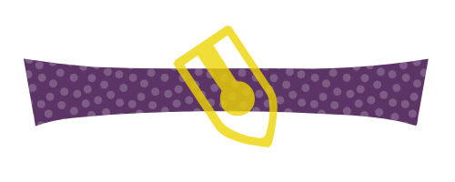
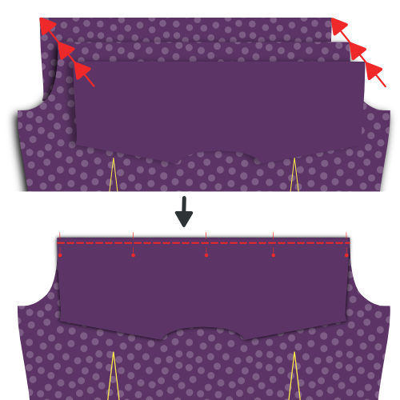
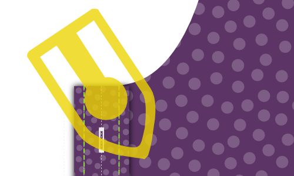
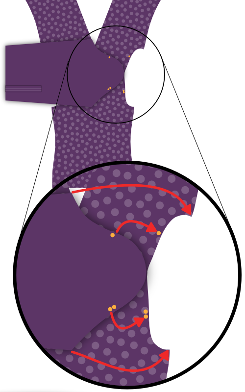
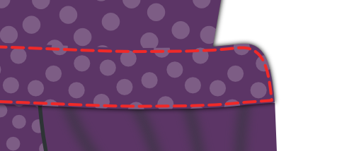

- - -
title: "Simon shirt: Sewing Instructions"
- - -

<Tip>

##### Volg de naad met Kelly en Julian

Kelly Hogaboom en Julian Collins deden een Simon(e) naadong, en ze hebben video's van
alle stappen.
Als je dit patroon wilt maken, kan Kelly en Julian je begeleiden om te beginnen.

You can find all the material's on Kelly's
site: [#simonsayssew with kelly hogaboom & julian collins](https://kelly.hogaboom.org/2020/07/simon-says-sew-with-kelly-hogaboom-and-julian-collins/)

</Tip>

### Stap 1: Bevestig tussenvoering

 

#### Kleef tussenvoering aan manchetten

To make two cuffs, you have cut out your cuff piece four times in fabric, and twice in interfacing.

For each cuff, press the interfacing piece to the bad side of the cuff piece.

> Als je stof geen slechte kant heeft maakt het niet uit aan welke twee stukken je de tussenvoering kleeft.
> 
> Het is echter een leuk detail om de binnenkant van je manchet van een andere stof te maken. In dat geval moet je zeker zijn dat je de tussenvoering aan het stuk kleeft dat je als buitenkant wil gebruiken.

> De vorm van je manchet zal anders zijn, afhankelijk van welke soort je gekozen hebt.
> 
> In the first illustration, you can see both a round barrel cuff and a French cuff as examples.
> 
> Vanaf nu gebruiken we de klassieke manchet in de illustraties, maar het proces is hetzelfde voor de andere soorten manchetten.

#### Press interfacing to collar, undercollar and collar stand

To make your collar, you need to cut one undercollar, one collar, and two collar stands. All of this both in fabric and interfacing.

For each piece, press the interfacing piece to the bad side.

### Stap 2: bereid de manchetten voor

#### Stik de manchet aan elkaar

Place both parts of your cuff (one with interfacing, one without) together with the good sides, and sew them together at the standard seam allowance.

> **Ensure you**
> 
> - Laat de kant die later aan de mouw bevestigd wordt open
> - Stop aan de naadwaarde van de rand die aan de mouw bevestigd wordt

#### Knip naadwaarde bij

Before we flip your cuff over, we need to trim back the seam allowance to remove bulk.

#### Strijk de naadwaarde terug

Fold back the seam allowances on each side of the cuff where the cuff attaches to the sleeve, and press them down.

> Als je eerder iets te ver langs de rand gestikt hebt ga je nu een paar steken moeten lostornen.

#### Keer manchet en strijk

Flip your cuff with the good sides out, and give it a good press.

> When pressing your cuffs, make sure to roll the seam a bit to the backside of the cuff to guarantee that the inner fabric of the cuff is not visible.

You can now put your cuffs aside, we'll attach them later.

### Stap 3: Bereid de kraag voor

#### Stik de kraag en onderkraag samen

Place both collar parts with the _good sides together_, and sew them together at the standard seam allowance.

#### Knip naadwaarde bij

Before we flip your collar over, we need to trim back the seam allowance to remove bulk.

#### Keer kraag en strijk

Flip your collar with the good sides out, get those tips as pointy as possible, and give it a good press.

> Denk er bij het strijken aan dat de onderkraag een beetje smaller is dan de bovenkraag.
> 
> Wanneer je de niet-gestikte randen op elkaar legt zorgt dit dat de naad naar de onderkant van de kraag rolt zodat deze niet zichtbaar is aan de goede kant.

#### Stik de kraag door

Top-stitch along the edge of the collar. This locks down the seam allowance and makes for a crisp look.

> Hoe ver je van de rand stikt is een stijlkeuze. Het is meestal een beetje minder dan de standaard naadwaarde. Kijk eens naar een paar bestaande hemden om een idee te krijgen.

### Stap 4: Bevestig kraag aan kraagstaander

#### Leg de kraag tussen de kraagstaanders en drieg vast

Mark the middle point of your collar and your collar stands with a pin. The middle point of each collar stand is actually slightly off-center since one end is longer than the other. Instead, find the middle point between the two notches.

First place a collar stand with the good side up, then your collar with the undercollar facing up (and the non-sewn side at the top), and finally the second collar stand with the good side down.

Your collar should sit between your two collar stands, and the middles (where you placed your pin) should be aligned.

> Hoe dit eruitziet hangt wat al van je keuzes, maar over het algemeen zal je kraag naar beneden buigen, en je kraagstaander naar boven.
> 
> Om dit allemaal mooi gelijk te krijgen gaan we het driegen, in plaats van te spelden. Je kraag is een belangrijk deel van je hemd, dus het is de moeite om dit te driegen.

First, replace the pins marking the middle with a pin that pins all parts together.

Now, start basting from this pin and work your way to the corner of the collar, making sure to align both edges of the fabric.

When you reach the corner of your collar, keep going and baste the end of both collar stands together.

When you've done one side, start from your pin in the middle again and do the other side. When you're done basting, you can take out the pin.

#### Stik je kraag aan de kraagstaanders

Sew along the edge of your collar stand, respecting the standard seam allowance.

> Let op dat je 2 cm voor de rand stopt (twee keer de standaard naadwaarde) aangezien we de naadwaarde omplooien in de volgende stap, en we de kraagstaander nog open genoeg moeten laten om het hemd ertussen te krijgen.

#### Plooi en strijk de naadwaarde van de kraagstaander

Fold back the seam allowance of your collar stand on the non-sewn side and press it down.

> In het midden zal het makkelijk zijn om de naadwaarde te strijken. Maar naar de punten toe zal dit moeilijk worden zonder plooien in je kraag te strijken.
> 
> Press it as best as you can without making folds in your collar. We strijken dit opnieuw zodra de kraagstaander gekeerd is.

#### Keer de kraagstaander en strijk

Flip your collar stand with the good sides out, and give it a good press. Make sure to keep the seam allowance on the collar stand folded inwards.

You can now put your collar aside, we'll attach it later.

### Stap 5: Optioneel: Bevestig je label

Our next step is to attach the yoke. But the yoke is a great place to put your label. So if you'd like to do that, we might as well start with that.

Pick one yoke, and you can sew your label on it in the center (on the good side).

### Stap 6: Bevestig de schouderpassen aan het rugpand

 

Place one yoke with the good side up. On top of that, place your back with the good side up, aligning the seam where it needs to be attached to the yoke.

Finally, place your second yoke on top of the back, but with the good side down.

Your back should now be sandwiched between the good sides of your two yokes.

If that's the case, sew them in place along the back/yoke seam, making sure to respect the seam allowance.

> Let op dat de schouderpas met het label aan de verkeerde kant van je rugpand zit, mocht je een label hebben toegevoegd.

When you're done, don't forget to give it a good press to make the seam lie flat.

### Stap 7: Stik de schouderpas door

With your yokes attached to the back, we are going to edge-stitch along the seam we just made, on the yoke side.

> Vouw de binnenste schouderpas uit de weg. Our edge stitching will catch the outer yoke, back and all the seam allowances, but not the inner yoke.

Just sew right next to the seam joining the outer yoke to the back.

> Doorstikken is als een sierstiksel, maar heel dicht bij de rand

### Stap 8: Sluit de achterste nepen

  

> Afhankelijk van je maten heeft je patroon wel of geen nepen. Indien geen nepen, ga dan voort met de volgende stap.

Your pattern may or may not have back darts. If it has them, you should close them now.

Place your back down with the good side up, and fold it back from the side seam so the fold runs from the top to the bottom of your dart.

Do the same for the other dart, so that both sides are folded back.

Feel free to gently press in this crease, it will help you to neatly sew the darts.

Sew across the line marking the dart to close the darts. Be careful to make sure the top and bottom of your darts are precisely where they need to be. If one dart sits higher than the other, it will look bad.

When you're done, don't forget to give it a good press. Press the extra fabric of the dart towards the side seams.

### Stap 9: Bereid het knopenpat voor

> Als je een aangeknipt knopenpat gekozen heb kan je de eerste twee substapjes overslaan en verdergaan met [Plooi het knopenpat](#fold-the-button-placket).

#### Stik het knopenpat vast

If you have chosen a separate button placket, sew it to the Front Right piece.

Place the Front Right (piece 1) down with the good side up, and place the Button Placket (piece 1b) on top of it with the good side down, making sure to align the seam.

Sew it in place with the default seam allowance.

#### Strijk de naadwaarde in de richting van het knopenpat

Place your front with the good side down, and press the seam allowance to the button placket side.

#### Plooi het knopenpat

Now, fold over the button placket on the first fold line, and press this fold in place.

Then, fold the placket over again, making sure to have the fabric extend just beyond the seam that joins your placket to the front.

When you're happy, press the folded placket.

#### Stik het geplooide knopenpat

> Dit is de klassieke aanpak. Als je voor het naadloze knopenpat gekozen heb moet je dit niet doen.
> 
> In plaats van het knopenpat door te stikken, laat je het gewoon geplooid. De plooien worden op hun plaats gehouden wanneer we later de knopen aannaaien.

From the good side of your shirt, sew down the folded placket by stitching in the ditch.

To do so, sew exactly on top of your earlier seam. Since you folded the fabric of your placket a bit past this seam, it will get caught at the back, fixing your folded placket in place, and locking the seam allowance inside.

### Stap 10: Bereid het knoopsgatenpat voor

> Als je een aangeknipt knoopsgatenpat gekozen heb kan je de eerste twee substapjes overslaan en verdergaan met Hoe werkt een klassiek knopenpat.

#### Stik het knoopsgatenpat vast

If you have chosen a separate buttonhole placket, sew it to the Front Left piece.

Place the Front Left (piece 2) down with the good side up, and place the Buttonhole Placket (piece 2b) on top of it with the good side down, making sure to align the seam.

Sew it in place with the default seam allowance.

When you're done, don't forget to give it a good press. Press the seam allowance towards the placket side.

#### Strijk de naadwaarde in de richting van het knoopsgatenpat

Place your front with the good side down, and press the seam allowance to the buttonhole placket side.

#### Hoe werkt een klassiek knopenpat

> Als je een naadloos knopenpat gekozen hebt moet je de stappen voor het knopenpat volgen, aangezien de constructie identiek is.
> 
> De stappen hieronder zijn voor een klassiek knopenpat.

Your placket has a bunch of lines on it, so let's first clarify what they are:

- De knoopsgatenlijn heeft is een lange stippellijn met knoopsgaten op. Ze geeft aan waar de knoopsgaten moeten komen
- De twee vouwlijnen zijn lange stippellijnen en zitten op gelijke afstand rechts en links van de knoopsgatenlijn
- De twee+twee stiklijnen zijn stippellijntjes die op gelijke afstand van elke vouwlijn zitten

#### Knip naadwaarde bij

> Als je een aangesneden knopenpat gekozen hebt is dit niet van toepassing.

The seam allowance of where you sewed your buttonhole placket to your front should fit inside your folded placket.

For that, trim back the seam allowance so that it doesn't extend beyond the first fold line on the placket.

#### Plooi het knoopsgatenpat

 

Fold the placket on the first fold line. Press the fold in place.

Then, fold the part you just folded again, this time on the second fold line. Press this fold in place too.

> Als je knoopsgatenpat geplooid en gestreken is helpen een paar spelden wel eens om te voorkomen dat dingen gaan verschuiven

#### Stik het geplooide knoopsgatenpat

 

Sew on the first sew line, closest to the edge.

Then, flip your shirt over so that the good side is up, and your placket is up too. Then sew on the second sew line.

> Deze twee rijen stiksel gaan altijd zichtbaar zijn, dus hou het netjes

#### Strijk het knoopsgatenpat

Congratulations, you made a classic buttonhole placket.

Now press that baby. You know you want to.

### Stap 11: Sluit de schoudernaden

> **Laten we een burrito maken**
> 
> We are going to close the shoulder seams with a technique that is commonly known as the **burrito method**.
> 
> Als dit je bekend in de oren klinkt weet je al wat te doen. Indien niet, lees dan even verder voor een slimme manier om de schoudernaden van je hemd te stikken en tegelijk alle naadwaarde weg te stoppen.

#### Speld de voorpanden aan de buitenste schouderpas

 

Place your back down with the good side up, but be careful to fold the inner yoke downward (as illustrated by the dotted line.

Place your fronts on your back, with the good sides down. Pin fronts to the yoke at the shoulder seam, good sides together.

#### Rol hemden, geen zakken

Roll up your back and fronts starting at the hem. Roll them into a neat sausage upwards until you can see the entire turned down yoke.

Now, you can flip the inner yoke over your rolled sausage to align the shoulder seams with the other yoke and fronts.

Pin them in place, and then sew the shoulder seams, making sure to keep your sausage (or burrito stuffing) out of the way so it doesn't get caught in the seam.

> Let op dat je de eigenlijke stiklijn gelijk legt. Door de hoeken van de halsopening kan het zijn dat de rand van de stof aan één kant langer is dan aan de andere.
> 
> However, the seamlines are the same length, so make sure to match them carefully using the notches.

#### Keer het binnenstebuiten door de halsopening

When you've sewn both shoulder seams, reach in through the neck opening, and pull out the back and front parts to inside-out your burrito.

#### Strijk de schoudernaden

You did all this work, so now make sure you make it look super sharp by giving it a good press. Make sure that the seam allowance between your yokes lies nice and flat for that.

### Stap 12: Stik de schoudernaden van de schouderpas door

Just as we've edge-stitched the bottom seam of the yoke in Step 3, we're going to edge-stitch the yoke at the shoulder seams too.

Since you've just pressed these shoulder seams, everything should lie nice and flat, and you just need to run a stitch right next to the seam.

> Zorg dat je op de schouderpas doorstikt, waar je alle naadwaarde mee vastzet, en niet op het voorpand.

### Stap 13: Maak het mouwsplit

#### Stik de mouwsplitreep

  

- Leg je mouw met de goede kant naar beneden, en de mouwsplitreep bovenop, ook met de goede kant naar beneden.
- Leg de rand van de mouwsplitreep (de onderlap van het mouwsplit) gelijk met de knip in de mouw, aan de kant het dichtst bij de zijnaad.
- Stik nu op de vouwlijn die op de mouwsplitreep aangeduid is, het dichtst bij de rand.

> Als je bij het uitknippen van je patroondelen het mouwsplit nog niet ingeknipt had volgens de aangegeven lijn, moet je dat eerst doen.

- Plooi de mouwsplitreep om, en strijk deze naad.
- Leg je mouw met de goede kant naar boven, en haal de mouwsplitreep door de knip in de mouw.
- Plooi twee keer op de aangegeven lijnen zodat de naadwaarde ingepakt zit.
- Make your folds so that the upper fold sits ever so slightly further than the seam you already made.
- Strijk alles goed plat, en stik de mouwsplitreep door aan de zijkant, door alle lagen heen.

#### Plooi en strijk de mouwsplitbies

Origami time! We're going to fold the sleeve placket overlap using the marked fold lines as our guide. This will be a lot easier if you press between each fold.

- Plooi eerst de buitenste randen van de mouwsplitbies naar binnen.
- Next, fold the entire thing in half.
- Plooi daarna de twee hoekjes tot een mooie punt.
- Strijk alles nog eens grondig.

#### Speld de mouwsplitbies

 

Place your sleeve down with the good side up. The guard we have sewn in earlier sits against the other unfinished fabric edge of where you cut into your sleeve.

Place your placket around that edge, one side above it, one underneath.

You need to slide the placket onto your sleeve until the middle of it (the tip) aligns with the cut in your sleeve.

The idea is that the placket closes up the unfinished edge, but also covers the guard of the other edge.

When you've got it where you want it, pin the placket down.

#### Stik de mouwsplitbies

Start at the edge of the sleeve (the bottom of the sleeve placket) and edge-stitch along the edge upwards.

Go around the tip, and come down again on the other side (the fold side) until you have passed the point where your guard ends.

Then, sew horizontally to the other side of the placket to finish.

> Ik heb hier een extra illustratie gemaakt die enkel de omlijning van de mouwsplitbies toont. Je ziet dat het einde van de mouwsplitreep vastzit in het stiksel van de mouwsplitbies, en dus netjes weggewerkt wordt.

### Stap 14: Zet de mouwen in

#### Belangrijk! Dit is een platte naad

> **Let op met de extra naadwaarde voor de platte naad**. Er is extra naadwaarde aan de mouw om de platte naad te kunnen maken.
> 
> Zorg dus dat je niet de rand van de stof gelijk legt, maar leg de stiklijnen zo op elkaar dat de mouw een extra centimeter uitsteekt.

#### Pin sleeve in place

Spread your shirt open so that both fronts and back lie flat with their good sides up.

Now place your sleeve on top with the good side down, matching the top of the sleeve with the shoulder seam.

> Be careful, your sleeve is not symmetric, so be sure to have the back notch (⊗) and cuff guard on the back side, and the front notch (⊙) on the front side.
> 
> Also note that the back notch (⊗) on the sleeve does not have a corresponding notch on the back of the shirt. That's because it should match up with the seam where your yoke joins the back.

You now need to pin the sleeve to the armhole. To do so, make sure to:

- Het begin en het einde van de mouwkop overeenkomen met het begin en het einde van het armsgat
- De merktekens op de mouwkop overeenkomen met die op de voorpanden en het rugpand
- De extra stof in de mouwkop tussen de merktekens verdeeld wordt, zoals getoond

#### Distribute sleevecap ease

The default sleevecap ease for this pattern is 0.5cm. If you have sleevecap ease, you need to distribute that extra length evenly between the notches as shown.

> If you are unsure what sleevecap ease is, have a look at the [documentation for the sleevecap ease pattern option](/docs/patterns/simon/options/sleevecapease).

#### Stik mouw in armsgat

When you've got your sleeve neatly pinned in your armhole, sew it in place. Be careful to avoid any pleats in the part between the notches where you need to ease in the sleevecap ease.

> Het zou niet nodig moeten zijn, maar ik ga het toch doen: Herhaal deze stap voor de andere mouw.

### Stap 15: Platte armsgatnaad

#### Strijk naadwaarde naar één kant

Lay down your freshly sewn sleeve seam with the good side down

We are going to press the seam allowance to one side. To do so, identify the seam allowance that is wider (for the flat-felled seam).

The longer seam allowance needs to lie on top of the shorter (standard seam allowance).

Once you have verified that, press down the seam allowance.

#### Plooi de extra naadwaarde weg

Now, fold the extra seam allowance for the flat-felled seam under the standard seam allowance.

You can use pins to hold this in place, but it's simpler to just press it.

> Dit zal redelijk eenvoudig zijn aan de rechte stukken van de naad, maar een beetje lastiger aan de afgeronde stukken. Neem je tijd, en indien nodig kan je kleine knipjes in de extra naadwaarde geven zodat ze de curves mooier kan volgen.

#### Stik de platte naad

Now, from the bad side of the fabric, sew the seam allowance down just at the edge where it folds under the other seam allowance.

Here it is important to keep an even distance from the seam of your sleeve. If you have a felling foot for your sewing machine, it will help you with that. But if not, just be careful.

> Het is belangrijker om op gelijke afstand van de naad te blijven dan om exact op de rand van de plooi te stikken. In een ideale wereld zit die plooi al op een gelijke afstand, maar als dit niet zo is, zorg dan gewoon dat je stiksel tenminste gelijk is. Zelfs al betekent dit dat je een beetje van de geplooide rand afwijkt.

#### Strijk de platte naad

When it's all done, press the flat-felled seam from the good side so it lies nice and flat.

### Stap 16: Sluit de zij- en mouwnaden

 

Place your shirt with the good sides together, and sew the side and sleeve seams to close the shirt.

> Er is extra naadwaarde aan de mouw en de voorpanden om een platte naad te maken. Zorg dus dat je niet de rand van de stof gelijk legt, maar leg de stiklijnen zo op elkaar dat de extra naadwaarde een centimeter uitsteekt.

### Stap 17: Platte naad aan de zij- en mouwnaden

#### Strijk naadwaarde naar één kant

We are going to press the seam allowance to one side. To do so, identify the seam allowance that is wider (for the flat-felled seam).

The longer seam allowance needs to lie on top of the shorter (standard seam allowance).

Once you have verified that, press down the seam allowance.

#### Plooi de extra naadwaarde weg

Now, fold the extra seam allowance for the flat-felled seam under the standard seam allowance.

You can use pins to hold this in place, but it's simpler to just press it.

> Dit zal redelijk eenvoudig zijn aan de rechte stukken van de naad, maar een beetje lastiger aan de afgeronde stukken. Neem je tijd, en indien nodig kan je kleine knipjes in de extra naadwaarde geven zodat ze de curves mooier kan volgen.

#### Stik de platte naad

Now, from the bad side of the fabric, sew the seam allowance down just at the edge where it folds under the other seam allowance.

Important here is to keep an even distance from the seam of your sleeve. If you have a felling foot for your sewing machine, it will help you with that. But if not, just be careful.

> Het is belangrijker om op gelijke afstand van de naad te blijven dan om exact op de rand van de plooi te stikken. In een ideale wereld zit die plooi al op een gelijke afstand, maar als dit niet zo is, zorg dan gewoon dat je stiksel tenminste gelijk is. Zelfs al betekent dit dat je een beetje van de geplooide rand afwijkt.

#### Strijk de platte naad

When it's all done, press the flat-felled seam from the good side so it lies nice and flat.

### Stap 18: Bevestig de manchetten aan de mouwen

#### Speld de manchet op z'n plaats

You need to insert the sleeve between the two layers of your cuff, making sure that the good side of the fabric sits against the side of your cuff that has the interfacing applied to it.

You will need to pin this in place, because depending on how long your sleeve placket is, it might be hard or even impossible to get this to lie flat.

Also note that your sleeve edge will be longer than your cuff (how much longer depends on the sleeve drape). You need to make one or a few folds in your sleeve to accommodate for this.

> Your pattern contains helplines on the sleeve to help you place the folds.

> Neem je tijd om alles nauwkeurig te spelden. We are going to edge-stitch this later, so it's important that the front and back of your cuff align nicely.

#### Stik de manchetten smal door

Once everything is pinned in place, edge stitch along the edge of your cuff to attach it to your sleeve.

It's important to catch both the outer and inner layer of your cuff on the edge.

> Zorg dat je langs de goede kant doorstikt, en hou het stiksel parallel met de rand van je manchet.

When you're done, give your cuffs a good press.

#### Sierstiksel op de manchetten

> Let op dat je je manchetten strijkt voor je dit doet.

Top-stitch around your cuff at a distance from the edge that is a bit less than your seam allowance. Go all the way around your cuff.

### Stap 19: Bevestig de kraag

#### Drieg de kraag vast

This is an important seam, so we are going to baste this in place to make sure it sits exactly right before we sew it.

Start at the center back, and place the seam allowance of your back part between your two collar stands. Work your way around one side, and then do the other.

Make sure to respect the standard seam allowance and - important - avoid any wrinkles.

> Ook al is je kraagstaander, redelijk recht, hij wordt bevestigd aan wat in feite een gat in je hemd is.
> 
> Dat is een beetje lastig, dus wees extra nauwkeurig aan de delen die het meest gebogen zijn: aan de schoudernaden.

#### Stik de kraag smal door

 

When you're happy with how you've basted your collar in place, it's time to sew that thing down.

We're going to start at the center-back and sew all the way around the collar stand.

#### Stik langs de rand van de kraag

To give more body to your collar, and firmly secure it in place we're going to sew along the top edge of the collar stand.

Sew about half the seam allowance from your earlier edge-stitching. Make sure to stop a few cm before the end of the collar.

> Je moet een paar cm voor het einde van de kraag stoppen (opgelet: het einde van de kraag, niet het einde van de kraagstaander) zodat dit stiksel helemaal bedekt is wanneer de kraag naar beneden geplooid ligt.

#### Strijk de kraag

Now that your collar is attached, give it a good press.

### Stap 20: Zoom je hemd

  

Time to finish the hem (that's the part you tuck in your trousers).

Fold up half of the hem allowance and press down. Then, fold up again and press again.

Now, sew along the upper edge to finish the hem.

### Stap 21: Maak knoopsgaten

If you haven't done so initially, mark all the places you should have buttonholes.

They sit along the front closure and at your cuffs.

When you've marked them, make buttonholes there.

### Stap 22: Naai knopen aan

Pin your shirt closed to transfer the place of the buttonholes to the button sides.

When you've marked where buttons should go, sew them on.

> In plaats van de locatie van de knopen op het patroon te gebruiken, duid ik liever de gemaakte knoopsgaten aan.
> 
> Als een knoopsgat dan een beetje alternatief geplaatst is zal de knoop dit gewoon volgen.

