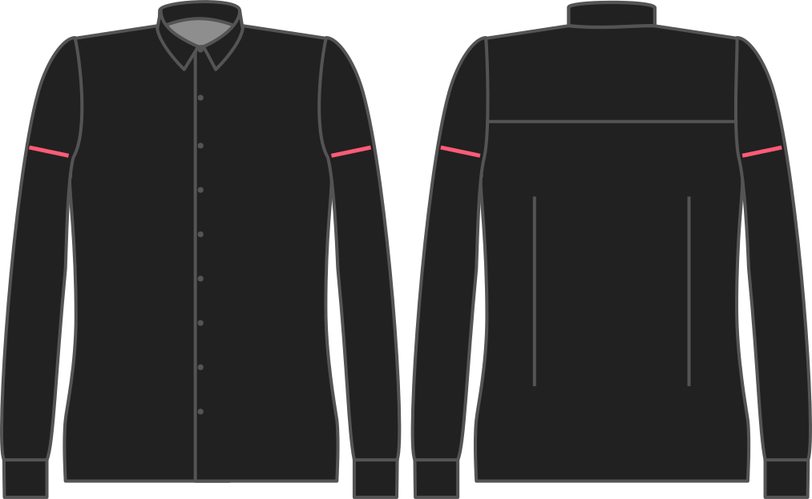

Hoeveel wijder dan je bovenarmomtrek wil je dat de mouw is?

<Note>

###### Waarom?

Het zijn juist mannen met grote armen die liever een aansluitende pasvorm, en dus minder overwijdte willen. Dit is omdat een strakke mouw de aandacht vestigt op hun sterke bovenarmen.

Als je bovenarmen wat mager zijn wil je hier misschien een beetje extra stof om alles wat te balanceren.

</Note>

<Warning>

We proberen je keuze hier te respecteren, maar onze prioriteit is zorgen dat de mouw in het armsgat past.

</Warning>

## Effect van deze optie op het patroon

