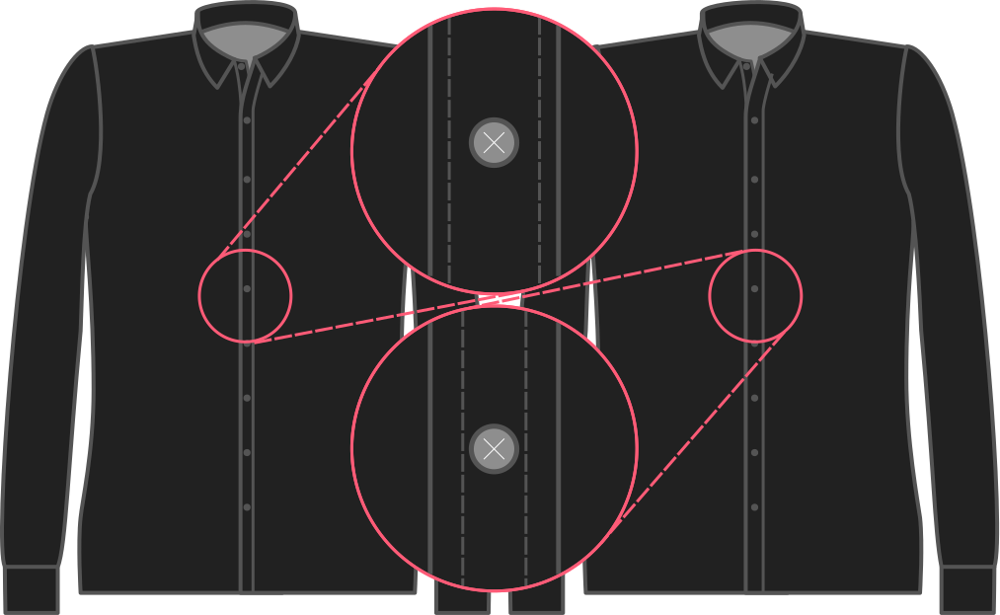

De breedte van de vouw op een klassiek knoopsgatenpat.

<Note>

Als je een stof hebt met een patroon (strepen of ruiten bijvoorbeeld) kan je de breedte op de helft van de breedte van je patroonherhaling zetten.
Op deze manier zal je patroon perfect doorlopen.

Dit is alleen van toepassing op een klassiek knopenpat. Dus als je voor het naadloze knopenpat koos wordt dit genegeerd.

</Note>

## Effect van deze optie op het patroon

