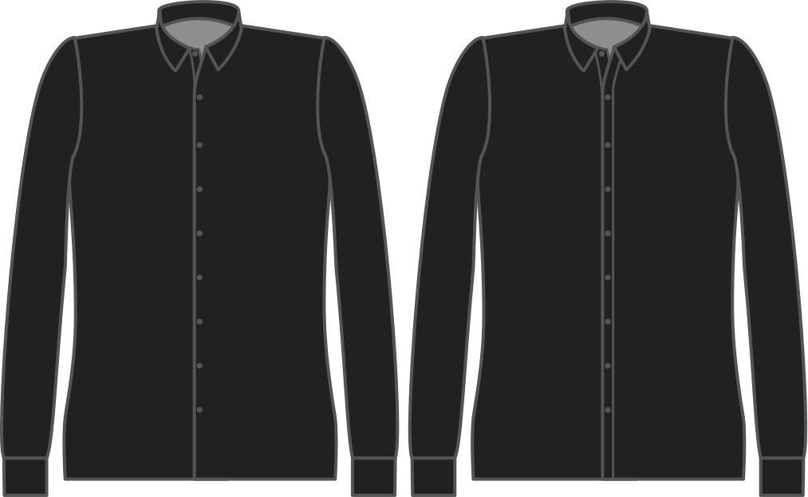

- - -
title: "Buttonhole placket style"
- - -

¿Quiere una placeta clásica de agujero de botón o una sin costura (a veces llamada estilo francés)?

<Tip>

Sin fisuras es menos trabajo y se ve genial.

</Tip>

<Note>

As seamless is only possible on a _cut-on_ placket, this option is ignored if you choose a seperate buttonhole placket.

</Note>

## Efecto de esta opción en el patrón

