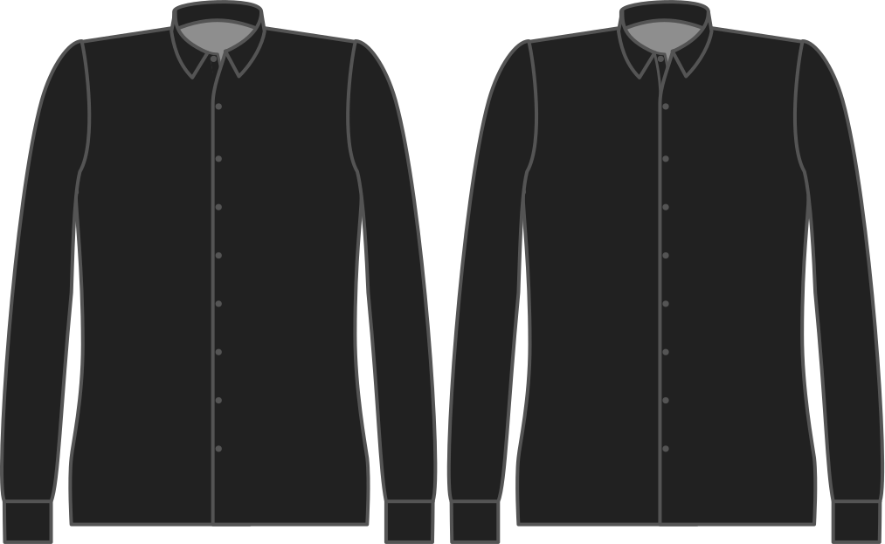

- - -
title: "Button placket style"
- - -

Möchten Sie, dass der Schaltflächen-Platzhalter an Stelle (klassischer Stil) genäht oder rückwärts geklappt und durch die Tasten (nahtloser Stil) gehalten wird?

<Tip>

Nahtlos ist weniger Arbeit, und es sieht großartig aus.

</Tip>

<Note>

As seamless is only possible on a _cut-on_ placket, this option is ignored if you choose a seperate button placket.

</Note>

## Effekt dieser Option auf das Schnittmuster

