Le nombre de degrés entre le bord du col et la ligne de grain.

<Note>

###### Pour quoi faire ?

Avec la hauteur du col, c'est le facteur le plus important pour le style de votre col.

Des valeurs plus élevées signifient un style plus découpé.

Dans l'image d'exemple, le haut est de 80 degrés par défaut et le bas est de 110 degrés.

</Note>

## Effect of this option on the pattern
