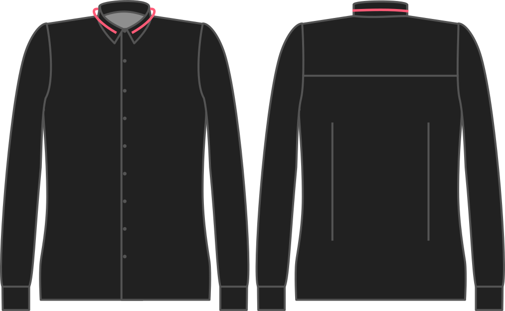

¿Cuánta facilidad quieres para tu cuello?

Si sientes que un cuello está sufriendo, puedes darte un poco más de facilidad y te sentarás más suelto alrededor del cuello. También puede bajar la facilidad para un ajuste ajustado.

## Effect of this option on the pattern
