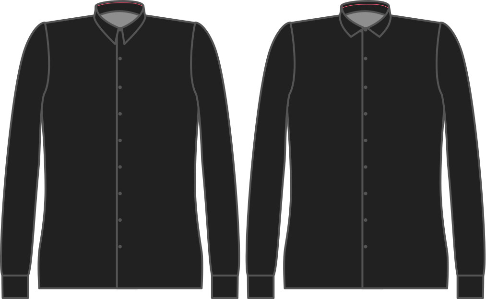

Cuánto el cuello es más alto que el cuello se encuentra en el centro de la espalda.

<Note>

###### ¿Cuál es el punto?

###### What's the point?

The collar starts upwards from the collar stand and then rolls over downwards. Pero todavía tiene que cubrir la posición del cuello. Para ello, tiene que ser un poco más largo.

Incrementar esto no hace que el cuello sea más alto (use la altura del cuello para eso), sino que más bien hace que descienda más abajo.

</Note>

## Efecto de esta opción en el patrón

