Cuánto se sitúan las curvas de cuello en los bordes.

<Note>

Puede ajustar esto para asegurarse de que los bordes de su cuello se sitúan en la parte delantera o bien horizontal.

</Note>

## Effect of this option on the pattern
