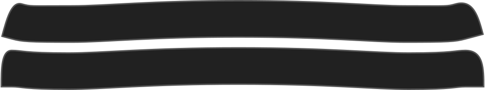

Combien le collier se monte sur les bords.

<Note>

Vous pouvez modifier cela pour vous assurer que les bords de votre collier se tiennent à l'avant ou bien à l'horizontale.

</Note>

## Effect of this option on the pattern
