- - -
title: "Collar stand width"
- - -

De hoogte van je kraagstaander.

<Note>

Dit is de belangrijkste parameter om de algemene hoogte van je kraag aan te passen. De standaard is een moderne en relatief smalle kraag, maar je kan helemaal los gaan richting Karl Lagerfeld.

</Note>

## Effect van deze optie op het patroon

