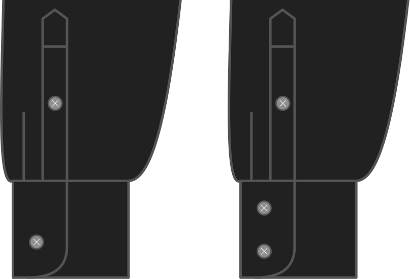

¿Quieres un solo botón en tu cuchillo de barras, o dos?

<Note>

Esto sólo se aplica a los barriles. Así que si eliges un corte francés como estilo de taza, esto será ignorado.

</Note>

## Effect of this option on the pattern
