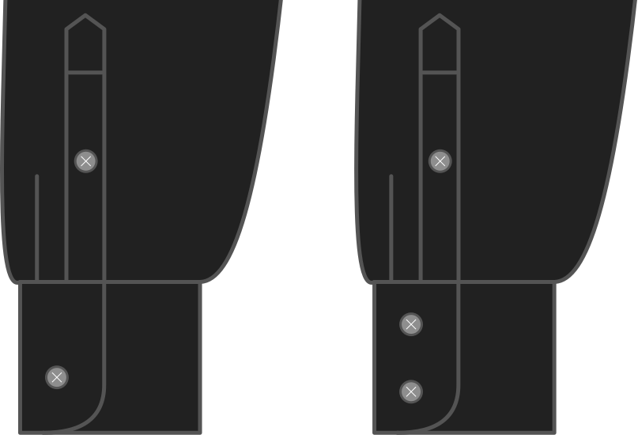

- - -
title: "Cuff button rows"
- - -

Do you want a single button on your barrelcuff, or two?

<Note>

This does only apply to barrelcuffs. So if you picked a French cuff as cuff style this will be ignored.

</Note>

## Effect of this option on the pattern

