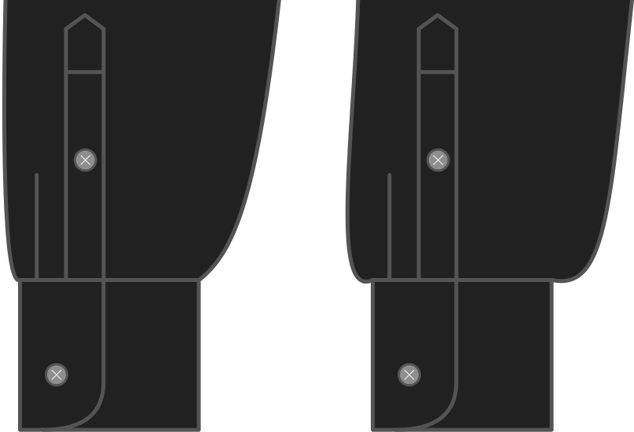

Cuánto el final de la manga es más ancho que la muñeca.

<Note>

Esto cambia un poco el aspecto de la manga. 
Una mayor cantidad de tapones hace que la manga sea más ancha y te da un efecto más *blous*, mientras que una manga menor hace que la manga sea más estrecha.

El tapón se trabajará en la taza con pliegues.

</Note>

## Effect of this option on the pattern
