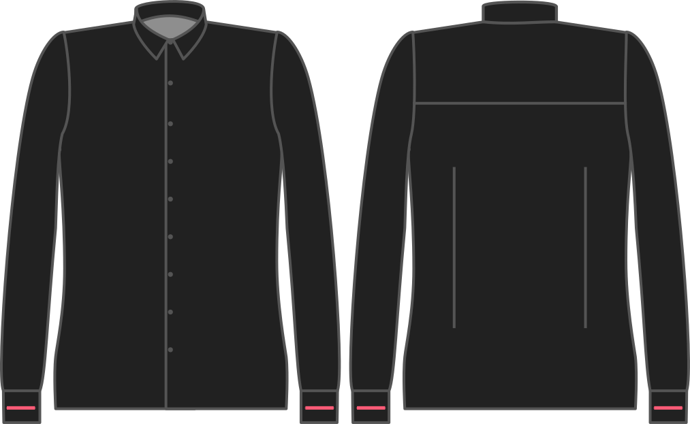

Legt fest, wieviel die Manschette größer ist als dein Handgelenk.

Ändern Sie diese Option, um Ihnen mehr oder weniger Platz im Handgelenk zu geben.

<Note>

Vielleicht möchtest du mehr, wenn du möchtest, dass die Hemdschicht über eine sperrige Uhr passt. Das Zimmer war sehr klein, aber das Personal war sehr freundlich und hilfsbereit.

Wer sein Shirt unter einem Pullover tragen möchte, sollte sich auch die Schmalspurtaste der Fässer ansehen.

</Note>

## Effekt dieser Option auf das Schnittmuster

