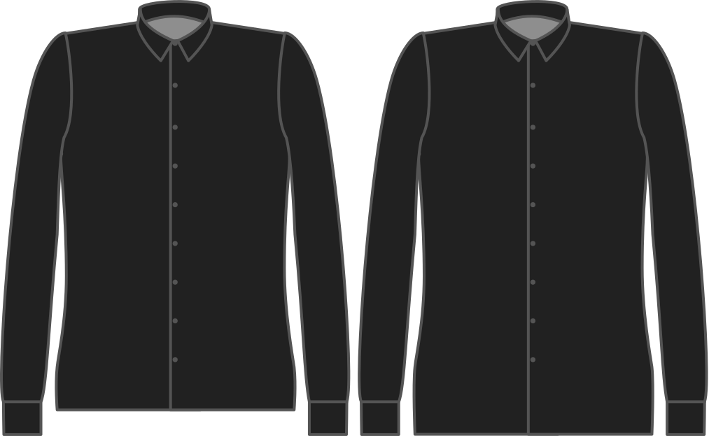

- - -
title: "Length bonus"
- - -

Combien de chemise voulez-vous pouvoir enfoncer dans votre pantalon?

<Note>

###### Pour quoi faire ?

Garder votre chemise bien enfoncée dans votre pantalon est la raison pour laquelle vous avez besoin de cette longueur supplémentaire.
Personne n'a besoin de savoir que le tatouage Justin Bieber sur le bas du dos.

Si vous voulez une chemise plus décontractée à porter sur votre pantalon, vous voudrez la diminuer.

</Note>

## Effet de cette option sur le motif

