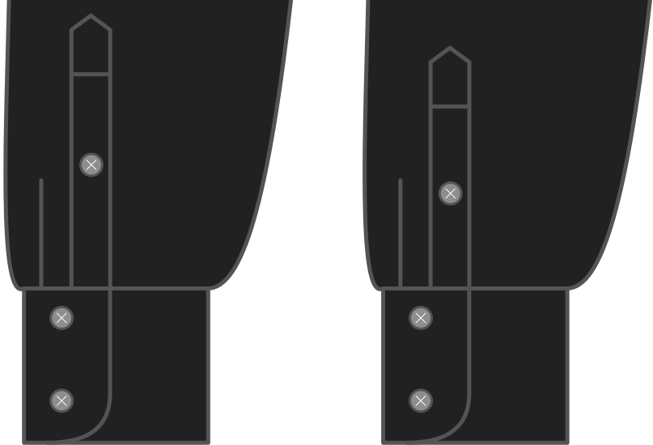

- - -
title: "Sleeve placket length"
- - -

Hoe lang wil je dat het mouwsplit is?

<Note>

Hoe langer je mouwsplit, hoe makkelijker je mouw uit te trekken is.
De lengte heeft ook invloed op hoe het eruitziet als je je mouwen oprolt

</Note>

## Effect van deze optie op het patroon

