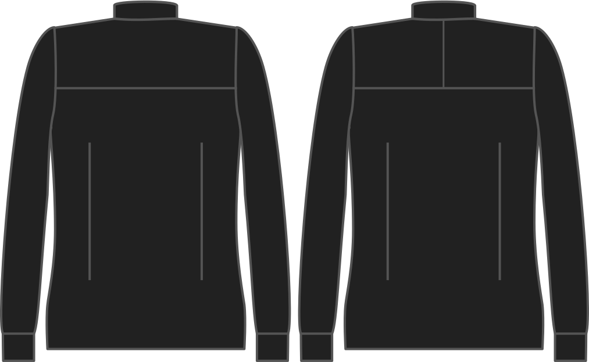

¿Quiere dividir?

<Note>

###### ¿Cuál es el punto?

###### What's the point?

With a split yoke, only half the yoke is included on the pattern, and you'll have to cut 4 parts instead of 2, and sew them together.

Es un poco más de trabajo, pero te permite alinear la línea de grano de forma diferente en ambas mitades del yugo, un efecto que a algunas personas les gusta.

</Note>

## Effect of this option on the pattern
