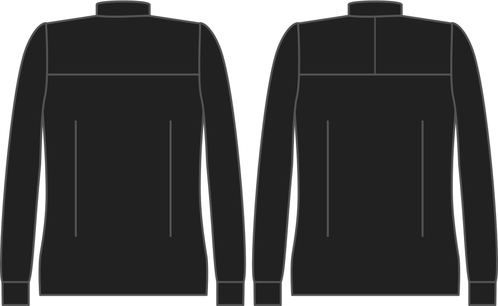

- - -
title: "Split yoke"
- - -

Voulez vous un split yoke ?

<Note>

###### Pour quoi faire ?

Avec un empiècement dos à couture médiane (split yoke), seule la moitié de l'empiècement étant représentée sur le patron, vous devrez couper 4 pièces au lieu de 2, et les coudre ensemble.

C'est un peu plus de travail, mais cela vous permet d'aligner le droit-fil différemment des deux côtés de l'empiècement, effet de style apprécié par certains.

</Note>

## Effet de cette option sur le motif

