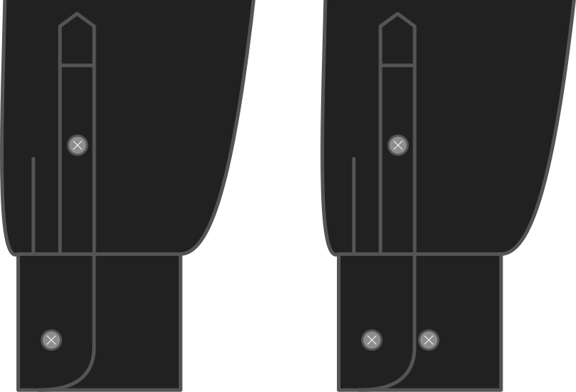

Wil je een extra knoop om je manchet iets strakker vast te knopen?

Als je je hemd onder een strakke (of toch aan de pols) trui of cardigan wil dragen kan je met deze knoop je manchet smaller maken, zodat die niet opfrommelt in je mouw.

<Note>

Dit is alleen van toepassing om de klassieke manhet. Dus als je een Franse manchet gekozen hebt wordt dit genegeerd.

</Note>

## Effect of this option on the pattern
