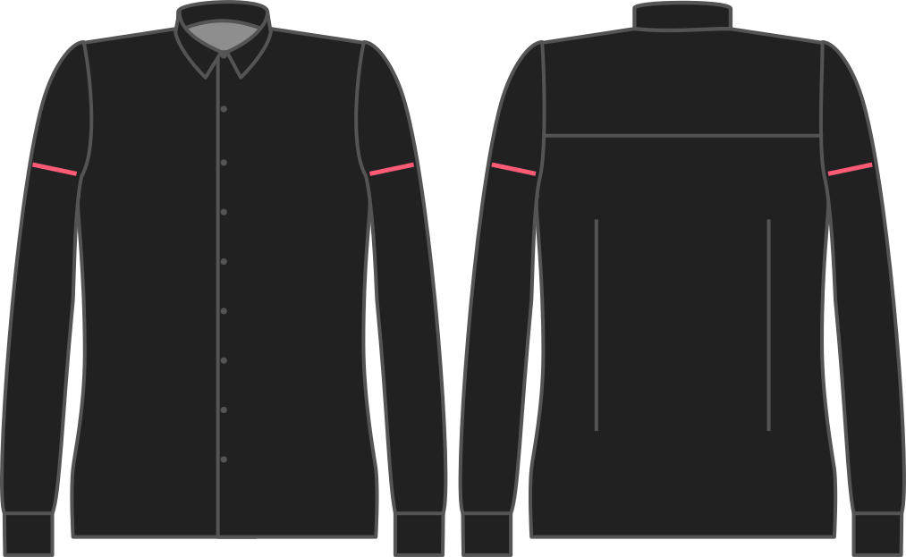

- - -
title: "Biceps ease"
- - -

¿Cuánto quiere que la manga sea más ancha que la cirugía de su arma?

<Note>

###### ¿Cuál es el punto?

###### What's the point?

It's actually men with big arms who prefer a tighter fit, and thus less ease here. Esto se debe a que llama la atención sobre sus fuertes brazos.

Si tus brazos superiores son más despellejados, necesitarás más facilidad para suavizar las cosas un poco.

</Note>

<Warning>

Intentaremos respetar su elección aquí, pero la prioridad es encajar la manga en el orificio.

</Warning>

## Efecto de esta opción en el patrón

