- - -
title: "Collar angle"
- - -

Hoeveel graden tussen de rand van de kraag en de draadrichting.

<Note>

###### Waarom?

Samen met de hoogte van de kraag is dit de belangrijkste factor voor de stijl van je kraag.

Een grotere waarde zorgt voor een meer weggeknipte look.

In dit voorbeeld is de bovenste versie 80° (de standaard) en de onderste 110°.

</Note>

## Effect van deze optie op het patroon

